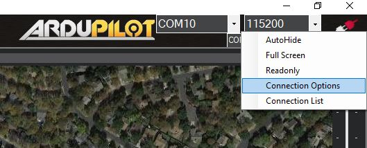
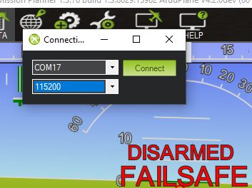
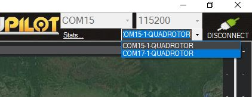

.. _common-redundant-telemetry:

=========================
Redundant Telemetry Links
=========================

Many high value vehicles utilize a single telemetry link for vehicle RC control, telemetry, and, often, video. While a properly setup GCS failsafe, will often return a vehicle safely, it may not allow a safe landing if that link remains non-operational upon the return.

Therefore, having redundant telemetry links is often a wise investment. For example, if the primary link is LTE based, an additional long range 900 Mhz or 433Mhz link may be a worthwhile investment. Even a shorter range WIFI link would allow re-establishing control upon return to home from a properly setup GCS failsafe in order to allow control for a safe, controlled landing.

Both Mission Planner and MAVProxy provide means of establishing redundant links to the vehicle, and switching between them in their display and control consoles. In the case of MAVProxy, that switching is automatically done based on best link performance, and can be done manually in Mission Planner.

Mission Planner
===============

Establishing the primary link is explained :ref:`elsewhere<common-connect-mission-planner-autopilot>`. In order to establish the second (or third or forth, etc.) link to the vehicle:

- right click the DISCONNECT button in order to get a connection options menu drop down

- select connection options and fill in the dialog for the next link's specifics

- the link to be shown in the various tabs/views/menus can then be selected by this drop down box:

MAVProxy
========

See `MAVProxy Link Management <https://ardupilot.org/mavproxy/docs/modules/link.html>`__ for information on adding telemetry links. 

To list all the links:

.. code:: bash

   link list

To force a link as the active one to receive commands, parameter changes, etc.

.. code:: bash

   set link x

To send commands to all links:

.. code:: bash

   alllinks <cmd>

for example: allinks mode rtl

