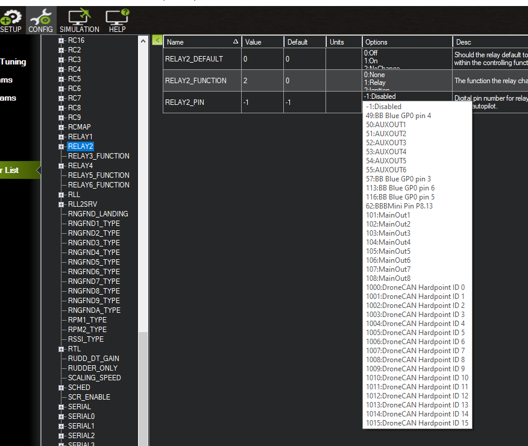
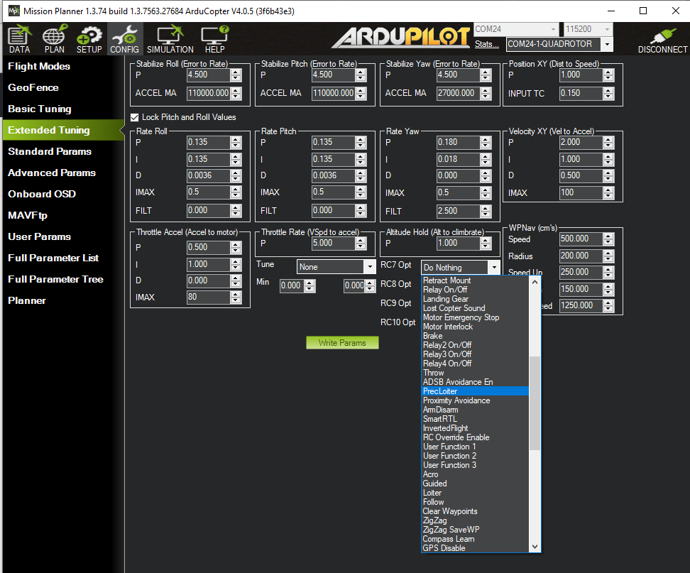

.. _common-relay:

============
Relay Switch
============

A "Relay" is an digital output pin on the autopilot that can be switched between 0 volts and either 3.3V or 5V.  Similar to a servo it allows the autopilot to invoke some action from another device on the vehicle.  Up to 4 pins can be defined as relays in Copter, and 6 in Plane and Rover.

Relay pins on the Pixhawk
=========================

On the Pixhawk AUX OUT 5 (pin 54) and AUX OUT 6 (pin 55) are setup as the "First" (or #0) and "Second" (or #1) Relays respectively.

.. image:: ../../../images/Relay_Pixhawk.jpg
    :target: ../_images/Relay_Pixhawk.jpg

The number of available Relays can be increased to a maximum of 6 by reducing the number of AUX pins used as :ref:`Servo <common-servo>` outputs.  This can be accomplished by reducing the :ref:`BRD_PWM_COUNT <BRD_PWM_COUNT>` from 4 to 2 or 0. Likewise, on other controllers, which have only PWM outputs, setting :ref:`BRD_PWM_COUNT <BRD_PWM_COUNT>` to a lower number will free up those outputs for use as GPIOs for controlling relays.

Defining the relay pins through the Mission Planner
===================================================

The First ~ Fourth relay pins can be defined most easily using the Mission Planner's Config/Tuning screen's Standard Params list as shown below for the Pixhawk.  For other boards, if you know the exactly pin number to use, the :ref:`RELAY_PIN <RELAY_PIN>` parameter can be set directly.

These are usually defined in the autopilot's hwdef.dat file `here <https://github.com/ArduPilot/ardupilot/tree/master/libraries/AP_HAL_ChibiOS/hwdef>`__ .

Pilot control of the relay
==========================

The relays can be controlled with the auxiliary switches. For Copter:

For Plane, setting the RCx_OPTION parameter, such as :ref:`RC5_OPTION<RC5_OPTION>` .
For Rover, see :ref:`Auxiliary Functions<common-auxiliary-functions>` .

Mission control of the relay
============================

Similar to a servo, the Relays can be activated during a mission using
the Do-Set-Relay mission command.  This is described on the :ref:`Copter Mission Command List wiki page <copter:mission-command-list_do-set-relay>`.
