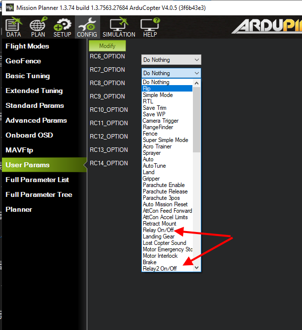
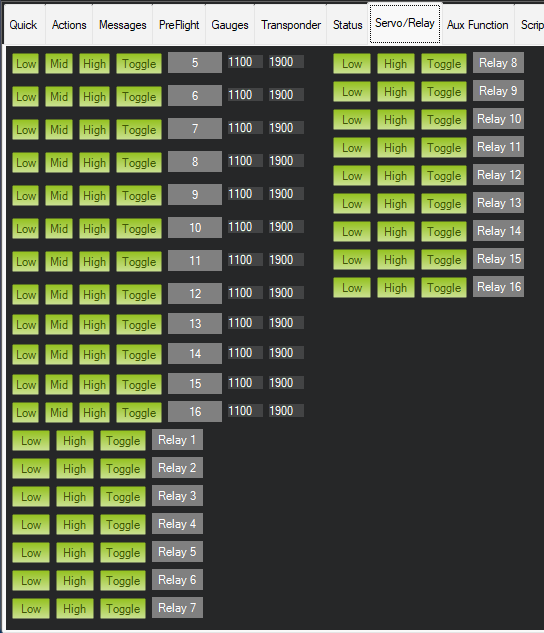

.. _common-relay:

============
Relay Switch
============

A "Relay" is an digital output pin on the autopilot that can be switched between 0 volts and either 3.3V or 5V, depending on the autopilot.  Similar to a servo it allows the autopilot to invoke some action from another device on the vehicle.  Up to 6 relays can be implemented.

The digital outputs that can be used as a relay are GPIOs. Normal servo/motor outputs can be configured for GPIO use. Occasionally, an autopilot will dedicate some pins for purely GPIO use as internal power controls, general purpose use,.etc. Consult the autopilot's documentation for pin number and information. In addition, it is possible to create a DroneCAN peripheral that has dedicated pins for relay use and these can be controlled as remote relays.

Relay Parameter Setup
=====================

Setup of a relay requires that which pin it controls be set, and its default state. In addition, some autopilot functions can be assigned to the relay.

Example below for the second Relay:

- :ref:`RELAY2_FUNCTION<RELAY2_FUNCTION>`: the control of the relay pin can be assigned as a normal relay, controlled by GCS or RC switch, or as the output of other features like parachute release, camera, brushed motor reversing relay, etc.. See table below for values. A non-zero value will show the remaining parameters after a parameter refresh.

===============    ========
RELAYx_FUNCTION    FUNCTION
===============    ========
0                   None
1                   Relay
2                   ICE Ignition (Plane Only)
3                   Parachute(Plane/Copter Only)
4                   Camera
5                   Bushed motor reverse 1 throttle or throttle-left or omni motor 1 (Rover Only)
6                   Bushed motor reverse 2 throttle-right or omni motor 2 (Rover Only)
7                   Bushed motor reverse 3 omni motor 3 (Rover Only)
8                   Bushed motor reverse 4 omni motor 4 (Rover Only)
9                   ICE Starter (Plane Only)
===============    ========

- :ref:`RELAY2_PIN<RELAY2_PIN>`: the autopilot designated GPIO pin to be used for the function. See  the :ref:`common-gpios` page for information on how to determine the pin numbers and setup for using autopilot servo/motor outputs. DroneCAN peripherals with remote relay outputs have pin numbers in the 1000 to 1015 range. Consult the peripheral's documentation for proper pin number to use.
- :ref:`RELAY2_DEFAULT<RELAY2_DEFAULT>`: After boot up, should the relay default to on or off. This only applies to RELAYx_FUNC "Relay" (1). All other uses will pick the appropriate default output state from within the controlling function's parameters.

.. note:: any change to relay pin setup requires a reboot to take effect.

Parameter setup is shown below using Mission Planner:

.. image:: ../../../images/Relay_SetupWithMP.png
   :target: ../_images/Relay_SetupWithMP.png

the RELAYx_PIN dropdown box shows some of the common pin numbers, but any appropriate number can be manually entered.

Pilot control of the relay
==========================

The relays can be controlled with the auxiliary switches. These can be set using the CONFIG/User Params screen as shown below:

.. note:: This screen allows setting RC5 thru RC14, but any RC channel (1-16) can have its ``RCx_OPTION`` (See :ref:`common-auxiliary-functions`) set as a RELAY, if its not already being used as another control function using the CONFIG/Full Parameter List screen.

Mission control of the relay
============================

Similar to a servo, the Relays can be activated during a mission using
the Do-Set-Relay mission command.  This is described on the :ref:`Copter Mission Command List wiki page <copter:mission-command-list_do-set-relay>`.

.. note:: In MAVLink the relays are numbered 0-5 instead of 1-6, so RELAY 0 is the first relay

Mission Planner control of the relay
====================================

Mission Planner allows the user to use buttons to set any of the first four relay pin's outputs low, high or set it low and briefly toggle it high using the DATA screen and the Servo/Relay sub-window, as show below:

.. note:: since this is using MAVLink control the first relay is labeled "Relay0" corresponding to RELAY1 in the parameters.
