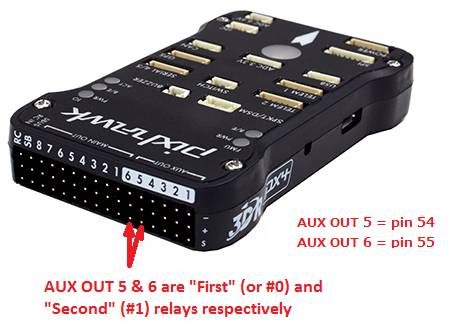

.. _common-relay:

============
Relay Switch
============

A "Relay" is an digital output pin on the autopilot that can be switched between 0 volts and either 3.3V or 5V, depending on the autopilot.  Similar to a servo it allows the autopilot to invoke some action from another device on the vehicle.  Up to 6 pins can be defined as relays.

Relay pins on IOMCU equipped autopilots
=======================================

Autopilots having an IOMCU (IO co-processor providing the "MAIN" PWM outputs) can have their AUX outputs configured as :ref:`GPIOs <common-gpios>` instead of Servo/Motor outputs and used as RELAY outputs.

For example, the Pixhawk default defines set up AUX OUT 5 (pin 54) and AUX OUT 6 (pin 55) as the "First" (or #0) and "Second" (or #1) Relays respectively.

The number of available Relays can be increased to a maximum of 6 by reducing the number of AUX pins used as :ref:`Servo <common-servo>` outputs.  This can be accomplished by reducing the ``BRD_PWM_COUNT`` from 4 to 2 or even 0.

.. note:: in firmware versions 4.2 and later, the method for setting a PWM/SERVO/MOTOR output to be a GPIO function is changed. Instead of ``BRD_PWM_COUNT`` being used, the individual ``SERVOx_FUNCTION`` parameter is merely set to "-1". If set to "0", it remains a PWM output, unassigned to a function, and outputs that output's trim value when board safety is not active. If the servo function is being "mirrored" to a remote device, as in the case of a DroneCAN or KDECAN ESC, then in order to change the autopilot board's corresponding output pin to be a GPIO, but allow the ``SERVOx_FUNCTION`` to still be assigned to the remote device, the :ref:`SERVO_GPIO_MASK<SERVO_GPIO_MASK>` parameter can be used to assign the board pin to be a GPIO without affecting the ``SERVOx_FUNCTION`` assignment for the remote device.

Likewise, on other controllers which have only PWM outputs and no IOMCU, setting ``BRD_PWM_COUNT`` to a lower number will free up their higher numbered outputs for use as GPIOs for controlling relays.

Defining the relay pins through the Mission Planner
===================================================

The First ~ Sixth relay pins can be setup most easily using the Mission Planner's CONFIG/Standard Params list as shown below after "Find"ing the term relay. Pin designations for several different autopilots are shown in the drop-down box. 

.. image:: ../../../images/Relay_SetupWithMP.png
    :target: ../_images/Relay_SetupWithMP.png

For other boards, you will need to find its hwdef.dat file `here <ttps://github.com/ArduPilot/ardupilot/tree/master/libraries/AP_HAL_ChibiOS/hwdef>`__ and determine the GPIO pin number listed beside its output number, as shown below:

.. image:: ../../../images/GPIO_numbers.png

In the above case, you could set the BRD_PWM_COUNT down to 8, freeing PWM9 and PWM10 for GPIO use, then use GPIO pin 58 (which is PWM output 9 on the board) for a relay pin. Use its GPIO number to set :ref:`RELAY_PIN <RELAY_PIN>` parameter in the above Mission Planner parameter entry ignoring the drop-down selections or, directly in the parameter itself, using the CONFIG/Full Parameter List screen.

.. note:: any change to relay pin setup requires a reboot to take effect.

Pilot control of the relay
==========================

The relays can be controlled with the auxiliary switches. These can be set using the CONFIG/User Params screen as shown below:

.. image:: ../../../images/User_params.png
    :target: ../_images/User_params.png

.. note:: This screen allows setting RC5 thru RC14, but any RC channel (1-16) can have its RCx_OPTION set as a RELAY, if its not already being used as another control function using the CONFIG/Full Parameter List screen.

Mission control of the relay
============================

Similar to a servo, the Relays can be activated during a mission using
the Do-Set-Relay mission command.  This is described on the :ref:`Copter Mission Command List wiki page <copter:mission-command-list_do-set-relay>`.

.. note:: In MAVLink the relays are numbered 0-5 instead of 1-6, so RELAY 0 is the first relay

Mission Planner control of the relay
====================================

Mission Planner allows the user to use buttons to set any of the first four relay pin's outputs low, high or set it low and briefly toggle it high using the DATA screen and the Servo/Relay sub-window, as show below:

