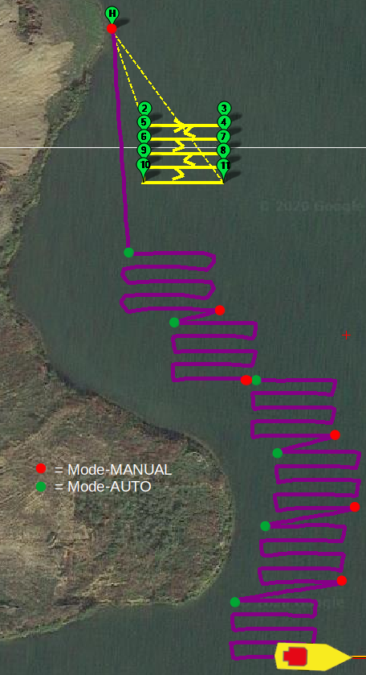
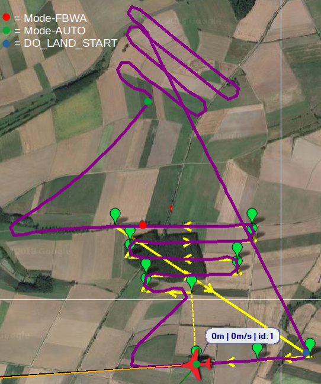
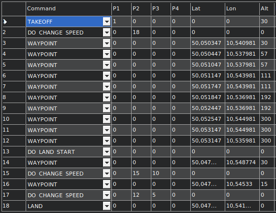

.. _common_relocate_mission:

==================
Relocate a Mission
==================

This page describes how to relocate an existing :ref:`Mission <common-planning-a-mission-with-waypoints-and-events>` temporarily when switching to  :ref:`AUTO-mode <plane:auto-mode>`.

Necessary Preparations
======================
3-position-switch
-----------------
To select the desired kind of Relocation, use a 3-position-switch (or any other similar programming) to generate a 1000/1500/2000mys output at an rc-channel of your choice.

 - 1000mys: NO RELOCATION
 - 1500mys: TRANSLATION
 - 2000mys: TRANSLATION + ROTATION

Set Parameter RCx_OPTION
------------------------
Set the ``RCx_OPTION`` Parameter of the selected channel to 93

Define a Mission
----------------
Define a 'north oriented' :ref:`Mission <common-planning-a-mission-with-waypoints-and-events>`. That means, when ROTATING, you can imagine that the vehicle is moving to north and having the MISSION on its nose.

The Relocation-Options
======================
Translation of Basepoint
------------------------
- The first Waypoint of a Mission that has location-information is used as the :ref:`Basepoint. <common_relocate_mission_basepoint>`
- That Basepoint is translated (and all Waypoints relative to that Basepoint) to the location of the vehicle where AUTO-mode is switched on.
- If ROTATION is selected, that Basepoint will be the center of rotation.

Additional Rotation by Heading
------------------------------
The amount of Rotation of the MISSION is the heading of the vehicle relative to north at the moment AUTO-mode is switched to. That means, e.g. when the vehicles heading is east, the Rotation is 90 deg clockwise.

Conditional Altitude Adaption
-----------------------------
The Target-Altitude of the MISSION is adapted according to current altitude of the vehicle when AUTO-mode is switched:

- If the current altitude is **lower or equal** than the target altitude of Basepoint, the target altitude of Basepoint is used - that means **no adaption** will be done.
- If the current altitude is **higher** than the target altitude of Basepoint, the complete **MISSION is lifted** by the altitude-difference.

Further Information
===================

- The Mission saved on FC is never touched - the Relocation is only temporary.
- Start- and Land-Commands and Commands after DO_LAND_START are never relocated.
- If the Parameter ``MIS_RESTART`` is set to 0 (Resume Mission), a further translation is earliest possible after a started Mission is reset or finished completely.
- A Relocation will only take place if the AUTO-mode is initiated by RC or GCS. That means, e.g. SOARING is working perfectly with RELOCATE_MISSION.

.. note::

   There is defined a Safety-Distance of [site wiki="plane"]50[/site][site wiki="copter"]10[/site][site wiki="rover"]5[/site] m between the current location of the vehicle and the Homepoint. 
   If the distance is lower than that value when switching to AUTO-mode, no translation/rotation will take place.

Example Use Cases
=================
Translation only
----------------

  Scanning the lake ground by a boat

Translation and Rotation
------------------------

  Placing the shape of a Mission with Start- and Land-Commands against the wind (Heading N/E -> Rotation 45°)

.. _common_relocate_mission_basepoint:

  The commands of the Mission above - item 3 is the Basepoint

