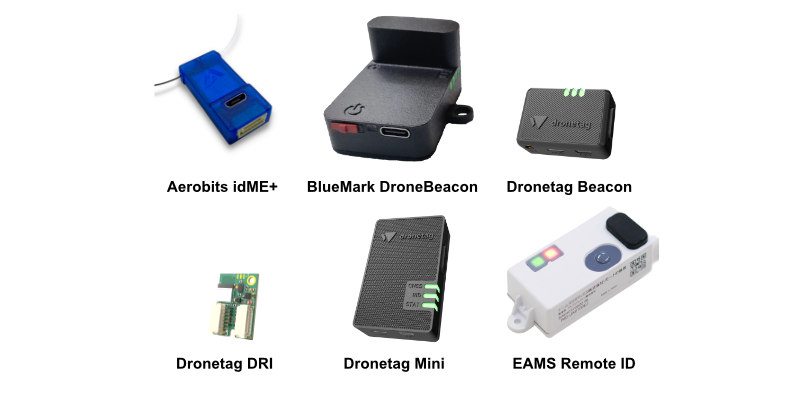
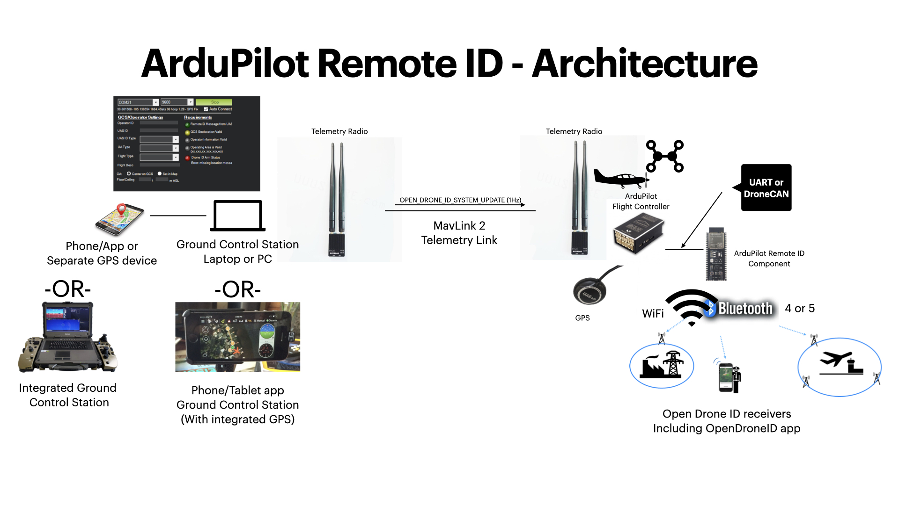
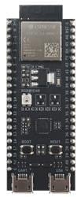

.. _common-remoteid:

[copywiki destination="copter,plane,rover"]

========================
Remote ID (aka Drone ID)
========================

Remote IDs are becoming a legal requirement in some countries.  Below is a list of devices compatible with ArduPilot

MAVLink enabled devices that connect to the autopilot:

- `Aerobits idME <https://www.aerobits.pl/product/idme/>`__
- `Dronetag Mini <https://dronetag.cz/en/products/mini/>`__

Stand-alone devices:

- `Aerobits idME+ <https://www.aerobits.pl/product/idme-remoteid/>`__
- `AEROENTRY remote id (Japan) <https://aeroentry.co.jp/info/product/228/>`__
- `BlueMark DroneBeacon <https://dronescout.co/dronebeacon-remote-id-transponder/>`__
- `Braveridge remote id (Japan) <https://www.braveridge.com/product/archives/49>`__
- `EAMS Robotics remote id (Japan) <http://www.eams-robo.co.jp/remoteid.html>`__
- `TEAD remote id (Japan) <https://www.tead.co.jp/product/remote-id/>`__

.. note:: US FAA Compliant devices are listed `here <https://uasdoc.faa.gov/listDocs>`__

OpenDroneID Compatible devices (support included in ArduPlane 4.0 and later)

- `BlueMark DroneBeacon MAVLink (EU, US) <https://dronescout.co/dronebeacon-mavlink-remote-id-transponder/>`__
- `Wurzbach Electronics <https://wurzbachelectronics.com/esp32-remote-id-development-set>`__
- `mRo RemoteID <https://store.mrobotics.io/product-p/m10049.htm>`__

OpenDroneID
===========

ArduPilot provides support for OpenDroneID in firmware versions 4.0 and later via MAVLink to an OpenDroneID compatible RemoteID module attached to either a serial port or DroneCAN port on the autopilot.

In order to provide tamper protection, a special autopilot firmware must be built and loaded on the autopilot which: enables this feature, prevents loading non-compliant firmware via GCS or normal uploaders, and provides further tamper-proofing.

For details on building firmware with OpenDroneID feature, see :ref:`dev:opendroneid` for details.

ArduRemoteID
============

ArduPilot also has developed firmware for  ESP32-S3 and C3 development boards for an OpenDroneID compatible Remote ID module for attachment by serial MAVLink connection or DroneCAN to the autopilot. A binary for flashing the board, along with instructions, is `available here <https://github.com/ArduPilot/ArduRemoteID>`__ .  Note, this firmware is rapidly evolving, so check for updates frequently. This device can be attached to the autopilot by USB, or serial, or DroneCAN (if external CAN transceiver is attached)

This firmware provides security signing and locking features for tamper resistance on the ArduRemoteID module:

- if the board has a USB programming port,access to that port, as well as the DroneCAN and MAVLink parameters, normally setup before shipment to customers can be locked, either temporarily or permanently, requiring a security key pair and secure commands to be used to alter those parameters.
- when in a locked state, the only way to update firmware is to use a secure WIFI web interface provided by the module using a public/private key pair.

See the detailed instructions in the `ArduRemoteID README.md file <https://github.com/ArduPilot/ArduRemoteID>`__.

End User Data Setup and Use
===========================

Mission Planner (must be the latest beta version) has a tab in its DATA view (Drone ID) for OpenDrone ID operation which allows connection of the required external serial GPS to obtain operation location, and setup tabs for UAS and Operator IDs, if required by your local jurisdiction. It also shows Remote ID status.
The ground station will also have status and pre-arm failure messages displayed if there are problems.

Other GCS are developing similar OpenDroneID setup wizards.

Testing
=======

See :ref:`OpenDroneID <dev:opendroneid>` for information on how to build firmware for OpenDroneID and to run the code on an autopilot to experiment with parameters,etc.

Android Application
-------------------

There is are android phone applications `OSM <https://play.google.com/store/apps/details?id=org.opendroneid.android_osm>`__  and `DroneScanner <https://play.google.com/store/apps/details?id=cz.dronetag.dronescanner>`__ in the Google Play Store that allows one to display RemoteID  Bluetooth and/or WIFI transmissions and vehicle data. 

Other references:

- `ArduPilot presentation on its OpenDroneID implementation <https://docs.google.com/presentation/d/1JgnqcIDn7rGCc8nl46AutO0p0ABODdCgBHFfxmKuUw4/edit#slide=id.p>`__
- The `OpenDroneID OSM <https://play.google.com/store/apps/details?id=org.opendroneid.android_osm>`__ android app can be used to check the Remote Id is working (`source code is here <https://github.com/opendroneid/receiver-android>`__)
- `OpenDroneID list of remote id devices for the US and EU <https://github.com/opendroneid/receiver-android/blob/master/transmitter-devices.md>`__

If you know if other available devices please `add a comment in this issue <https://github.com/ArduPilot/ardupilot_wiki/issues/4414>`__

Video Tutorial for OEMs Adding Remote ID to ArduPilot Systems
=============================================================

.. youtube:: Az8v4Kx4hS0
