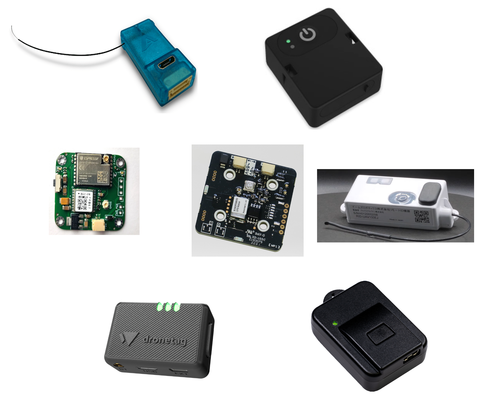

.. _common-remoteid:

[copywiki destination="copter,plane,rover"]

========================
Remote ID (aka Drone ID)
========================

Remote IDs are becoming a legal requirement in some countries.  Below is a list of devices compatible with ArduPilot

MAVLink enabled devices that connect to the autopilot:

- `Aerobits idME <https://www.aerobits.pl/product/idme/>`__
- `BlueMark DroneBeacon MAVLink (EU, US) <https://dronescout.co/dronebeacon-mavlink-remote-id-transponder/>`__ (support expected to be added in ArduPilot-4.3.0)
- `Dronetag Mini <https://dronetag.cz/en/products/mini/>`__

Stand-alone devices:

- `Aerobits idME+ <https://www.aerobits.pl/product/idme-remoteid/>`__
- `EAMS Robotics remote id (Japan) <http://www.eams-robo.co.jp/remoteid.html>`__
- `TEAD remote id (Japan) <https://www.tead.co.jp/product/remote-id/>`__

OpenDroneID
===========

ArduPilot provides support for OpenDroneID in firmware versions 4.2 and later via MAVLink to an OpenDroneID compatible module attached to either a serial port or DroneCAN port on the autopilot.

In order to provide tamper protection, a special autopilot firmware must be built and loaded on the autopilot which: enables this feature, prevents loading non-compliant firmware via GCS or normal uploaders, and provides further tamper-proofing.

An example of the required modifications for an OpenDroneID firmware version for an autopilot is shown for the `Cube Orange here <https://github.com/ArduPilot/ardupilot/tree/master/libraries/AP_HAL_ChibiOS/hwdef/CubeOrange-ODID>`__

ArduPilot also has developed firmware for  ESP32-S3 and C3 development boards for an OpenDroneID compatible ID module for attachment by serial MAVLink connection to the autopilot. A binary for flashing the board, along with instructions, is `available here <https://github.com/ArduPilot/ArduRemoteID>`__ .

This device can be attached to the autopilot by USB, or serial, or DroneCAN (if external CAN transceiver is attached)

.. image:: ../../../images/ESP32-S3.jpg
    :target: ../../_images/ESP32-S3.jpg

Testing
-------

See :ref:`OpenDroneID <dev:opendroneid>` for information on how to build firmware for OpenDroneID and to run the code on an autopilot to experiment with parameters,etc.

Android Application
-------------------

There is an `android phone application <https://play.google.com/store/apps/details?id=org.opendroneid.android_osm>`__ in the Google Play Store that allows one to display RemoteID  Bluetooth and/or WIFI transmissions and vehicle data. 

Other references:

- `ArduPilot presentation on its OpenDroneID implementation <https://docs.google.com/presentation/d/1JgnqcIDn7rGCc8nl46AutO0p0ABODdCgBHFfxmKuUw4/edit#slide=id.p>`__
- The `OpenDroneID OSM <https://play.google.com/store/apps/details?id=org.opendroneid.android_osm>`__ android app can be used to check the Remote Id is working (`source code is here <https://github.com/opendroneid/receiver-android>`__)
- `OpenDroneID list of remote id devices for the US and EU <https://github.com/opendroneid/receiver-android/blob/master/transmitter-devices.md>`__

If you know if other available devices please `add a comment in this issue <https://github.com/ArduPilot/ardupilot_wiki/issues/4414>`__
