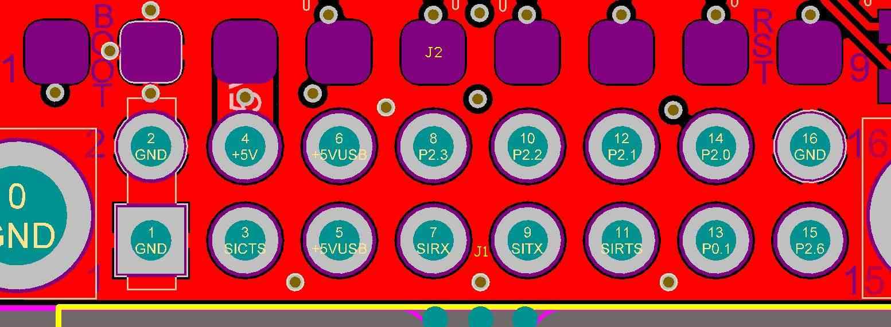

.. _common-rfd900:

==================
RFD900 Radio Modem
==================

The RFD900 Radio Modem is a high powered 900Mhz, ISM band radio modem
designed for long range serial communication.  Ranges of `15km and much higher have been reported <http://www.edgeresearchlab.org/our-projects/edge4-16-feb-2013/rfd900/>`__.

.. warning::

   These modems are high-power RF devices. It is suggested to
   provide separate +5 voltage to the modems. It is NOT suggested to power
   these modems directly from Autopilots telemetry port

.. image:: ../../../images/RFD900_telemetry_radio.jpg
    :target: ../_images/RFD900_telemetry_radio.jpg

Overview
========

The hardware is closed source but the `software is open <https://github.com/RFDesign/SiK>`__ and is based on the same
software that runs on the :ref:`SiK Radio <common-sik-telemetry-radio>`
meaning configuration and setup is extremely similar and these radios
can even be paired with a 900Mhz SiK radio (i.e. you may choose to use
one RFD900 on the ground, and a SiK radio in the aircraft).

Users can either use radio modem unit itself and acquire antennas,
cables as separate or by getting ready made telemetry sets as in below:

Frequencies available:

-  868Mhz ISM for EU area
-  900Mhz ISM for US area

Ready made sets are available:

Ready made set includes antennas, connecting cables for Pixhawk and APM
2.x autopilots, usb cable for ground unit. FTDI adapter, power
filtering, adapter PCBs and strong protective casing

-  `jDrones Store, RF900Mhz Set <http://store.jdrones.com/jD_RD900Plus_Telemetry_Bundle_p/rf900set02.htm>`__
-  `jDrones Store, RF868Mhz Set <http://store.jdrones.com/jD_RD868Plus_Telemetry_Bundle_p/rf868set02.htm>`__

The radio and antennas as separate units are available:

-  `RFDesign Store, 900Mhz <http://store.rfdesign.com.au/rfd-900p-modem/>`__
-  `RFDesign Store, 868Mhz <http://store.rfdesign.com.au/rfd-868-modem/>`__

Key Features
============

-  Long range >40km depending on antennas and GCS setup
-  2 x RP-SMA RF connectors, diversity switched.
-  1 Watt (+30dBm) transmit power.
-  Transmit low pass filter.
-  > 20dB Low noise amplifier.
-  RX SAW filter.
-  Passive front end band pass filter.
-  Open source firmware / tools, field upgradeable, easy to configure.
-  Small, light weight.
-  Compatible with 3DR / Hope-RF radio modules.
-  License free use in Australia, Canada, USA, NZ.

Status LEDs
===========

The radios have 2 status LEDs, one red and one green. The meaning of the
different LED states is:

-  Green LED blinking - searching for another radio
-  Green LED solid - link is established with another radio
-  Red LED flashing - transmitting data
-  Red LED solid - in firmware update mode

Interfaces
==========

-  RF : 2 x RP-SMA connectors
-  Serial: Logic level RS232 (+3.3v nominal, +5v tolerant)
-  Power: +5v, ~800mA max peak (at maximum transmit power)
-  GPIO: 6 General purpose IO (Digital, ADC, PWM capable).
-  Connect as follows:

Configuring using the Mission Planner
=====================================

Many users will not need to configure their radios! One case where you
might do so is when you use your vehicle with others — in which case you
will need to specify different radio channels (Net ID).

Mission Planner supports configuring your radios using a simple GUI
interface. For more information see :ref:`Configuring a Telemetry Radio using Mission Planner <common-configuring-a-telemetry-radio-using-mission-planner>`.

Support for different countries/regions
=======================================

It is very important that you configure your radios to comply with your
regional/country regulations for frequency, hopping channels and power
levels. For information on radio/region frequency ranges and settings,
see

:ref:`Telemetry Radio Regional Regulations <common-telemetry-radio-regional-regulations>`.

Discussion Forum
================

The best place to discuss these radios including set-up issues is on
`Seppo's RFD900 discussion on diydrones <http://diydrones.com/forum/topics/rfd900-new-long-range-radio-modem>`__.
