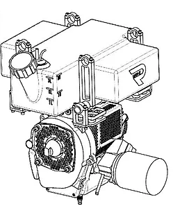
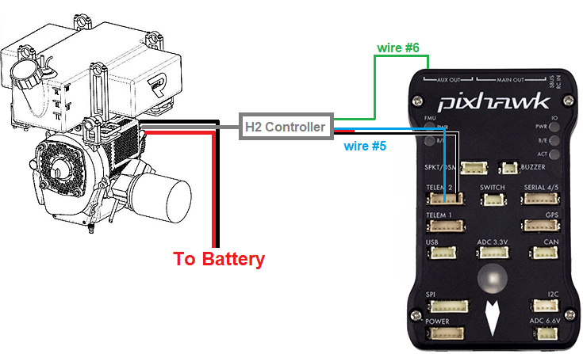
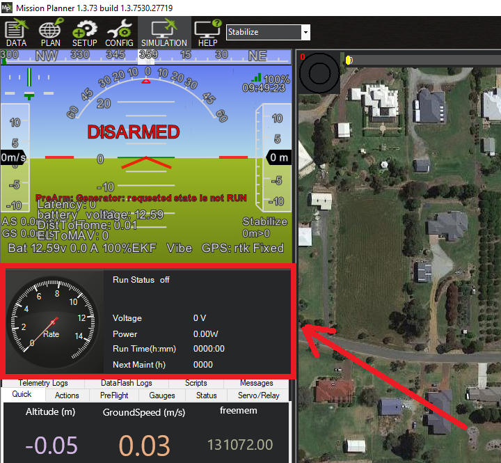

.. _common-richenpower-generator:

=====================
RichenPower Generator
=====================

The RichenPower H2 Hybrid and H2plus Hybrid generators can be used to extend a vehicle's flight time by charging the battery in flight.  Feedback from the generator including RPM, voltage and current allows the operator to monitor the system via the ground stations.

A transmitter's auxiliary switch can be used to control the generator's speed (stop, idle or run).

Where to Buy
------------

The H2 Hybrid and H2plus Hybrid generators can be purchased directly from the `RichenPower webstore <https://www.richenpower.com/shop>`__

Connection and Configuration
----------------------------

The generator's serial output ("#5") should be connected to one of the autopilot serial ports (e.g. Telem2)

The generator's PWM input ("#6") should be connected to one of the autopilot's servo outputs (e.g. "AUX OUT1", aka servo output9)

Connect to the autopilot with a ground station and set the following parameters and then reboot the autopilot:

- :ref:`GEN_TYPE <GEN_TYPE>` = 3 (RichenPower)
- :ref:`SERIAL2_PROTOCOL <SERIAL2_PROTOCOL>` = 30 (Generator)
- :ref:`SERIAL2_BAUD <SERIAL2_BAUD>` = 9 (9600)
- :ref:`RC9_OPTION <RC9_OPTION>` = 85 (Generator)
- :ref:`SERVO9_FUNCTION <SERVO9_FUNCTION>` = 42 (Generator Control)

Controlling the Generator
-------------------------

Please refer to the generator manual for operating instructions but in short:

- The generator can only be started by pulling the ripcord
- The transmitter's auxiliary switch can change the speed of the generator:

    - Low position stops the generator
    - Middle position for idle
    - High position for run (to charge the battery)

Start-up procedure:

- Connect battery to generator
- Connect battery for autopilot
- Start Ground Station and connect telemetry

  - H2 generator light should be off
  - GCS HUD should display, "PreArm: Generator: requested state is not Run"

- Move auxiliary switch to high position to switch generator to "run"

  - H2 relay should click
  - H2 Light should be green
  - GCS HUD should display, "PreArm: Generator: warming up (0%)"
  - If using Mission Planner, the generator display should show "Run Status off"

- Check motor is primed by manually pushing the plastic bulb to pump petrol from the tank into the carburetor
- Pull ripcord to start generator

   - Motor should run at low RPM
   - If using Mission Planner, the generator display should show "Run Status WarmingUp"
   - GCS HUD should display, "PreArm: Generator: warming up (100%)"
   - If using Mission Planner, the generator display should show "Run Status Generating"
   - Generator should increase to full throttle 

- Arm and takeoff

Shutdown procedure:

- Move auxiliary switch to low position to switch generator to "off"
- If using Mission Planner, the generator display should show "Run Status Idle"
- Generator should shut down after about 30 seconds
- If using Mission Planner, the generator display should show "Run Status Off"
- Unplug battery from generator

Monitoring from the GCS
-----------------------

Mission Planner has a generator monitor window that appears as soon as GENERATOR MAVLink messages arrive.

Vibration isolation
-------------------

The high vibration from the generator means that :ref:`vibration isolation <common-vibration-damping>` is critical
