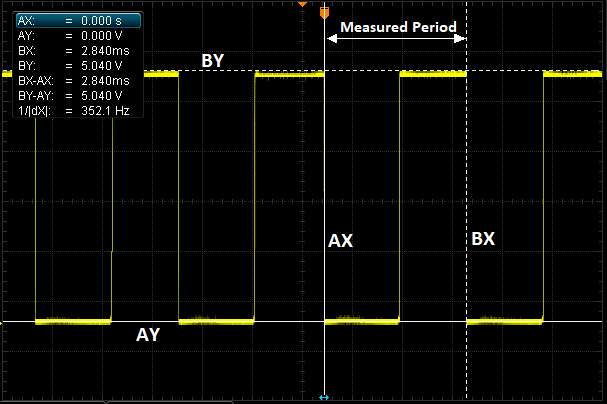

.. _common-rpm:

===============
RPM Measurement
===============

ArduPilot supports the use of numerous types of RPM sensors.  They are commonly used in traditional helicopters to measure main rotor speed and motor/engine RPM.  
RPM sensors are mandatory for those who wish to use the closed-loop throttle governor functionality available to helicopters.  Additionally, vehicles that employ 
2-stroke and 4-stroke Internal Combustion Engines (ICE) use RPM sensors are for ignition timing.  The same rpm sensor can be used to log engine RPM in ArduPilot.

Common types of RPM sensor that can be used in ArduPilot:

- Hall effect
- ESC Telemetry
- Electrical commutation
- Optical

in addition, a pseudo RPM sensor which reports the center frequency of the dynamic harmonic notch filter is also an option.

Any RPM sensor that outputs a step-change in voltage as a function of RPM can be used with ArduPilot.  A brief explanation of how the RPM library works is given.  This is followed by 
instructions for how to setup the different types of RPM sensor.  Up to two RPM sensors can be used.

How the RPM Library Works (TYPE = AUXPIN)
=========================================

The RPM library in ArduPilot monitors the voltage of the designated signal pin. The image below shows a typical output voltage of an RPM sensor:

As it can be seen the voltage oscillates between 0V and 5V.  The voltage drops are either caused by a magnet passing a hall effect sensor, or are the output of a 
different type of sensor(eg. optical).  When a 'falling edge' is detected the time is stored.  When the voltage drops again the time difference between the falling edges can be 
calculated.  The time between the voltage drops is proportional to the RPM.  The scaling value that correlates the time between the falling edges and the RPM is 
dependent upon the setup and device being used.  Device-specific advice on scaling parameters is given later in this guide. 

In this example, the output is from an electrical commutation sensor, connected to a motor with 4 poles.  The RPM can be calculated as follows:

Where dt is the time between falling edges (in seconds) and S is the scaling factor.  In this example, 4 poles means that there will be 4 wave periods per revolution.  
Hence, the scaling factor would be 0.25 and the resulting RPM would be 5282.  This is a somewhat simplistic view of how ArduPilot calculates the RPM, but it illustrates 
the key underlying concepts.

Hall Effect Sensors
===================

**Hardware Setup**

Perhaps the most often used, hall effect sensors change their output voltage in the presence of a sufficiently strong magnetic field.  A magnet needs to be fixed to 
the rotating component that is to be measured.  For helicopters, this requires that a hole or recess is made in the autorotation tail drive wheel and the magnet 
glued in place (as in the image below).  For ICE the magnet will be mounted in the output shaft.

The polarity of the magnet matters.  Only one pole will create the change in voltage required.  To ensure that the magnet is affixed in the correct orientation 
either an oscilloscope or the `Arduino sketch found here <https://github.com/ArduPilot/ardupilot/blob/master/libraries/AP_RPM/examples/ArduinoHallEffectDebug.ino>`__ 
can be used.  If using an oscilloscope, this guide assumes that you have sufficient knowledge to be able to set up this test.  If using the Arduino sketch method 
in the link provided, a comprehensive set of instructions are commented at the beginning of the sketch.  An Arduino Uno was used when writing and testing the sketch 
and is recommended.

.. note::

   Most hall effect sensors that are intended for use with radio control vehicles will require some additional modification.  Often, they will need an additional 
   pull-up resistor to be added between the Vcc and signal lines.  In some cases, their Vcc, gnd, and signal lines won't match the colour coding of the wire.  Hence,
   it is advisable to experiment with the provided Arduino sketch and a bread board to be sure of the sensor pin orientation.

For a reliable RPM signal the hall effect pick-up should be mounted very close to the magnet.  The image below shows an example mounting on a helicopter.

.. image:: ../../../images/Installed_Hall_Effect_Sensor.jpg
    :target: ../_images/Installed_Hall_Effect_Sensor.jpg
    :width: 240px

The three wires should then be plugged into the autopilot.  This is commonly done using a standard servo plug.  Ground to Gnd, Vcc to 5V, and the signal line 
needs to be attached to a GPIO pin.  On most smaller boards this will be any one of the PWM pins on the servo rail.  On a Pixhawk this must be one of the AUX ports.  
For reasons explained later it is recommended to use the highest number pin first.  E.g. AUX 6 on a Pixhawk/Cube or PWM 9 on a MatekF405-Wing.

**Parameter Setup**

First the board needs to be configured to allow PWM pins to be set for GPIO.  This is done using the parameter ``BRD_PWM_COUNT`` .  Reduce the PWM count to free up a pin to be used for GPIO.  On non-Pixhawk boards the PWM count will include all PWM outputs.  On Pixhawk boards this parameter only affects AUX pins.  Write the parameter and reboot the autopilot.

.. note:: in firmware versions 4.2 and later, the method for setting a PWM/SERVO/MOTOR output to be a GPIO function is changed. Instead of ``BRD_PWM_COUNT`` being used, the individual ``SERVOx_FUNCTION`` parameter is merely set to "-1". If set to "0", it remains a PWM output, unassigned to a function, and outputs that output's trim value when board safety is not active. If the servo function is being "mirrored" to a remote device, as in the case of a DroneCAN or KDECAN ESC, then in order to change the autopilot board's corresponding output pin to be a GPIO, but allow the ``SERVOx_FUNCTION`` to still be assigned to the remote device, the :ref:`SERVO_GPIO_MASK<SERVO_GPIO_MASK>` parameter can be used to assign the board pin to be a GPIO without affecting the ``SERVOx_FUNCTION`` assignment for the remote device.

Now the RPM library must be enabled. In the following sections, we will use the second instance of RPM sensor for parameter examples.

Set the parameter :ref:`RPM2_TYPE<RPM2_TYPE>` to 1 for a GPIO pin based sensor.  Write the parameter to ArduPilot then refresh/fetch the 
parameters.  You will now find that the instance of RPM (e.g. RPM2) has a number of other parameters available for editing, allowing you to complete your setup.

Now the autopilot needs to be told which pin to find the RPM signal on.  To do this you will need to find the pin number in the hwdef.dat file for your
board.  These can be found `here <https://github.com/ArduPilot/ardupilot/tree/master/libraries/AP_HAL_ChibiOS/hwdef>`__.  Within the file for your board you will 
need to find where the GPIO(*) definition is.  The pin must have a timer assigned. Normally, these will be PWM servo/motor outputs that have been designated as a GPIO instead of PWM output. See :ref:`common-gpios`, for more information.

for example, if we have set AUX port 5 to a GPIO and its GPIO numbering corresponds to pin 54, 54 must be entered into the parameter :ref:`RPM2_PIN<RPM2_PIN>` for the RPM sensor.

The parameter :ref:`RPM2SCALING<RPM2_SCALING>` will correspond to the number magnets used.  Most commonly only one magnet is used and this parameter is set to 1.  Some installations use 
2 magnets, 180 degrees out of phase.  In this case this parameter should be set to 0.5.

Initially, it is recommended to leave the parameters :ref:`RPM2_MIN<RPM2_MIN>`, :ref:`RPM2_MAX<RPM2_MAX>`, and :ref:`RPM2_MIN_QUAL<RPM2_MIN_QUAL>` as their defaults.  If an RPM signal exceeds any of these limits then the value reported in the ground station and the logs is zero.  Therefore, only adjust these values once you have confirmed that your RPM sensor is working as expected, otherwise it can make it more difficult to debug if nothing is getting reported.

.. note::

    If using two RPM sensors the min, max, and quality parameters are valid for both of the RPM sensors.  In this case be sure to set these values to encompass the 
    RPM ranges of both sensors.

Finally, to test that everything is working, you can use the rpm1/rpm2 live feeds in the quick tab in mission planner or the live tuning window.  Alternatively the 
RPM history can be reviewed in the logs.

ESC Telemetry - Average Motor RPM
=================================

The RPM library can also be used to setup an 'RPM sensor' that computes and logs the average RPM for selected motors on the vehicle that are controlled by BLHeli_32 or BLHeli_S capable ESCs.  First the ESC telemetry will need to be setup.  See :ref:`BLHeli Telemetry<blheli32-esc-telemetry>` for details on how to do this.  Once complete set ``RPMx_TYPE`` to 5 and write the parameters to ArduPilot.  Then refresh/fetch the parameters.  You will find a number of additional parameters are now available for that instance.  Find and set ``RPMx_ESC_MASK`` to add which ESC channels you want to be included in the average. For example for the second RPM instance:

:ref:`RPM2_ESC_MASK<RPM2_ESC_MASK>` is a bitmask, with each bit corresponding to a channel. If you wanted the average RPM for motors 1 to 4 you would set :ref:`RPM2_ESC_MASK<RPM2_ESC_MASK>` = 1 + 2 + 4 + 8 = 15.

Electrical Commutation Sensors
==============================

Electrical commutation RPM sensors can be added retrospectively using something like the Hobbywing brushless RPM sensor.  Some ESCs, such as the Castle Creations Edge 
series, that have an auxiliary output, can be configured to output a pulse per commutation.

For clarification, this is not the same as the RPM that can be passed 
via serial telemetry with ESCs.  For information on how to set up RPM reporting with capable ESCs, see the :ref:`ESC Telemetry<blheli32-esc-telemetry>`.

The setup for electrical commutation RPM sensors is much the same as hall effect sensors, so the steps above are applicable.  The only difference is the scaling value 
to be entered in the :ref:`RP2_SCALING<RPM2_SCALING>` parameter.  Now, the scaling value is a function of the number of poles in the motor and should be the reciprocal of the number of 
poles.  E.g. A 4 pole motor will need a scaling value of 0.25.

Optical Sensors
===============

Again, the setup of optical sensors is much the same as the hall effect sensor.  The only difference is the scaling value.  :ref:`RPM2_SCALING<RPM2_SCALING>` should be set to be the reciprocal 
of the number of reflective obstacles that pass the sensor in a single rotation.

Harmonic Notch Center Frequency
===============================

If ``RPMx_TYPE`` = 4, then the center frequency of the harmonic notch is reported.  See :ref:`common-imu-notch-filtering` for how this value is obtained.

Heli Magnetic Sensors Known to Work with ArduPilot
==================================================

- `Align Magenetic Sensor <https://modelhelicopters.co.uk/products/align-beastx-governor-sensor-hegbp002t?variant=42819003220168>`__
- `HoTT RPM Magnetic Sensor <https://www.controlhobbies.com/Telemetry-magnetic-sensor-to-measure-RPM-33616.html>`__
- `SMModelBau Magnetic Sensor <https://www.sm-modellbau.de/magnetischer-Drehzahlsensor-fuer-UniTest-2-UniLog-1-2>`__

