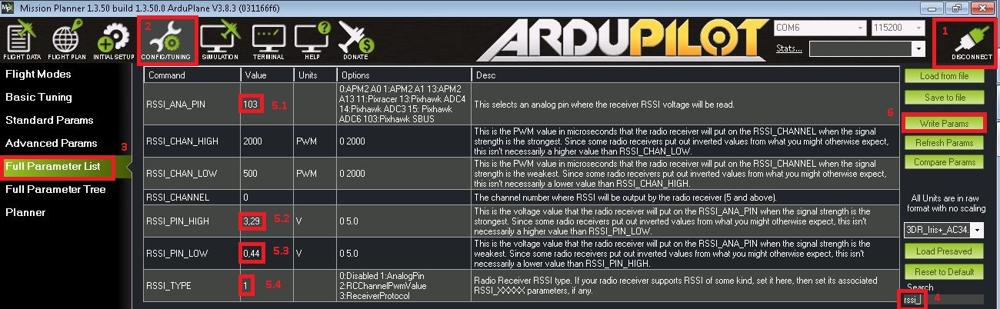
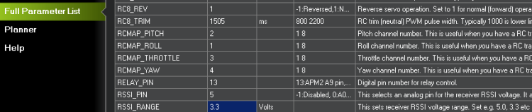
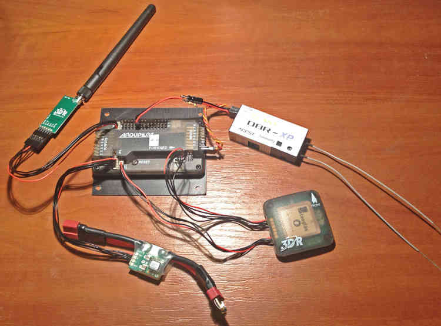
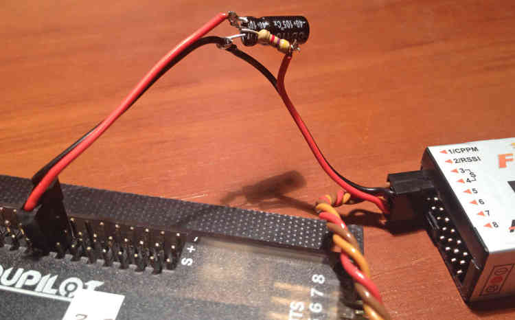
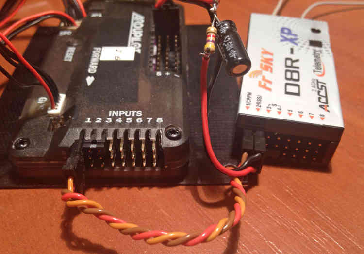

.. _common-rssi-received-signal-strength-indication:

==========================================
Received Signal Strength Indication (RSSI)
==========================================

This article shows how to get the Received Signal Strength Indication
(RSSI) to your flight controller.

.. image:: ../../../images/mp_hud_rssi.jpg
    :target: ../_images/mp_hud_rssi.jpg

How to visualize RSSI value in the artificial horizon of Mission Planner
========================================================================

If the RSSI reading is not displayed in your artificial horizon yet,
  - Open Mission Planner Software.
  - Goto "FLIGHT DATA" menu [1].
  - "Right click" within artificial horizon window [2].
  - Choose "User Items".
  - Check "rxrssi" checkbox [3] and close "Display This" window [4].
  - "rxrssi" should be displayed in your artificial horizon now [2].
  
.. image:: ../../../images/MissionPlanner_RSSI_DisplayRxRSSI.JPG
    :target: ../_images/MissionPlanner_RSSI_DisplayRxRSSI.JPG

How to utilize Futaba S.BUS2 "Frame Error Rate" information to be used as RSSI in your flight controller
========================================================================================================

The **Frame Error Rate (FER)** indicates, if the receiver has trouble decoding a received data package sent by the transmitter. The value is similar to RSSI. 

The FER information is implemented within the **Futaba S.BUS2** datastream. It is not transmitted as a continuous value, but is sent in 25% resolution.

How to setup the Hardware
-------------------------

To extract the FER from the **Futaba S.BUS2** datastream, a `S.BUS2 to Analog DC voltage converter <http://shop.tje.dk/catalog/product_info.php?products_id=43>`__ can be used.

A basic setup using a **Futaba R7008SB** receiver and an additional S.BUS2 GPS Multi Sensor is shown in the image below. A similar setup should work using a **Futaba R7003SB** receiver.
   
   
.. note::

   To enable **S.Bus and S.Bus2 protocol** on your Futaba receiver, you have to set your **R7008SB** receiver to **"Mode B"** or **"Mode C"** and your **R7003SB** receiver to **"Mode A"**. Check out your `R7008SB <http://manuals.hobbico.com/fut/r7008sb-manual.pdf>`__ or `R7003SB <http://manuals.hobbico.com/fut/r7003sb-manual.pdf>`__  user manual for further details.

.. image:: ../../../images/SBUS2_2_analog_converter.png
    :target: ../_images/SBUS2_2_analog_converter.png

How to configure flight controller RSSI parameters in Mission Planner using Analog Input 
----------------------------------------------------------------------------------------

To setup the RSSI parameter in your flight controller,
  - Connect your flight controller hardware via USB to your computer and open Mission Planner Software.
  - Connect your flight controller using the "CONNECT" button [1].
  - Goto "CONFIG/TUNING" menu [2].
  - Goto "Full Parameter List" tab [3].
  - Goto "Search" input field and enter "rssi_" [4].
  - Choose an input pin on your flight controller where you want to input the analog voltage output of your converter [5.1]. In this example we set "RSSI_ANA_PIN" to "103". This means, analog DC voltage output of the converter must be connected to "SBUS" input pins of the flight controller as shown in the image above.
  - Enter your calibration voltages for "RSSI_PIN_HIGH" [5.2] and "RSSI_PIN_LOW" [5.3] according to the Note shown below. 
  - Set "RSSI_TYPE" to "1" [5.4]. This means, your flight controller is set to accept an analog voltage on the input pin you set in step [5.1].
  - Write the parameters to your flight controller by pressing the "Write Params" button [6].
  - Note: All other "RSSI_*" parameters shown in the list are not used by the flight controller when "RSSI_TYPE" is set to "1". They can be ignored.

.. note::

   The converter is designed to provide a max. voltage output of 3.3 V DC when 100% of the frames are good, and appr. 0.4 V DC when connection is lost or receiver is in failsafe. To get best results, it is best practice to calibrate the output voltages of the converter at "full reception" and "Tx off" using a voltmeter. In general the converter should output the following DC voltage:
  - **Rx in failsafe** --> 12 % of max. **VDC out ~ 0.4 V DC**
  - Rx received <= 25 % good frames --> 34 % of max. VDC out ~ 1.1 V DC
  - Rx received <= 50 % good frames --> 56 % of max. VDC out ~ 1.85 V DC
  - Rx received <= 75 % good frames --> 78 % of max. VDC out ~ 2.6 V DC
  - **Rx received <= 100 % good frames** --> 100 % of max. **VDC out ~ 3.3 V DC**
  
How to setup RSSI Feedback to your Futaba FASSTest Telemetry capable transmitter
--------------------------------------------------------------------------------

In addition to the S.BUS2 to Analog conversion, the `converter <http://shop.tje.dk/catalog/product_info.php?products_id=43>`__  is looping back the FER / RSSI value to the S.BUS2 datastream simultaniously. This feature enables all users of **FASSTest Telemetry capable transmitters** to setup a **Telemetry RSSI Feedback** as an option. Moreover an **audible and/or vibration alarm** can be set to notice when received signal quality is degrading.

To use this feature, the **"FASSTest-14CH" protocol** has to be enabled in your transmitter.

The following screenshots show the setup procedure for a Futaba T14SG. Other FASSTest capable transmitters have to be setup in a similar way:
  - Enter the "LINKAGE MENU" by double clicking the "LNK" button [1].
  - Goto "SYSTEM" and press "RTN" [2].
  - Within "SYSTEM" menu, goto the protocol selection tab and choose "FASSTest-14CH" protocol [3] .
  - In case you changed the protocol, eventualy you have to re "LINK" your receiver to your transmitter [4]. 
  - Ensure, that TELEMETRY is set to "ACT" [5].

.. image:: ../../../images/FASSTest_EnableProtocol.png
    :target: ../_images/FASSTest_EnableProtocol.png

Due to the fact that Futabas Telemetry Sensors can't be renamed, the transmitted FER / RSSI value appears as a simple **"temperature sensor"**, wheras "0°C" means "Rx in failsafe" and "100°C" means "Rx received <= 100 % good frames".

The `converter <http://shop.tje.dk/catalog/product_info.php?products_id=43>`__ is reporting the current FER / RSSI value into Slot 1 of S.Bus2 Telemetry datastream.

In order to decode the FER / RSSI feedback of the converter, a standard "TEMP125" Sensor has to be assigned to Slot 1 of your transmitter:
  - Enter the "LINKAGE MENU" by double clicking the "LNK" button.
  - Show page 2 of the menu by pressing "S1" [1], goto "SENSOR" and press "RTN" [2].
  - Goto Slot 1 tab and press "RTN" [3].
  - Choose "TEMP125" Sensor and confirm the selection by pressing "RTN" two times [4]. 
  - Slot 1 should be assigned with a "TEMP125" Sensor now [5]. If so, leave the menu by pressing "HOME/EXIT" button two times.

.. image:: ../../../images/FASSTest_AdressTelemetrySensorToSlot.png
    :target: ../_images/FASSTest_AdressTelemetrySensorToSlot.png

To display the FER / RSSI value and to trigger an alarm, your TELEMETRY MONITOR has to be configured: 
  - Enter the "TELEM.MONI" menu by pressing the "HOME/EXIT" button [1].
  - Goto "RECEIVER" and press the "RTN" button [2].
  - Goto DISPLAY tab [3] and choose "3" [4].
  - Goto "SENSOR" [5] and choose "TEMP125" [6] and confirm with "RTN".
  - Press "HOME/EXIT" to return to "TELEM.MONI" display and to see the RSSI / FER value as a "Temperature" [7].
  - To set alarms, goto "TEMP" [7] and press "RTN". For alarm setup please refer to your Tx user manual.
  - As soon as you connect your receiver with power, the FER / RSSI value will show up as well as the standard received signal quality indicator [8].
  - The converter can be mixed with other telemetry devices as long as they are assigned to Slot 2 to Slot 31 [9].
  
.. image:: ../../../images/FASSTest_SetupTelemetryDisplay.png
    :target: ../_images/FASSTest_SetupTelemetryDisplay.png
 
Provide RSSI from FrSky receiver to APM.
========================================

-  Select the input pin with the **RSSI_PIN** parameter.
-  However some of receivers such as FrSky D8R-XP output 0 - 3.3 V.
-  For that reason I've added new parameter: **RSSI_RANGE**.
-  This was also a requested issue
   previously: **https://github.com/ArduPilot/ardupilot/issues/648**
-  When the RSSI_RANGE parameter is set to your radio's maximum RSSI
   voltage the RSSI **rxrssi** is shown in the range 0-100.
-  The ability to set the RSSI_RANGE  parameter has been added to
   Mission Planner in the Full Parameter List:

Complete System with RSSI addition
==================================

RSSI Filter
===========

**A 4.7k resistor and 10uF capacitor are used to filter out the pulses
from the receiver's RSSI output.**

RSSI Connections
================

RSSI embedded in PWM from UHF systems (Pixhawk)
===============================================

Both EZ-UHF and OpenLRS have the option of embedding RSSI into a PWM channel, saving you from having to add filters, etc.
You can use any channel from channel 5 and up, but keeping the on channel 9 or above will keep your regular servo channels free.

Set up your UHF system to embed the RSSI into the desired channel and then change the following parameters:

- RSSI_ANA_PIN : 103
- RSSI_TYPE    : 2 
- RSSI_CHANNEL : Your selected channel from above.

**Developed and illustrated by Lukasz - Thank You - Hope this helps.**
