.. _common-rssi-received-signal-strength-indication:

==========================================
Received Signal Strength Indication (RSSI)
==========================================

This article shows how to get the Received Signal Strength Indication
(RSSI) to your autopilot.

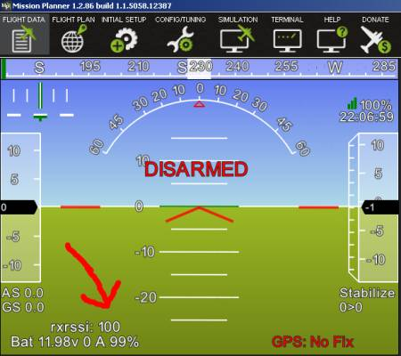

Setting up RSSI on your autopilot
=================================

RSSI can be specifically set up by a collapsible set of parameters. By default, it is required to first set 
 :ref:`RSSI_TYPE<RSSI_TYPE>`  according to how the RC receiver's signal strength indication will be fed to the autopilot:

+---+--------------------+---------------------------------------------------------------------------------------------+
| Value                  | Function                                                                                    |
+===+====================+=============================================================================================+
| 0 | Disabled           | no RSSI used                                                                                |
+---+--------------------+---------------------------------------------------------------------------------------------+
| 1 | AnalogPin          | signal strength indicated by a fixed voltage (0 - 3.3 or 5V) fed to an analog (ADC) pin     |
+---+--------------------+---------------------------------------------------------------------------------------------+
| 2 | RCChannelPwmValue  | signal strength indicated by a dedicated channel's PWM value,                               |
|   |                    | optionally embedded into a sum signal (cPPM / SBus)                                         |
+---+--------------------+---------------------------------------------------------------------------------------------+
| 3 | ReceiverProtocol   | supports RSSI via dedicated receiver protocols like SUMD or ST24                            |
+---+--------------------+---------------------------------------------------------------------------------------------+
| 4 | PWMInputPin        | allows to specify a GPIO pin to read PWM type RSSI input                                    |
+---+--------------------+---------------------------------------------------------------------------------------------+

After setting :ref:`RSSI_TYPE<RSSI_TYPE>` to a value other than 0 you will have to save and refresh your parameters to uncollapse a set of subordinate parameters that allow to further specify RSSI handling. 

There are four basic options for feeding RSSI to your autopilot:

 :ref:`RSSI_TYPE<RSSI_TYPE>` = 1  Analog voltage type RSSI fed to a dedicated pin
  :ref:`RSSI_ANA_PIN<RSSI_ANA_PIN>`  specifies the pin used to read RSSI voltage. This parameter defaults to the correct pin number on most boards when using current chibios firmware.
 
  :ref:`RSSI_PIN_HIGH<RSSI_PIN_HIGH>`  voltage received on the :ref:`RSSI_ANA_PIN<RSSI_ANA_PIN>` when the signal is the strongest. 
 
  :ref:`RSSI_PIN_LOW<RSSI_PIN_LOW>`  voltage received on the :ref:`RSSI_ANA_PIN<RSSI_ANA_PIN>` when the signal is the weakest.

 :ref:`RSSI_TYPE<RSSI_TYPE>` = 2  PWM Channel type RSSI embedded in a collective PPM / sum signal (sBus)
  :ref:`RSSI_CHANNEL<RSSI_CHANNEL>`  Channel number the radio receiver will use to embed RSSI if collective / sum signal is used (channel 5 and up).
 
  :ref:`RSSI_CHAN_HIGH<RSSI_CHAN_HIGH>`  PWM value the radio receiver will output when the signal is the strongest.
 
  :ref:`RSSI_CHAN_LOW<RSSI_CHAN_LOW>`  PWM value the radio receiver will output when the signal is the weakest.

 :ref:`RSSI_TYPE<RSSI_TYPE>` = 3  digital receiver protocols' signal quality or dropped packets information (SUMD / ST24 /FPort)
 Scaled internally, no further adjustments required.
 

 :ref:`RSSI_TYPE<RSSI_TYPE>` = 4  PWM type RSSI fed to a dedicated GPIO pin
  :ref:`RSSI_ANA_PIN<RSSI_ANA_PIN>`  Specifies the GPIO pin to read PWM type RSSI from. On boards with IOMCU these are the AUX pins that can be used as PWM output by default or alternatively set to be used as GPIO using the  :ref:`BRD_PWM_COUNT<BRD_PWM_COUNT>`  parameter.
 
  :ref:`RSSI_CHAN_HIGH<RSSI_CHAN_HIGH>`  PWM value the radio receiver will output when the signal is the strongest.
 
  :ref:`RSSI_CHAN_LOW<RSSI_CHAN_LOW>`  PWM value the radio receiver will output when the signal is the weakest.

.. note::
    Some radio receivers output inverted RSSI values (lowest voltage / PWM on best reception), so _HIGH parameters may actually be set to lower values than corresponding _LOW parameters for correct internal scaling to 0 - 100%.

.. note::
    To read analog voltage type RSSI,  :ref:`RSSI_ANA_PIN<RSSI_ANA_PIN>`  can be set to any free ADC pin available. On pixhawk / cube type boards, this includes the sBus out / RSSI input pin (103). When using dedicated ADC pins, the corresponding pin number usually matches the ADC1 channel used on that pin. See the DMA1 map in the `resepective processor's alternative function table <https://github.com/ArduPilot/ardupilot/tree/master/libraries/AP_HAL_ChibiOS/hwdef/scripts>`__ for further reference.

Displaying the RC receiver's RSSI value in MissionPlanner's HUD
===============================================================

Once you have set up RSSI correctly on your autopilot, the corresponding values will be sent to your groundstation within the telemetry stream and can be displayed on your GCS. Additionally, your RC receiver's RSSI will be logged and can be displayed on your onboard or standalone OSD.

To display RC receiver's RSSI on MP's HUD:

- Open Mission Planner and connect to the autopilot
- On the Flight Data screen, right-mouse-button click on the HUD and select "User Items"
- On the "Display this" window that appears, check "rxrssi"

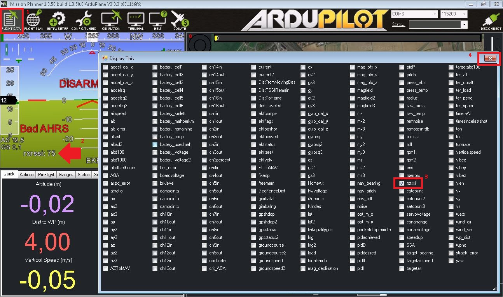

.. note::
    It is crucial to select  rxrssi  to display the RC link's rssi, while the items  rssi  and  remrssi  are used to display a radio modem's ground- and remote-transceiver's signal strength indication.

Connection examples
===================

Below are examples of typical RC receiver RSSI connection schemes:

RSSI embedded in a collective PPM / sum signal's channel
--------------------------------------------------------

It is common practice to feed all RC channels from your RC receiver to your autopilot using a cPPM or sBus type sum signal on a single signal wire. Most UHF type RC systems like EZUHF, OpenLRS, Crossfire or DragonLink support embedding RSSI into a dedicated channel within this collective / sum signal stream. As per ArduPilot default channels 1-4 are used as input for primary control (roll, pitch, throttle, yaw), any channel number above 4 can be used to embed RSSI. Usually, these systems use a GUI to assign RSSI to a dedicated channel slot on your RC receiver, or have it set to a standard channel by default. See your respective system's user manual for reference.

If there is an existing RC receiver connection to your autopilot, no additional wiring is required for using embedded RSSI:

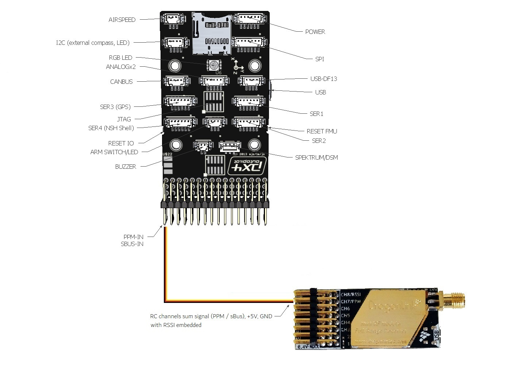

The example below shows how to assign channel 5 to embed RSSI on a DragonLink RC receiver:

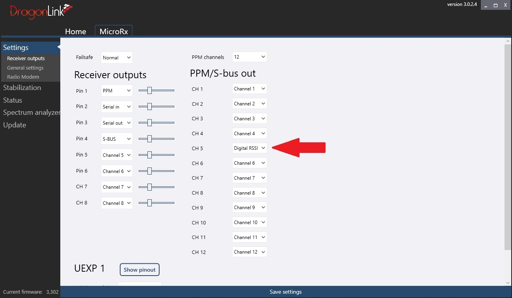

RSSI values will be output both within the PPM stream on signal pin 1 as well as within the sBus stream on pin 4. Either can be fed to your autopilot's RCInput pin.

Now set your RSSI parameters accordingly:

 :ref:`RSSI_TYPE<RSSI_TYPE>`  = 2 (requires parameter reload if set to default 0 previously)

 :ref:`RSSI_CHANNEL<RSSI_CHANNEL>`  = the channel used to embed RSSI on your RC receiver (Ch5 in the above example)

 :ref:`RSSI_CHAN_HIGH<RSSI_CHAN_HIGH>`  = channel value at strongest reception

 :ref:`RSSI_CHAN_LOW<RSSI_CHAN_LOW>`  = channel value at weakest reception

Displaying  rxssi  alongside with the respective RC channel's input value in your GCS helps to adjust the value range to match a 0 - 100% RSSI scale:

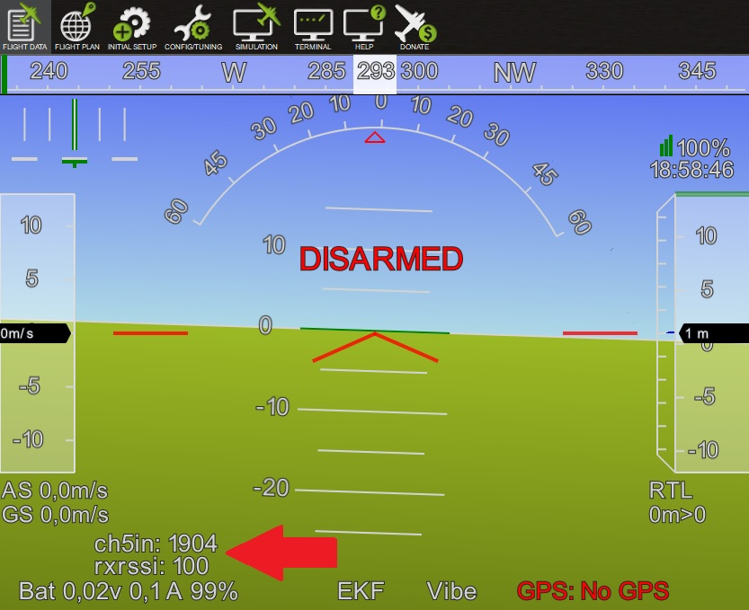

At strongest reception, Ch5 shows a PWM value of 1904 us. With the transmitter switched off, it will drop to 1093 us. Setting  :ref:`RSSI_CHAN_HIGH<RSSI_CHAN_HIGH>`  and  :ref:`RSSI_CHAN_LOW<RSSI_CHAN_LOW>`  respectively allows to scale the used PWM range to 0 - 100 % with optimal resolution.

.. note::
    Certain sBus protocol variances may lead to channel values not being updated during receiver failsafe conditions. In this case, you will see the last valid RSSI value displayed during a failsafe. As the received signal strength usually gradually decreases under flight conditions, this will likely not have any negative effects. However, during setup and testing it might be confusing to see RSSI freezed at a compareably high value while your RC transmitter is actually switched off.

Analog voltage type RSSI fed to a dedicated pin
-----------------------------------------------

If your RC receiver outputs an analog voltage range type RSSI, you can feed this to your autopilot's analog RSSI input pin. Typical voltage range is 0 - 3,3V or 0 - 5V. See your RC system's manual for detail or check using a multimeter.

.. note::
    Mind that though most autopilots' input pins theoretically are 5V tolerant, most ADCs will only measure up to 3,3 - 3,6 V unless equipped with voltage dividers to scale down higher input voltages. Check your RC receiver's RSSI voltage as well as your autopilot's specifications to ensure compatibility.

If there is an existing RC receiver connection to your autopilot that includes supply voltage and ground, only one additional signal wire is required. The example below shows how to connect a receiver's analog voltage type RSSI to a pixhawk autopilot's sBus output pin:

Now set your RSSI parameters accordingly:

 :ref:`RSSI_TYPE<RSSI_TYPE>`  = 1 (requires parameter reload if set to default 0 previously)

 :ref:`RSSI_ANA_PIN<RSSI_ANA_PIN>`  = 103 (PixHawk SBUS output / RSSI input pin)
 
 :ref:`RSSI_PIN_HIGH<RSSI_PIN_HIGH>`  voltage received on the :ref:`RSSI_ANA_PIN<RSSI_ANA_PIN>` when the signal is the strongest, usually 3,3V.
 
 :ref:`RSSI_PIN_LOW<RSSI_PIN_LOW>`  voltage received on the :ref:`RSSI_ANA_PIN<RSSI_ANA_PIN>` when the signal is the weakest, usually 0V

.. note::
    RSSI type options depend on your individual RC system's specifications. Some systems require additional workarounds or additional hardware conversion of non-standard proprietary protocols.

    

PWM type RSSI fed to a dedicated pin
------------------------------------

If your RC receiver outputs PWM type RSSI on a dedicated pin or pad, you can feed this to one of your autopilot's GPIO pins. Use parameter  :ref:`BRD_PWM_COUNT<BRD_PWM_COUNT>`  to set PWM output pins as GPIO. On pixahwk type hardware, this refers to the AUX pins as they are connected to the board's MCU, bypassing the IOMCU co-processer.

+----------------------+-------------------------+
| HW Pin (AUX) number  | alternative GPIO number |
+======================+=========================+
| 1                    | 50                      |
+----------------------+-------------------------+
| 2                    | 51                      |
+----------------------+-------------------------+
| 3                    | 52                      |
+----------------------+-------------------------+
| 4                    | 53                      |
+----------------------+-------------------------+
| 5                    | 54                      |
+----------------------+-------------------------+
| 6                    | 55                      |
+----------------------+-------------------------+

In the above example, setting  :ref:`BRD_PWM_COUNT<BRD_PWM_COUNT>`  to 4 will set pins 1-4 for use as PWM output and free the remaining pins 5 and 6 for use as GPIO 54 and 55.

If there is an existing RC receiver connection to your autopilot that includes supply voltage and ground, only one additional signal wire is required. The example below shows how to connect a receiver's PWM type RSSI output to a pixhawk autopilot's AUX 6 pin set for use as GPIO 55:

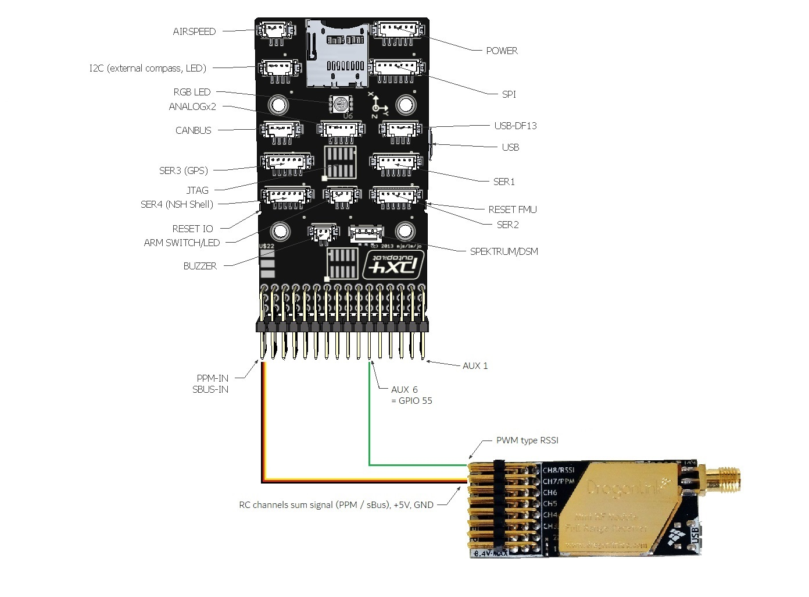

Now set your RSSI parameters accordingly:

 :ref:`RSSI_TYPE<RSSI_TYPE>`  = 4 (requires parameter reload if set to default 0 previously)

 :ref:`RSSI_ANA_PIN<RSSI_ANA_PIN>`  = GPIO pin number used (55 in the above example)
 
 :ref:`RSSI_CHAN_HIGH<RSSI_CHAN_HIGH>`  = PWM value at strongest reception

 :ref:`RSSI_CHAN_LOW<RSSI_CHAN_LOW>`  = PWM value at weakest reception

Special use cases
=================

Converting Non-standard PWM type RSSI to analog voltage
-------------------------------------------------------

For non-standard RSSI types like some FrSky receivers' high frequency PWM RSSI, an RC filter can be used to level the signal, rendering it useable for the autopilot's analog RSSI input pin:

**A 4.7k resistor and 10uF capacitor are used to filter out the pulses
from the receiver's RSSI output.**

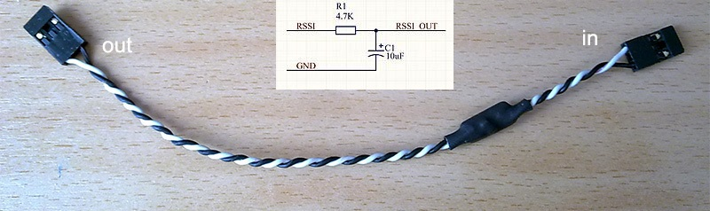

How to utilize Futaba S.BUS2 "Frame Error Rate" information to be used as RSSI in your autopilot
------------------------------------------------------------------------------------------------

The **Frame Error Rate (FER)** indicates, if the receiver has trouble decoding a received data package sent by the transmitter. The value is similar to RSSI. 

The FER information is implemented within the **Futaba S.BUS2** datastream. It is not transmitted as a continuous value, but is sent in 25% resolution.

How to setup the Hardware
-------------------------

To extract the FER from the **Futaba S.BUS2** datastream, a `S.BUS2 to Analog DC voltage converter <http://shop.tje.dk/catalog/product_info.php?products_id=43>`__ can be used.

A basic setup using a **Futaba R7008SB** receiver and an additional S.BUS2 GPS Multi Sensor is shown in the image below. A similar setup should work using a **Futaba R7003SB** receiver.
   
   
.. note::

   To enable **S.Bus and S.Bus2 protocol** on your Futaba receiver, you have to set your **R7008SB** receiver to **"Mode B"** or **"Mode C"** and your **R7003SB** receiver to **"Mode A"**. Check out your `R7008SB <http://manuals.hobbico.com/fut/r7008sb-manual.pdf>`__ or `R7003SB <http://manuals.hobbico.com/fut/r7003sb-manual.pdf>`__  user manual for further details.

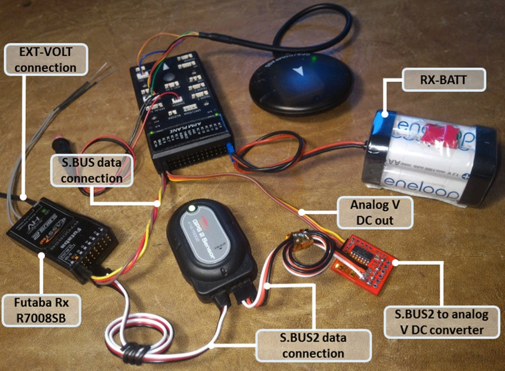

.. note::

   The converter is designed to provide a max. voltage output of 3.3 V DC when 100% of the frames are good, and appr. 0.4 V DC when connection is lost or receiver is in failsafe. To get best results, it is best practice to calibrate the output voltages of the converter at "full reception" and "Tx off" using a voltmeter. In general the converter should output the following DC voltage:

  - **Rx in failsafe** --> 12 % of max. **VDC out ~ 0.4 V DC**
  - Rx received <= 25 % good frames --> 34 % of max. VDC out ~ 1.1 V DC
  - Rx received <= 50 % good frames --> 56 % of max. VDC out ~ 1.85 V DC
  - Rx received <= 75 % good frames --> 78 % of max. VDC out ~ 2.6 V DC
  - **Rx received <= 100 % good frames** --> 100 % of max. **VDC out ~ 3.3 V DC**

How to setup RSSI Feedback to your Futaba FASSTest Telemetry capable transmitter
--------------------------------------------------------------------------------

In addition to the S.BUS2 to Analog conversion, the `converter <http://shop.tje.dk/catalog/product_info.php?products_id=43>`__  is looping back the FER / RSSI value to the S.BUS2 datastream simultaniously. This feature enables all users of **FASSTest Telemetry capable transmitters** to setup a **Telemetry RSSI Feedback** as an option. Moreover an **audible and/or vibration alarm** can be set to notice when received signal quality is degrading.

To use this feature, the **"FASSTest-14CH" protocol** has to be enabled in your transmitter.

The following screenshots show the setup procedure for a Futaba T14SG. Other FASSTest capable transmitters have to be setup in a similar way:
  - Enter the "LINKAGE MENU" by double clicking the "LNK" button [1].
  - Goto "SYSTEM" and press "RTN" [2].
  - Within "SYSTEM" menu, goto the protocol selection tab and choose "FASSTest-14CH" protocol [3] .
  - In case you changed the protocol, eventualy you have to re "LINK" your receiver to your transmitter [4]. 
  - Ensure, that TELEMETRY is set to "ACT" [5].

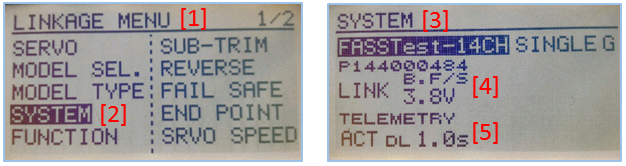

Due to the fact that Futabas Telemetry Sensors can't be renamed, the transmitted FER / RSSI value appears as a simple **"temperature sensor"**, wheras "0°C" means "Rx in failsafe" and "100°C" means "Rx received <= 100 % good frames".

The `converter <http://shop.tje.dk/catalog/product_info.php?products_id=43>`__ is reporting the current FER / RSSI value into Slot 1 of S.Bus2 Telemetry datastream.

In order to decode the FER / RSSI feedback of the converter, a standard "TEMP125" Sensor has to be assigned to Slot 1 of your transmitter:
  - Enter the "LINKAGE MENU" by double clicking the "LNK" button.
  - Show page 2 of the menu by pressing "S1" [1], goto "SENSOR" and press "RTN" [2].
  - Goto Slot 1 tab and press "RTN" [3].
  - Choose "TEMP125" Sensor and confirm the selection by pressing "RTN" two times [4]. 
  - Slot 1 should be assigned with a "TEMP125" Sensor now [5]. If so, leave the menu by pressing "HOME/EXIT" button two times.

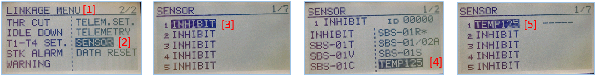

To display the FER / RSSI value and to trigger an alarm, your TELEMETRY MONITOR has to be configured: 
  - Enter the "TELEM.MONI" menu by pressing the "HOME/EXIT" button [1].
  - Goto "RECEIVER" and press the "RTN" button [2].
  - Goto DISPLAY tab [3] and choose "3" [4].
  - Goto "SENSOR" [5] and choose "TEMP125" [6] and confirm with "RTN".
  - Press "HOME/EXIT" to return to "TELEM.MONI" display and to see the RSSI / FER value as a "Temperature" [7].
  - To set alarms, goto "TEMP" [7] and press "RTN". For alarm setup please refer to your Tx user manual.
  - As soon as you connect your receiver with power, the FER / RSSI value will show up as well as the standard received signal quality indicator [8].
  - The converter can be mixed with other telemetry devices as long as they are assigned to Slot 2 to Slot 31 [9].
  
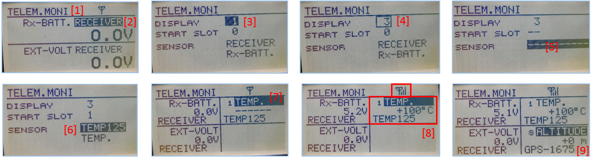
 

**Developed and illustrated by Lukasz - Thank You - Hope this helps.**
