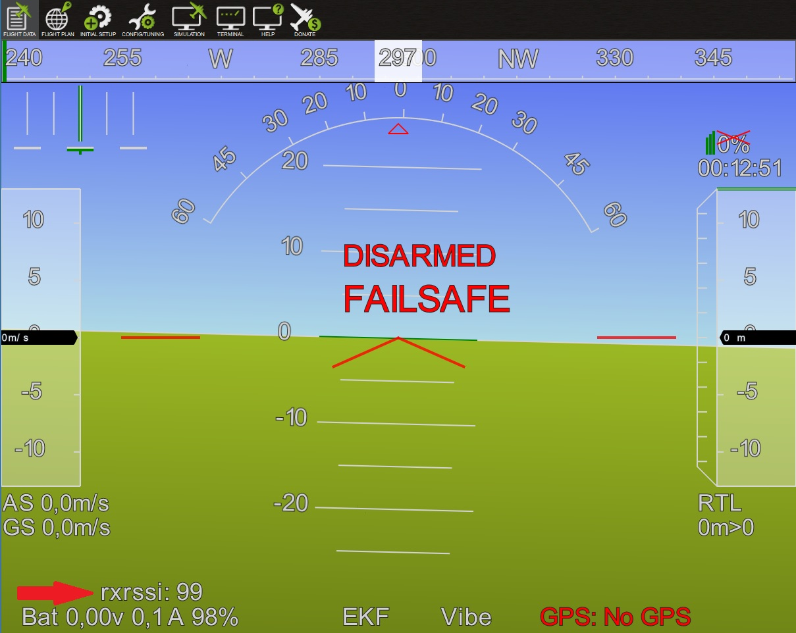

.. _common-rssi-received-signal-strength-indication:

==========================================
Received Signal Strength Indication (RSSI)
==========================================

This article shows how to get the Received Signal Strength Indication
(RSSI) from an FrSky receiver to APM.

Provide RSSI from FrSky receiver to APM.
========================================

-  Select the input pin with the **RSSI_PIN** parameter.
-  However some of receivers such as FrSky D8R-XP output 0 - 3.3 V.
-  For that reason I've added new parameter: **RSSI_RANGE**.
-  This was also a requested issue
   previously: **https://github.com/diydrones/ardupilot/issues/648**
-  When the RSSI_RANGE parameter is set to your radio's maximum RSSI
   voltage the RSSI **rxrssi** is shown in the range 0-100.
-  The ability to set the RSSI_RANGE  parameter has been added to
   Mission Planner in the Full Parameter List:

Complete System with RSSI addition
==================================

RSSI Filter
===========

**A 4.7k resistor and 10uF capacitor are used to filter out the pulses
from the receiver's RSSI output.**

RSSI Connections
================

.. image:: ../../../images/rssi_connections_3.jpg
    :target: ../_images/rssi_connections_3.jpg

**Developed and illustrated by Lukasz - Thank You - Hope this helps.**
