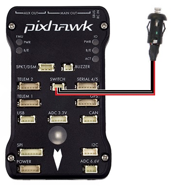
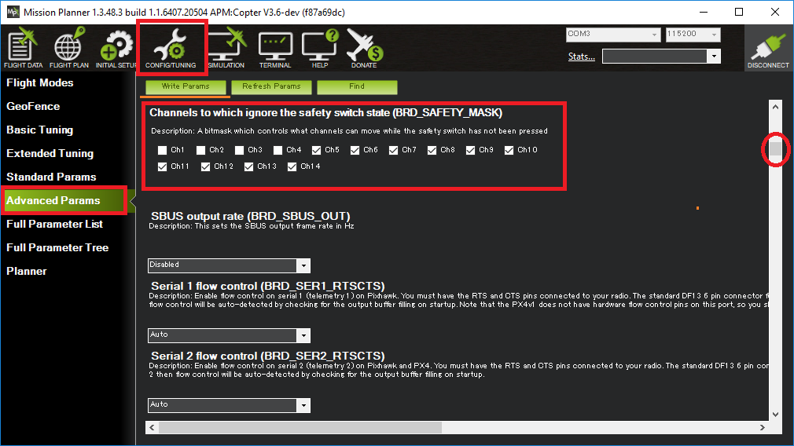

.. _common-safety-switch-pixhawk:

[copywiki destination="copter,plane,rover"]

=============
Safety Switch
=============

A safety switch can be used to enable/disable the outputs to motors and servos.

LED meaning
===========

- Constant blinking - system is initialising
- Intermittent blinking - system is ready.  press the safety switch to enable output to the motors.
- Solid - safety switch has been pressed, motors and servos are able to move once the vehicle is armed.

Configuring the Safety Switch
=============================

- :ref:`BRD_SAFETYENABLE <BRD_SAFETYENABLE>` = 0 to disable the switch
- :ref:`BRD_SAFETY_MASK <BRD_SAFETY_MASK>` can be used to set which individual channels are enabled/disabled with the safety switch

Using the Safety Switch to force I/O board firmware update
==========================================================

If the safety switch is held down for the first few seconds after a Pixhawk is powered up, the I/O firmware is reloaded.

This is normally not required but in some rare cases is required after a firmware upload if you hear the "Start up Failed" sound after startup (see :ref:`Sounds wiki page <common-sounds-pixhawkpx4>`).

.. note::

   A Pixhawk has two CPUs, the main CPU (aka FMU) is where ArduPilot runs.  
   There is a separate I/O CPU which is responsible for some I/O including PWM outputs to the MAIN OUT channels.  
   Pixracers only have the main CPU.
