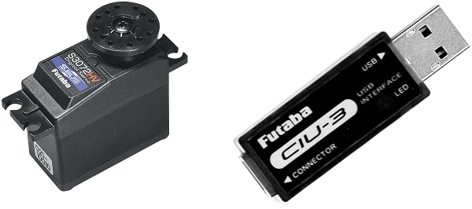
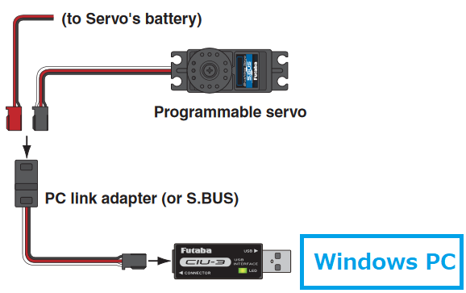
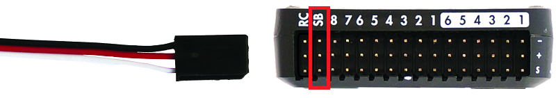
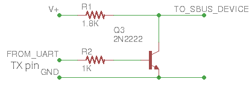

.. _common-sbus-output:

SBus Servos
===========

`Futaba SBus/SBus2 servos <https://www.futabarc.com/servos/sbus.html>`__ accept the serial `SBus protocol <https://www.futabarc.com/sbus/>`__ and can be controlled by ArduPilot once connected to the autopilot's "SB" port or any other serial port.  Up to 16 servos can be daisy chained together meaning that instead of each servo being directly connected to the autopilot, only a single serial connection from the autopilot is required.

The transmission rate is 100K baud.

Where to Buy
------------

- Available from many online retailers including `Amazon.com <https://www.amazon.com/s/ref=nb_sb_noss?url=srs&field-keywords=s-bus+servo>`__
- The `Futaba CIU-3 USB Interface <https://www.amazon.com/FUTABA-BB1166-CIU-3-USB-Interface/dp/B01I4KQ0QA/ref=sr_1_19?>`__ is also recommended to allow easy configuration of the servos (`online manual <http://manuals.hobbico.com/fut/ciu-3-manual.pdf>`__)

Configuring the Servos
----------------------

Each servo's ID needs to be set to a number from 1 to 16.  The number chosen should correspond to the servo number used to configure and control the servo from within ArduPilot.  For example if the ID is set to "9", the :ref:`SERVO9_MIN <SERVO9_MIN>`, :ref:`SERVO9_MAX <SERVO9_MAX>`, :ref:`SERVO9_FUNCTION <SERVO9_FUNCTION>`, etc parameters will be used to configure the servo.

- Connect the servo the Futuba CIU-3 USB Interface dongle (`online manual <http://manuals.hobbico.com/fut/ciu-3-manual.pdf>`__) and plug the dongle into a Windows PC.  A prompt should appear to download and install the required drivers
- Download and install the S-Link software (`search for "S-Link" here <https://www.futabarc.com/software-updates.html>`__)
- Use S-Link to set each servo's ID (`online instructions <http://downloads.hobbico.com/software/fut/S_Link_Manual-ENG.pdf>`__)

*image courtesy of Futaba.com*

Connecting Servos to a Autopilot
--------------------------------

If using a Pixhawk connect the servo to the "SB" port on the back of the autopilot.  For Cube autopilots use the "SBUSo" port.  For other autopilots without these connectors see the instructions below. The :ref:`BRD_SBUS_OUT<BRD_SBUS_OUT>` parameter must be enabled (=1).

.. note:: On some autopilots, this pin has a shared function with analog RSSI input by setting :ref:`RSSI_ANA_PIN<RSSI_ANA_PIN>` to this pin. These functions cannot be used simultaneously.

:ref:`SERVO_SBUS_RATE <SERVO_SBUS_RATE>` controls the update rate to the servos.  The default is 50 Hz but can be set to any value in the range of 25 Hz to 250 Hz

Connecting Servos to a Serial Port
----------------------------------

SBus servos can also be controlled from any of the autopilot's serial ports. The protocol uses inverted logic levels (unidirectional: output only) meaning an inverting cable is required when using a standard serial port. Below is a diagram showing a simple NPN transistor inverter which will suffice:

- Set the :ref:`SERIAL2_PROTOCOL <SERIAL2_PROTOCOL>` = 15 ("SBUS servo out") if using Telem2.  For other serial ports use the appropriate ``SERIALx_PROTCOL`` parameter.
- The port's baud rate parameter (in this case :ref:`SERIAL2_BAUD <SERIAL2_BAUD>` ) will automatically be set to 100,000

SBUS to PWM Decoders
--------------------

SBus to PWM decoders allow using the SBus interface with regular PWM servos but beware that some decoders including the `FrSky SBUS & CCPM Decoder <https://alofthobbies.com/frsky-sbus-cppm-decoder-with-pins.html>`__ generate a fixed PWM output rate (~170 Hz) that may damage analog servos (digital servos should be fine)
