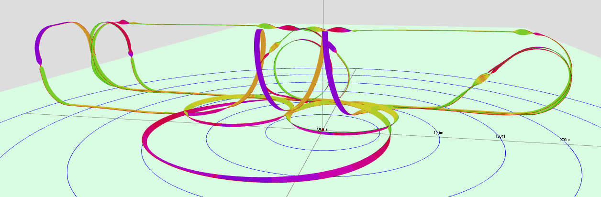

.. _common-scripted-aerobatics-4.4:

[copywiki destination="plane"]

===================
Scripted Aerobatics
===================

.. note:: this capability is in ArduPlane 4.2 and higher

ArduPilot has the capability of executing aerobatics from a LUA script. Either via AUTO mode mission items, or via scripts executed in many normal plane flight modes, usually controlled via a transmitter switch and selection RC channels.

.. note:: this requires a vehicle capable of aerobatic flight, properly tuned pitch,roll, and yaw rate controllers, and the pilot should be capable of safely taking over control (by switch or mode change) the vehicle while in an unusual attitude, if the need arises. The ``ACRO_x_RATE`` parameters limit the maximum commanded rate for each axis, as in ACRO mode.

Mission NAV_SCRIPT_TIME 
=======================

The SCRIPT_TIME waypoint type allows for a :ref:`LUA<common-lua-scripts>` script to take control of the roll/pitch/yaw rates of the vehicle for a time. For protection against lack of an appropriate script being active (ie was not loaded in the APM/Scripts directory of the SD card) to assume control, or LUA script crash due to error, there is a mandatory parameter which provides a maximum time the script can takeover, before the next mission item is executed. An additional layer of protection is provided within the firmware execution of the NAV_SCRIPT_TIME command that requires the script to access it within every 200ms, so the command's timeout parameter (P2) can be set to 0 (unlimited time out) for longer running aerobatics sequences (> 255 seconds), IF they are known to be otherwise well-behaved and present on the SD card.

The format of the SCRIPT_TIME item is:

.. raw:: html

   <table border="1" class="docutils">
   <tbody>
   <tr>
   <th>Command Field</th>
   <th>Mission Planner Field</th>
   <th>Description</th>
   </tr>
   <tr>
   <td><strong>param1</strong></td>
   <td>
   </td>
   <td>Command ID number, accessible from running script to identify requested maneuver</td>
   </tr>
   <tr>
   <td><strong>param2</strong></td>
   <td></td>
   <td>Maximum time in seconds (1-255) before next mission item is processed. A value of 0 is unlimited time and should be used only with verified scripts</td>
   </tr>
   <tr>
   <td><strong>param3</strong></td>
   <td>arg1</td>
   <td>Parameter which is accessible from running script for maneuver use a first variable.</td>
   </tr>
   <tr>
   <td><strong>param4</strong></td>
   <td></td>
   <td>Parameter which is accessible from running script for maneuver use as a second variable.</td>
   </tr>
   <tr>
   <td><strong>param5</strong></td>
   <td>arg3</td>
   <td>Parameter which is accessible from running script for maneuver use as a third variable.</td>
   </tr>
   <tr >
   <td><strong>param6</strong></td>
   <td>arg4</td>
   <td>Parameter which is accessible from running script for maneuver use as a fourth variable.</td>
   </tr>
   <tr style="color: #c0c0c0">
   <td><strong>param7</strong></td>
   <td>Alt</td>
   <td>Target altitude</td>
   </tr>
   </tbody>
   </table>

A LUA script would need to be running when the above mission command is encountered to recognize that it needs to take control, and start sending pitch/roll/yaw rate inputs into the autopilot to control its attitude and/or trajectory. It can use the four variable input parameters of the command to control aspects of the maneuver, such as rate of rolls/loops, repeat counts, time for certain segments of the maneuver, etc. An example is provided in the LUA Scripting Applet directory called `plane_aerobatics.lua <https://github.com/ArduPilot/ardupilot/tree/master/libraries/AP_Scripting/applets/Aerobatics/FixedWing>`__ for several types of tricks and full aerobatic schedules.

The execution of a script running during the NAV_SCRIPT_TIME item can easily be interrupted by switching modes out of AUTO.

.. note:: returning to AUTO mode would resume the AUTO mission at the last item before switching modes. If this was a NAV_SCRIPT_TIME command it would re-start from the beginning.

.. note:: be sure to have valid waypoints before and after a NAV_SCRIPT_TIME sequence of commands in order to establish path for the scripts to use (optionally) and to have sufficient altitude before trying this feature.

.. tip:: if you create your mission, and place the LUA script you intend to use in the /scripts subdirectory of a SITL simulation, you can test the script and the mission without risking your vehicle.

Trajectory Precise Plane Aerobatics LUA script (firmware 4.4 and higher)
========================================================================

A trajectory precise (attempts to track an exact earth referenced geospatial path), plane aerobatics script example is provided in the LUA Scripting Applet directory called `plane_aerobatics.lua <https://github.com/ArduPilot/ardupilot/tree/master/libraries/AP_Scripting/applets/Aerobatics/FixedWing>`__ . This LUA applet has a multitude of maneuvers, as well as complete sequences of routines, and the ability to easily create and add new sequence of routines.

These tricks and sequences can be either run as part of a mission using the NAV_SCRIPT_TIME mission command above, or activated by a switch on the RC transmitter.

The script provides numerous individual tricks, and a table of their IDs is provided in the `README.md <https://github.com/ArduPilot/ardupilot/tree/master/libraries/AP_Scripting/applets/Aerobatics/FixedWing/README.md>`__ file. Below is a list, but future expansion is anticipated so check the README:

==== ========================  ======  ===========  ==========   ==========  ==========
 ID  Name                      Arg1    Arg2         Arg3         Arg4        Turnaround 
==== ========================  ======  ===========  ==========   ==========  ==========
 1   Figure Eight              radius  bank angle                            No
 2   Loop                      radius  bank angle   #   loops                No
 3   Horizontal Rectangle      length  width        radius       bank angle  No
 4   Climbing Circle           radius  height       bank angle               No
 5   vertical Box              length  height       radius                   No
 6   Immelmann (FastRoll)      radius                                        Yes
 7   Straight Roll             length  num rolls                             No
 8   Rolling Circle            radius  num rolls                             No
 9   Half Cuban Eight          radius                                        Yes
 10  Half Reverse Cuban Eight  radius                                        Yes
 11  Cuban Eight               radius                                        No
 12  Humpty Bump               radius  height                                Yes
 13  Straight Flight           length  bank angle                            No
 14  Scale Figure Eight        radius  bank angle                            No
 15  Immelmann Turn            radius                                        Yes
 16  Split-S                   radius                                        Yes
 17  Upline-45                 radius  height gain                           No
 18  Downline-45               radius  height loss                           No
 19  Stall Turn                radius  height       direction                Yes
 20  Procedure Turn            radius  bank angle   step-out                 Yes
 21  Derry Turn                radius  bank angle                            No
 23  Half Climbing Circle      radius  height       bank angle               Yes
 25  Laydown Humpty            radius  height                                Yes
 26  Barrell Roll              radius  length       # spirals                No
 27  Straight Hold             length  bank angle                            No
 28  Partial Circle            radius  bank angle                            No
 30  Eight Point Roll          length                                        No
 31  Multi Point Roll          length  num points                            No
 32  Side Step                 radius  bank angle                            No
==== ========================  ======  ===========  ==========   ==========  ==========

To use as part of a mission, you would insert a SCRIPT_TIME mission item as shown:

in the above example, once WP3 is reached the airshow (shown here as "204", loaded from a shedules file named trick204.txt, see scheduels section below) will execute, and when finished, proceed to WP5.

Tricks on a Switch
------------------

This applet also provides a means to execute tricks or sequences via an RC Switch in normal modes like ACRO, LOITER, CRUISE, or FBWA.

Setup
-----

- Make sure you have Autotuned your plane and that its capable of doing aerobatics in ACRO mode well (Bixlers and flying wings only can do rolls and loops, generally, since they have insufficient yaw authority and side fuselage area...ie must be able to knife edge for full capability). This includes Autotuning the new YAW rate controller. Enable :ref:`YAW_RATE_ENABLE<YAW_RATE_ENABLE>` and set :ref:`ACRO_YAW_RATE<ACRO_YAW_RATE>` appropriately (90deg/s is a good start). When you Autotune, not only do pitch and roll, but also yaw by exercising the rudder, like pitch and roll.
- Enable scripting, on an autopilot that is capable (F7 or H7) with :ref:`SCR_ENABLE<SCR_ENABLE>` =1, reboot and set :ref:`SCR_HEAP_SIZE<SCR_HEAP_SIZE>` = 250000 (you will need more if other scripts are running also) and :ref:`SCR_VM_I_COUNT<SCR_VM_I_COUNT>` = 200000.
- Copy the `plane_aerobatic.lua <https://github.com/ArduPilot/ardupilot/tree/master/libraries/AP_Scripting/applets/FixedWing>`__ script into your SD card APM/scripts directory. Use the RAW view and copy to files on the SD card. Reboot.
- If you want to activate tricks and schedules from an RC switch, assign an RC channel to ``RCx_OPTION`` = 300 for the trick activation switch (low=disable,mid=show trick number selected, high= do it) and one for 301 which is trick selection. This normally a pot or slider, but can be any switch (which limits the number of tricks to the number of switch positions). Set the ``TRIK_ENABLE`` to 1 and reboot. Then set `TRIK_COUNT`` parameter to the number of tricks (11 maximum) to be selectable by the trick selection channel. Reboot.
- For each trick/schedule, set its corresponding ``TRIKn_ID/ARG1/ARG2/ARG3/ARG4`` parameters. For example, if you wish TRIK3 to be a Vertical Box, 50 meters tall, 100 meters long, with corner radii of 15 meters, set ``TRIK3_ID`` = 5, ``TRIK3_ARG1`` = 100, ``TRIK3_ARG2`` = 50, and ``TRIK3_ARG3`` = 15. Other TRIK3 argument values are ignored.
- Setting the activation switch to mid position will identify the trick number selected by the selection channel on the ground station or TX, if running :ref:`Yaapu <common-frsky-yaapu>` telemetry.
- You can abort out of the trick by putting activation switch low, change modes, or set selector to 0. A trick or sequence will also abort if the programmed trajectory is not being met with an error limit. This usually indicates a lack of sufficient vehicle tuning or power.

.. note: Do not rely on defaults for ``TRIKx`` parameters...they need to be setup for each trick!

Remember: ALTITUDE IS YOUR FRIEND! dont attempt your first one below 200feet! and FPV is a good way to try it out first, if you have trouble with seeing the vehicle at that altitude.

AEROM Parameters
----------------

Many new parameters will appear when this script is loaded, which control the tuning of the tricks. See the `README.md <https://github.com/ArduPilot/ardupilot/tree/master/libraries/AP_Scripting/applets/Aerobatics/FixedWing/README.md>`__ file for up to date information, but a few should be changed from their defaults in most cases:

- ``AEROM_PATH_SCALE`` this is probably the most critical when using the example schedules. Individual tricks in a mission, or a trick on a switch, can adjust the trick dimensions with the TRIKx_ARGy parameters. But the schedules, unless edited, have dimensions suited to high performance pattern planes with significant vertical speed capability. For normal 3D planes or sport planes these are too aggressive and the sequence will probably abort on many tricks, especially in wind. However, if you lower the path scale from "1" (no scaling) to ".75", more normal 3D planes will be able to execute the schedule. For marginally powered (can barely hover vertically) planes, even a ".5" scale factor, or less, might be required, scaling all radii and lengths of the pattern by 50%.
- ``AEROM_THR_MIN`` should be set to 15-20 (%) to maintain inertia at the bottom of loops, etc.
- ``AEROM_KE_ANG`` most planes need a little boost to the knife edge rudder, so setting this 10 is usually needed
- :ref:`AIRSPEED_CRUISE<AIRSPEED_CRUISE>`: while the script does NOT use the airspeed sensor, it  uses GPS velocity to track the trajectory and this parameter to set target ground speeds. As such you may wish to set this (even if there is no airspeed sensor) to a "fast" cruise speed within the vehicles capability. Flying on the fast end of cruise helps deal with wind impacts.

Schedules
---------
The applet also allows loading sequences of tricks to perform contest schedules like F3A or airshows as a single trick which can be executed from a mission or as Trick on a Switch. These are text files of the form ``trickX.txt``, where X would be the trick id, and located in the /scripts directory, or the root directory on the SD card where the plane_aerobatics.lua script is stored. These should not be the same number as existing tricks.

An example for a schedule is included as `trick72.txt <https://github.com/ArduPilot/ardupilot/blob/master/libraries/AP_Scripting/applets/Aerobatics/FixedWing/trick72.txt>`__ and would be executed as ``TRIKx_ID`` = 72 via switch or in an AUTO mission command. The schedule will display its "name" when started, and as each trick begins a "message" will sent to the GCS to indicate its start.

Several sequences, such as F3A, etc. are included in the `Schedules folder <https://github.com/ArduPilot/ardupilot/tree/master/libraries/AP_Scripting/applets/Aerobatics/FixedWing/Schedules>`__.
The above 'trick72.txt' is the SuperAirshow Sequence, consisting of Loop/HalfReverseCubanEight/ScaleFigureEight/Immelmann/Roll/Split-S/RollingCircle/HumptyBump/Barrel Rool/Cross Box TopHat/Triangular Loop:

Adding new basic tricks can also be done via a schedule file. This is shown in the SuperAirShow schedule file where a triangle loop and a crossbox tophat trick have been created and loaded with the schedule sequence.

Trick File Commands
-------------------

Several commands can be used within the trick file:

- name: <the name of the Trick>
- message: <usually the trick name>  displayed as a GCS message. This should be positioned immediately before the trick
- <trick name> <param1><parm2>..<param4>   the subroutine name in the plane_aerobatics file that actually performs the trick and its passed parameters
- align_center:   this will wait to start the following trick until the vehicle is centered, or if beyond the center (in the direction of flight) of the aerobatic box, immediately. The center is where the trick schedule was started.
- align_box x:  this positions the start of the next trick "x" from the box end in the direction of travel, ie "1" would make the trick be aligned at the box end, while .75 would start it 3/4 the way from center to it. Usually a value of "1" is used.

Tuning for Aerobatics
=====================

Normal ArduPilot Autotune provides a safe, stable PID tune for most vehicles. As such, its not optimized for precision aerobatics which require a tight tune. See below:

.. toctree::
   :maxdepth: 1
    
   Aerobatic Tuning <common-aerobatics-tuning>

Analyzing Performance
=====================

Analyzing the resulting execution of the trick(s) or schedules can easily be done by using the `Plot3d tool <http://plot3d.ardupilot.org>`__ which displays the programmed path and the actual executed path graphically. The first part of the timeline will trace the programmed path, while the second half traces the actual. Both are overlaid at the start to show path errors. The lua script will log additional items while executing the trick(s) to allow this tool to display this information.

To use this tool, load your flight log file using the **Load BIN** button, select "manual" site selection and **Copy Origin** to set the view to you home location.

Overlaid on the above image is the second tool: using the ``AERT.Perr`` log message which shows the 3D position error from programmed path in meters. The above shows that the vehicle was blown downwind in high crosswinds out of the rolling circle by 15m at one point. This was greatly improved in later flights by increasing the speed at which the plane did the routine (increase :ref:`AIRSPEED_CRUISE<AIRSPEED_CRUISE>`)

Simulation
==========

Using SITL, especially in conjunction with :ref:`RealFlight<dev:sitl-with-realflight>` and a RealFlight model like the `AddictionX <https://github.com/ArduPilot/SITL_Models/tree/master/RealFlight/Released_Models/Planes/Addiction_3D>`__, makes development and debugging much easier without risking a real vehicle. However, simulation can also be done without RealFlight using Mission Planner alone with ArduPilot's provided 3D plane model.

Below is a video showing simulation using Mission Planner and the built-in 3D plane simulation:

.. youtube:: soAGBNPhNQ

If you are using RealFlight for simulations, here is how to setup the Addiction 3D model to do scripted trajectory aerobatics:

.. youtube:: YB_zJ7laF7M

Script Calls into the firmware
==============================

Other scripts can be developed which allow control of the vehicle, either via NAV_SCRIPT_TIME mission items or from normal flight modes. The key calls are:

- Enabling scripting control override of roll/pitch/yaw rates and throttle with a specific call "vehicle:nav_scripting_enable(..)" which returns a boolean indicating  success or failure.

- Obtaining the arguments of a NAV_SCRIPT_TIME command using "vehicle:nav_script_time()" if running while in AUTO mode.

- Controlling the above rates and throttle with the "vehicle:set_target_throttle_rate_rpy(....)" function, which must be called regularly (at least every second) to set the roll/pitch/yaw rates and throttle percentage. Failure to do so, will disable the control override and return control to the original flight mode. Changing flight modes also disables script control.

