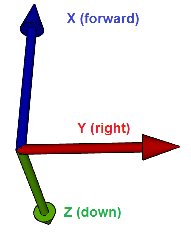

.. _common-sensor-offset-compensation:

[copywiki destination="copter,plane,rover"]

===================================
Sensor Position Offset Compensation
===================================

Copter-3.5 (and higher) includes compensation for sensor placement on the vehicle.  This page clarifies what parameters can be set and how they should be set.

.. note::

     In most vehicles which have all their sensors (IMU, GPS, optical flow, etc) within 15cm of each other, it is unlikely that providing the offsets will provide a noticeable performance improvement.

The sensor's position offsets are specified as 3 values (X, Y and Z) which are distances in meters from the IMU (which can be assumed to be in the middle of the flight controller board) or the vehicle's center of gravity.

- X : distance forward of the IMU or center of gravity.  Positive values are towards the front of the vehicle, negative values are towards the back.
- Y : distance to the right of the IMU or center of gravity.  Positive values are towards the right side of the vehicle, negative values are towards the left.
- Z : distance *below* the IMU or center of gravity.  Positive values are *lower*, negative values are *higher*.

In practice the distance to the sensor can be measured from the center of the flight controller unless the flight controller itself is placed a significant distance from the vehicle's center of gravity in which case
the IMU position offsets can be specified and then the other sensor's position offsets can be specified from the vehicle's center of gravity.

Parameter Details
=================

**IMU (aka INS):**

For the best results the flight controller (and thus the IMUs) should be placed at the center-of-gravity of the vehicle but if this is physically impossible the offset can be partially compensated for by setting the following parameters.

- :ref:`INS_POS1_X <INS_POS1_X>`, :ref:`INS_POS1_Y <INS_POS1_Y>`, :ref:`INS_POS1_Z <INS_POS1_Z>` the first IMU's position from the vehicle's center-of-gravity
- :ref:`INS_POS2_X <INS_POS2_X>`, :ref:`INS_POS2_Y <INS_POS2_Y>`, :ref:`INS_POS2_Z <INS_POS2_Z>` the second IMU's position from the vehicle's center-of-gravity
- :ref:`INS_POS3_X <INS_POS3_X>`, :ref:`INS_POS3_Y <INS_POS3_Y>`, :ref:`INS_POS3_Z <INS_POS3_Z>` the third IMU's position from the vehicle's center-of-gravity

The compensation is only *partial* because ArduPilot can correct the vehicle's velocity and position estimate but it does not correct the acceleration estimate.
For example if the flight controller was placed on the nose of a vehicle and the vehicle suddenly leans back (i.e. rotates so that it's nose points up) with no offset compensation the vehicle velocity
estimate would momentarily show the vehicle is climbing when it's not.  With the position offsets added the velocity would not show this momentary climb.  The EKF would still show a momentary vertical acceleration and
because we use the acceleration in our altitude hold controllers this could still lead to the vehicle momentary reducing throttle.

Although individual position offsets can be set for each IMU, the difference between the placement of IMUs on most flight controller boards is so small that the same values can be used for all IMUs

**GPS:**

- :ref:`GPS_POS1_X <GPS_POS1_X>`, :ref:`GPS_POS1_Y <GPS_POS1_Y>`, :ref:`GPS_POS1_Z <GPS_POS1_Z>` the first GPS's position from the vehicle's IMU or center-of-gravity
- :ref:`GPS_POS2_X <GPS_POS2_X>`, :ref:`GPS_POS2_Y <GPS_POS2_Y>`, :ref:`GPS_POS2_Z <GPS_POS2_Z>` the second GPS's position from the vehicle's IMU or center-of-gravity

**Range Finder (Sonar or Lidar):**

- :ref:`RNGFND_POS_X <RNGFND_POS_X>`, :ref:`RNGFND_POS_Y <RNGFND_POS_Z>`, :ref:`RNGFND_POS_Z <RNGFND_POS_Z>` the first RangeFinder's position from the vehicle's IMU or center of gravity
- :ref:`RNGFND2_POS_X <RNGFND2_POS_X>`, :ref:`RNGFND2_POS_Y <RNGFND2_POS_Z>`, :ref:`RNGFND2_POS_Z <RNGFND2_POS_Z>` the second RangeFinder's position from the vehicle's IMU or center of gravity

**Optical Flow:**

- :ref:`FLOW_POS_X <FLOW_POS_X>`, :ref:`FLOW_POS_Y <FLOW_POS_Y>`, :ref:`FLOW_POS_Z <FLOW_POS_Z>` distance from the IMU or center of gravity

