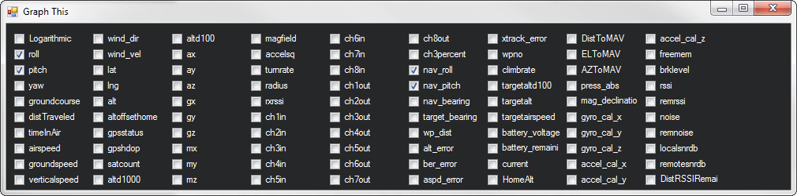

.. _common-sensor-testing:

==============
Sensor Testing
==============

This article shows how to check that the main main sensors (including
position and GPS) are working properly.

Checking the main sensors
=========================

With *Mission Planner* connected, move the autopilot board and
you should see the artificial horizon move accordingly.

.. note::

   Remember how artificial horizons work: when the aircraft tilts to
   the right, the horizon tilts to the left (tilt your head and you'll see
   what I mean). This is normal!

In the screenshot below, the vehicle is tilted a bit to the right.

The map will also show your current position using the GPS sensor if you
have the GPS module connected, are outside and have GPS lock.

Display Sensor Data on Graph
============================

You can see the output from all the various sensors by clicking on the
**Tuning** checkbox on the bottom right of the display **  1  ** This
will bring up the graphical sensor display.

If you click on the legend at the top of it **  2  ** , it will bring up
a window **"Graph This"** that allows you to choose which sensors and
data outputs to display.

.. image:: ../../../images/MP_RAW_SENSOR_DISPLAY.jpg
    :target: ../_images/MP_RAW_SENSOR_DISPLAY.jpg

A video showing how to graph the sensor data is provided below:

..  youtube:: w4G4K5Q27hw
    :width: 100%
