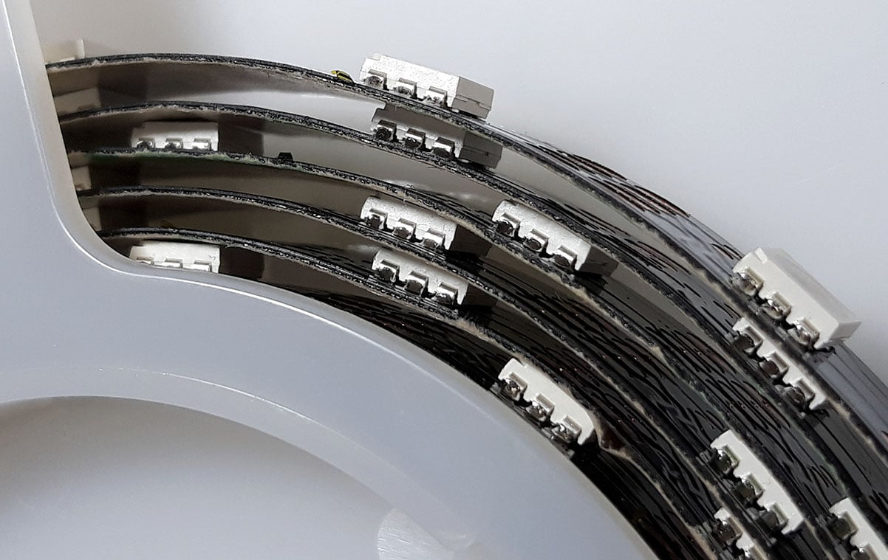
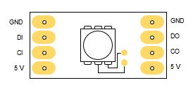
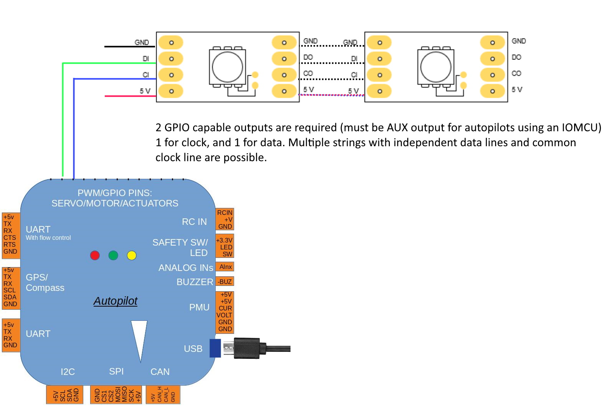

.. _common-serial-led-ProfiLED:

ProfiLED
========

This feature is avalable in Copter 4.0 and later.

ProfiLEDs are spaced at 20mm resulting in 50 LED's per meter. ProfiLEDs are supplyed in 2m strips with the servo header pre-attached, simply plug them in. The strips can be cut at any point and extended or have a new header added and plugged into a second pair of output pins. ProfiLED's require both clock and data signal. As supplied the clock is the yellow wire and green is data. Both the clock and data pins must be in the same PWM group. It is possible to share a clock pin over multiple strips in the same group. If there are spare pins it may be more convenient to setup two clock pins for that group. ProfiLED's require 5 volts and can draw a significant amount of current if all turned on at once. ProfiLED's default to white until a valid signal is received.

.. image:: ../../../images/ProfiLED-install.png

Any servo output wired to the clock of the LED's should be set to ``SERVOx_FUNCTION`` 132 for 'ProfiLED Clock'. The data input to the LED's should be set to ``SERVOX_FUNCTION`` 129 - 'ProfiLED 1', 130 - 'ProfiLED 2' or 131 - 'ProfiLED 3' for notify output or one of the scripting outputs (``SERVOx_FUNCTION`` 94 to 109) for use with Lua scripting. To enable ProfiLED notify output the :ref:`NTF_LED_TYPES<NTF_LED_TYPES>` bitmask should include ProfiLED, this is bit 9. :ref:`NTF_LED_LEN<NTF_LED_LEN>` should be set to the length of the longest string that is connected. There are several other NTF parameters that allow the brightness and colour patterns to be changed. Several Lua scripting LED control examples can be found in the ArduPilot `examples folder <https://github.com/ArduPilot/ardupilot/tree/master/libraries/AP_Scripting/examples>`__.

ProfiLEDs are avalable from CubePilot resellers, official retailers are listed `here  <http://www.proficnc.com/stores>`__.
