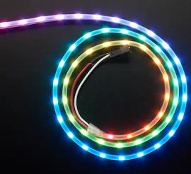

.. _common-serial-led-neopixel:

NeoPixel
========

Up to four strings of "NeoPixel" style (WS2812B compatible) RGB LEDs can be used to display the same LED patterns as other RGB LEDs including those commonly installed on GPS/compass units.  Each string can have multiple LEDs with the maximum number dependent upon the autopilot's CPU speed.  On a high speed autopilot with an H7 processor, up to 44 individual LEDs per string are known to work.

Attach each LED to a separate PWM output and set the following parameters

- Set :ref:`NTF_LED_TYPES<NTF_LED_TYPES>` to include ``NeoPixel`` (bit 8)
- Set :ref:`NTF_LED_LEN<NTF_LED_LEN>` to the number of LEDs connected to a servo output (up to 4)
- Set SERVOx_FUNCTION to ``NeoPixel1``, ``NeoPixel2``, ``NeoPixel3`` or ``NeoPixel4`` where "x" corresponds to the PWM output channel that the LED is connected to

.. note:: a few "NeoPixel" LED types have a different data order for the red and green data instead of the normal green/red/blue orde. If you are not displaying the desired colors, try setting the :ref:`NTF_LED_TYPES<NTF_LED_TYPES>` parameter to ``NeoPixelRGB`` tpe instead.

.. warning:: Most WS2812 style LED and strings will operate correctly when connected to the autopilot. However, if you get intermittent or non-operation, you may need to implement one of the configurations below. This is due to the fact that the autopilot outputs swing to 3.3V but the worst case input signal high spec for the LED is 4.3V at a 5V supply. So at extremes of tolerance/manufacturing spec, you can get a combination which will not work correctly. In that case the easiest solution is to lower the LED supply as shown below.

.. image:: ../../../images/neopixel-fix.png

But this causes a small loss in LED brilliance. An easy way to avoid this, if an LED can be isolated in the string, is to use an LED to level shift the signal for you so that the rest of the string can be powered by the full 5V.

.. image:: ../../../images/ws-levelshift.png
