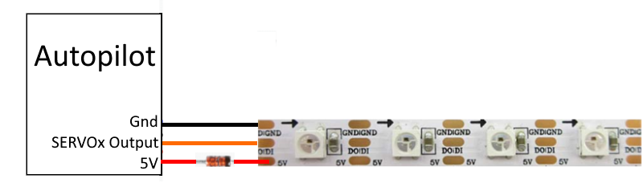
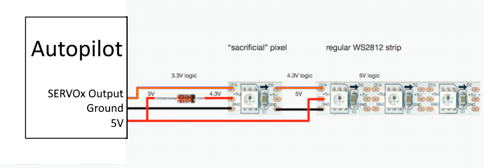

.. _common-serial-led-neopixel:

NeoPixel
========

A "NeoPixel" style (WS2812B compatible) RGB LED can be attached to any PWM output by setting its SERVOx_FUNCTION to one of the ``NeoPixelx`` output functions and setting :ref:`NTF_LED_TYPES<NTF_LED_TYPES>` parameter to ``NeoPixel``. Multiple ``NeoPixelx`` output functions are provided for connecting multiple strings (up to 4).

If used for notification purposes, be sure to set :ref:`NTF_LED_TYPES<NTF_LED_TYPES>` "Neopixel" bit(8).

.. warning:: Most WS2812 style LED and strings will operate correctly when connected to the autopilot. However, if you get intermittent or non-operation, you may need to implement one of the configurations below. This is due to the fact that the autopilot outputs swing to 3.3V but the worst case input signal high spec for the LED is 4.3V at a 5V supply. So at extremes of tolerance/manufacturing spec, you can get a combination which will not work correctly. In that case the easiest solution is to lower the LED supply as shown below.

But this causes a small loss in LED brilliance. An easy way to avoid this, if an LED can be isolated in the string, is to use an LED to level shift the signal for you so that the rest of the string can be powered by the full 5V.

