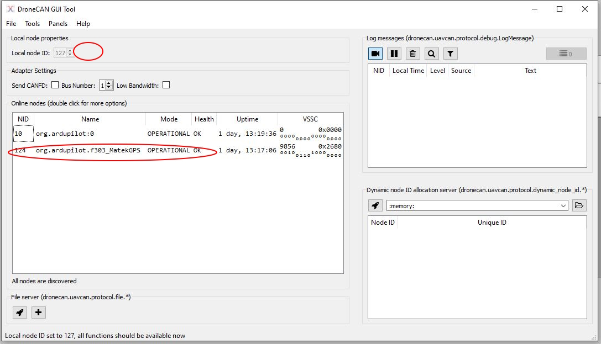
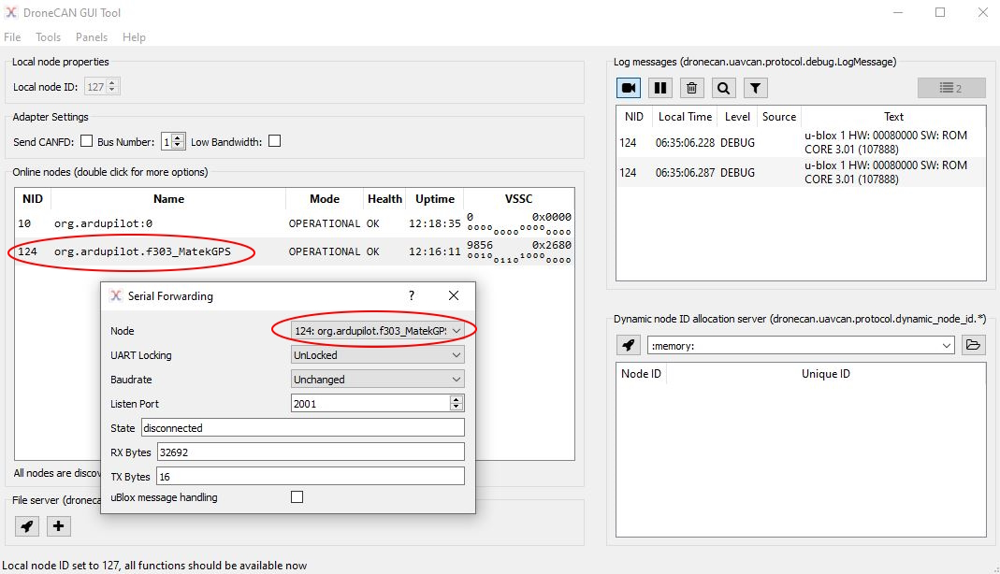
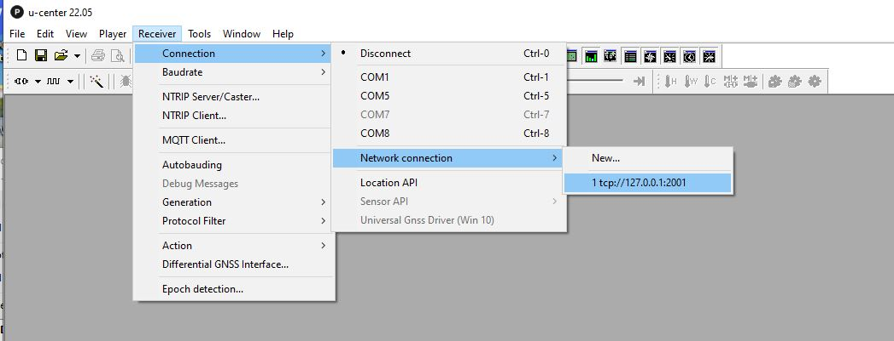
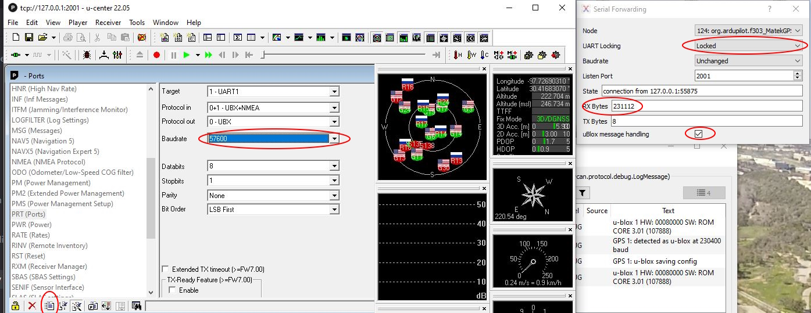

.. _common-serial-over-DroneCAN:

============================
Passing Serial over DroneCAN
============================

It is possible to pass serial communications from programs such as Ublox GPS U-Center over DroneCAN to the peripheral. This allows configuring and firmware updating internal serially connected peripherals sitting behind a DroneCAN interface, such as GPS modules.

.. note:: The DroneCAN peripheral must be running AP_Periph firmware revision 1.5.1 or later and the DroneCAN GUI tool version 1.2.22 or later

This is accomplished using the latest version of the `DroneCAN GUI tool <https://firmware.ardupilot.org/Tools/CAN_GUI/>`__ :

- Connect the autopilot with its target DroneCAN peripheral to your PC. Do not start a local ground station like Mission Planner.
- Start the DroneCAN GUI tool over MAVlink to the autopilot and click the local node ID checkmark

- Click Panels->Serial Forwarding and select the peripheral node to forward from

- Start U-Center or other appropriate tool and connect to the local host using port 2001, ie 127.0.0.1:2001 from its Receiver->Connection->Network Connection menu. You may have to create it as a NEW connection first.

You will now be connected to the application and the State in the Serial Forwarding dialog will change to show the connection. You can examine the DroneCAN module's data flow, check its firmware revision, make configuration changes, etc. Whatever you could do if the module was directly connected to the PCs serial port using U-Center or other application.

In order to change configuration of the DroneCAN's peripheral module (GPS,etc.) over this link you will need to change "UART Locking" in the Serial Forwarding dialog to "Locked". This gives the connected program exclusive access to the module to allow changes to be made without the DroneCAN peripheral's microcontroller overwriting them. This is required to make permanent configuration changes and for firmware upgrading.

.. note:: be aware that configuration changes you make may still be overwritten when rebooting the DroneCAN peripheral. For example, some GPS configuration items are changed at initialization of a GPS unless the :ref:`GPS_AUTO_CONFIG<GPS_AUTO_CONFIG>` is disabled, but those not auto configured would remain unchanged.

Firmware Update
===============

.. note:: this has only been tested on Ublox F9P based devices as of this writing.

While in the above connected state, you can also update the internal module's firmware, if available and if the module normally allows this when connected as a standalone module, outside of the DroneCAN peripheral.

For UBlox F9P GPSs, you will need to change the modules baud rate from 230.4KBaud down to 56.7Kbaud using the Config-> PRT configuration:

- Check the uBlox message handling checkbox in the Serial Forwarding dialog box. This will watch for the baud rate change you will be making and change the DroneCAN's serial port baud rate to match so communication can continue.
- Select View->Configuration->PRT and change the baud to 57.6K and click the send button.

- Verify that communication is still occurring by seeing the RX bytes number change in the Serial Forwarding dialog box. If not repeat the about PRT change.
- Then using U-Center's Tools menu, select the Firmware update and select the firmware image file and set the baud rate to 56.7Kbaud. Click GO button at the bottom  to start the update.

Video
=====

Here is a video showing the process.

.. youtube:: Dh8hrsp1c9A