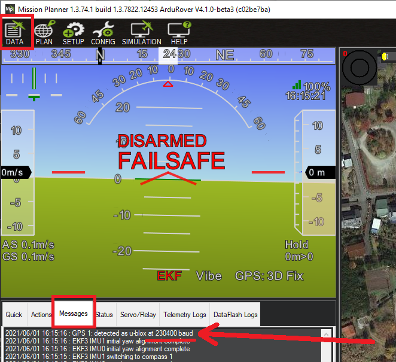

.. _common-serial-passthrough:

[copywiki destination="copter,plane,rover"]

==================
Serial Passthrough
==================

"Serial Passthrough" allows the autopilot to route serial protocol messages between serial ports on the autopilot including the USB port.  This can be used to configure a sensors or devices (which have a serial interface) without disconnecting it from the autopilot using a USB connection. It is also possible to pass data from any serial port to another serial port.

.. note::

     This feature is available in Copter-4.0 (and higher), Plane-3.10, Rover-3.6 (and higher)

Setup
-----

- The sensor or device (with a serial interface) should already be connected to one of the autopilot's serial ports.  Ideally it should already be working.
- Connect the autopilot to a PC using a USB cable and connect with a Ground Station (i.e. Mission Planner, QGC, etc).

.. note::  On most F7 and H7 boards, a second USB virtual serial port also appears when you connect via USB to the autopilot and is assigned the last SERIALx port in ArduPilot for SLCAN use. This can also be used for serial device configuration by changing :ref:`SERIAL_PASS1<SERIAL_PASS1>` to that port's number. This allows the autopilot to remain connected to a Ground Control Station, and still use passthrough to a sensor for configuration simultaneously on the PC via its configuration program.

- Disable the sensor driver's use of the serial port by setting ``SERIALx_PROTOCOL`` to -1 ("None").
- Be sure to set each port's baud rate appropriately using the ``SERIALx_BAUD`` parameters. The rates may be different for each port. ArduPilot will do the buffering.  For example, if attempting passthrough to the first GPS, :ref:`SERIAL3_BAUD <SERIAL3_BAUD>` should normally be set to 230400 but you may check the GPS driver's "autobauding" by looking at the ground stations Message window soon after startup.

- The default for :ref:`SERIAL_PASS1<SERIAL_PASS1>` (the first serial port to be interconnected) defaults to SERIAL0, the primary USB port.
- Set :ref:`SERIAL_PASSTIMO <SERIAL_PASSTIMO>` to a length of time (in seconds) that gives you enough time to connect with the sensor's configuration software.  30 to 60 seconds is a good choice
- Set :ref:`SERIAL_PASS2 <SERIAL_PASS2>` to the number of the serial port connected to the sensor.  I.e. "2" if the sensor is connected to Telem2/Serial2.
- Press the "Disconnect" button on the ground station but leave the USB cable from the PC to the autopilot connected.
- Open the sensor's configuration software and connect to the autopilot's COM port.  If all goes well the configuration software should work as it does when the PC is directly connected to the sensor
- After you are done, remember to restore the ``SERIALx_PROTOCOL`` to its original value to re-enable the sensor

If the configuration fails to connect there are some things to try:

- Some configuration software will not allow connecting to the autopilot's COM port by default but may have a option to display all available COM ports
- If no serial messages are received from the PC the timeout will expire and :ref:`SERIAL_PASS2 <SERIAL_PASS2>` will revert to -1

Video
-----

..  youtube:: 7dE4rOXeHnA
    :width: 100%
