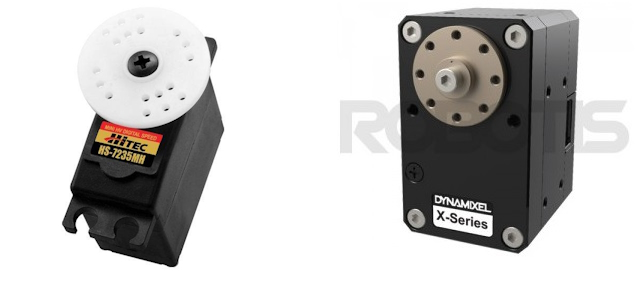

.. _common-servo-landingpage:

======
Servos
======

ArduPilot supports several types of servos.

*images courtesy of hobbyking.com and robotis.com*

.. toctree::
    :maxdepth: 1

    Servos (PWM) <common-servo>
    SBus Servos <common-sbus-out>
    Robotis Servos <common-servo-robotis>
    Volz Servos <common-servo-volz>
