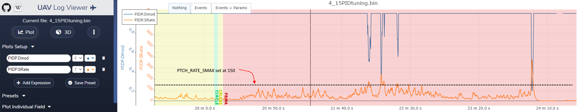

.. _common-servo-limit-cycle-detection:

=====================
Limit Cycle Detection
=====================

ArduPilot provides a limit cycle detection feature to help reduce or eliminate oscillations in the control loops due to excessive tuning gains. The algorithm monitors the actuator slew rates, and if above limits set by the _SMAX parameters, will lower the control loop gains in an attempt to stop the oscillations. These parameters are:
[site wiki="plane"]
- :ref:`PTCH_RATE_SMAX<PTCH_RATE_SMAX>` for pitch
- :ref:`RLL_RATE_SMAX<RLL_RATE_SMAX>` for roll

for the Pitch and Roll control surface detection limits on fixed wing.
[/site]
[site wiki="copter"]
- :ref:`ATC_RAT_RLL_SMAX<ATC_RAT_RLL_SMAX__AC_AttitudeControl_Multi>` for roll
- :ref:`ATC_RAT_PIT_SMAX<ATC_RAT_PIT_SMAX__AC_AttitudeControl_Multi>` for pitch
- :ref:`ATC_RAT_YAW_SMAX<ATC_RAT_YAW_SMAX__AC_AttitudeControl_Multi>` for yaw
- :ref:`PSC_ACCZ_SMAX<PSC_ACCZ_SMAX>` for position control
[/site]
[site wiki="rover"]
- :ref:`ATC_BAL_SMAX<ATC_BAL_SMAX>` for balance bots loop
- :ref:`ATC_SAIL_SMAX<ATC_SAIL_SMAX>` for sail management loop
- :ref:`ATC_SPEED_SMAX<ATC_SPEED_SMAX>` for speed control loop
- :ref:`ATC_STR_RAT_SMAX<PSC_ACCZ_SMAX>` for steering control loop
[/site]
The limit should be set to no more than 25% of the actuator's maximum slew rate to allow for load effects.
[site wiki="copter,rover"]
Currently the defaults for these are "0", disabling them. Setting them to a value can be done experimentally if oscillations are present. Setting them too low will result in sluggish responses.
[/site]
[site wiki="plane"]
For example, for most servos which specify a 0.1s speed for 60 deg deflection (600deg/s), the value should be no more than 150, which is the default.

For QuadPlane actuators (motors,surfaces,tilt servos depending on frame type):

- :ref:`Q_A_RAT_PIT_SMAX<Q_A_RAT_PIT_SMAX>` for VTOL pitch
- :ref:`Q_A_RAT_RLL_SMAX<Q_A_RAT_RLL_SMAX>` for VTOL roll
- :ref:`Q_A_RAT_YAW_SMAX<Q_A_RAT_YAW_SMAX>` for VTOL yaw
- :ref:`Q_P_ACCZ_SMAX<Q_P_ACCZ_SMAX>` for VTOL position control

These are in different units (full activations per second), and have 50 as the default, which effectively de-activates them because they are too high. Currently, setting these such that they are active interferes with the QAUTOTUNE and this will be corrected in the future, but it allows logging of the actual slew rates in the PIQx.SRate log messages. 
[/site]
When these values are exceeded, the appropriate PID Dmod log data ( PIDR.Dmod, PIQP.DMod, etc.)will show values spiking below 1 in the plots, indicating lowered gains. An ideal tune, will have this occur very occasionally during operation, but not frequently. By examining the logged PIDx.SRate messages one can see the actual slew rates being used and set these _ SMAX values appropriately to be at or slightly above the general peak slew rates.

an example for Plane pitch:

