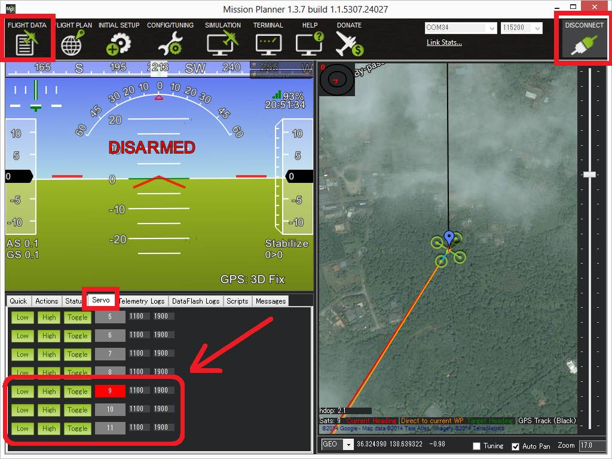

.. _common-servo-robotis:

==============
Robotis Servos
==============

Robotis Dynamixel servos are high-end "smart actuators" featuring built in motion control hardware that can be controlled by ArduPilot once connected to the autopilot's serial port.

Robotis servos using the "`DYNAMIXEL Protocol 2.0 <http://emanual.robotis.com/docs/en/dxl/protocol2/>`__" are supported. The `XM430\-W350\-T <https://emanual.robotis.com/docs/en/dxl/x/xm430-w350/>`__ in particular is known to work correctly with ArduPilot.

.. note::

   Support for these servos is available in Copter-4.0, Plane-3.10 and Rover-3.5 (or higher)

Where to Buy
------------

- `ROBOTIS Global <https://en.robotis.com/shop_en/>`__
- `ROBOTIS USA <https://www.robotis.us/>`__
- `ROBOTIS Japan <https://e-shop.robotis.co.jp/>`__
- `U2D2 <http://www.robotis-shop-en.com/?act=shop_en.goods_view&GS=3288&keyword=U2D2>`__ is also recommended to allow easy configuration of the servos (`online manual <http://emanual.robotis.com/docs/en/parts/interface/u2d2/>`__ )

Configuring the Servos
----------------------

Before initial use the ID for each servo needs to be set using the DYNAMIXEL Wizard configuration tool.

`DYNAMIXEL Wizard 2.0 <http://emanual.robotis.com/docs/en/software/dynamixel/dynamixel_wizard2/>`__ is the latest DYNAMIXEL configuration tool supporting Windows / Linux / Mac OSX.

- Visit `ROBOTIS' international download center <https://en.robotis.com/service/downloadpage.php?ca_id=10>`__ to download and install DYNAMIXEL Wizard 2.0"
- Attach the U2D2 to the servos as described in the `online manual <http://emanual.robotis.com/docs/en/parts/interface/u2d2/>`__
- Start the R+ Manager, connect to the appropriate COM port and set each servo's ID to a value from 1 to 16.  The number chosen for each servo should correspond to the servo number used to configure and control the servo.  For example if the ID is set to "9", the :ref:`SERVO9_MIN <SERVO9_MIN>`, :ref:`SERVO9_MAX <SERVO9_MAX>`, :ref:`SERVO9_FUNCTION <SERVO9_FUNCTION>`, etc parameters will be used to configure the servo.

Connecting and Configuring
--------------------------

-  Connect one of the servos to any serial port on the autopilot.  In this example SERIAL4 is used but any serial port should work
-  Additional servos should be connected to the first by daisy chaining them as shown above
-  Set the following parameters on the autopilot

  - :ref:`SERIAL4_PROTOCOL <SERIAL4_PROTOCOL>` = 19 ("RobotisServo")
  - :ref:`SERIAL4_BAUD <SERIAL4_BAUD>` = 57 (57600 baud)
  - :ref:`SERIAL4_OPTIONS <SERIAL4_OPTIONS>` = 4 to enable half-duplex mode

Testing with the Mission Planner
================================

The mission planner's Flight Data screen includes a "Servo" tab on the
bottom right that can be used to test that the servos are moving
correctly.

