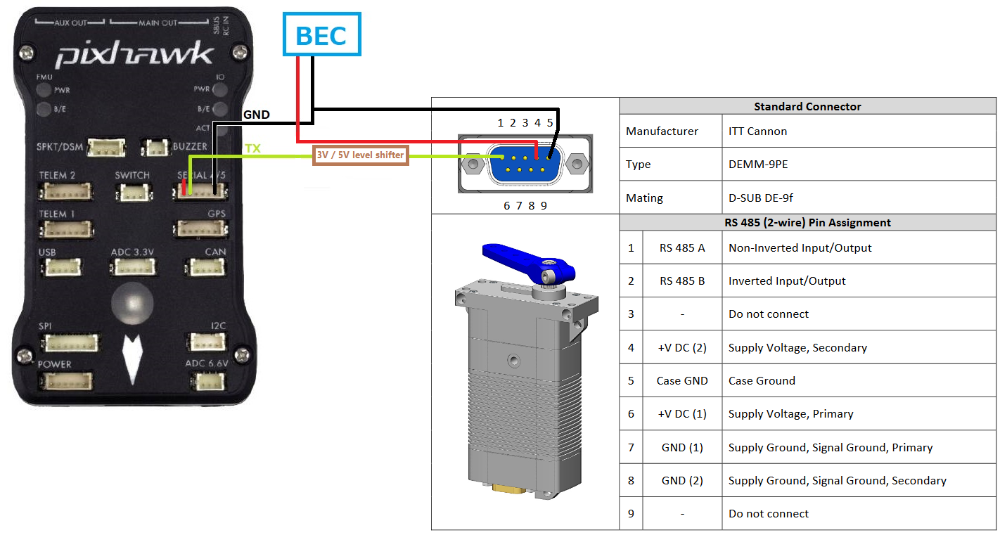

.. _common-servo-volz:

===========
Volz Servos
===========

`Volz servos <https://www.volz-servos.com/English/Products/>`__ are high-end servos which can be controlled with a normal PWM signal or using a custom RS-422 serial protocol.  This page describes the setup when using the serial protocol

.. warning::

    This wiki page is a work-in-progress and has not been verified to be correct

Where To Buy
------------

- Various online retailers sell these servos or you can `contact Volz directly <https://volz-servos.com/contact/?lang=en>`__.  Check the datasheet of the servo to confirm it has the RS-422 serial interface

Connection and Configuration
----------------------------

image courtesy of the `Volz DA-26 servo datasheet <https://volz-servos.com/resources/Downloads/Datasheets/DA-26_Datasheet_uni.pdf>`__

- Use a BEC to provide power to the servo as shown above
- Connect the servo's TTL pin to a 5V-to-3V level shifter and then to one of the autopilot's serial port's TX pins.  The diagram above shows the servo connected to a Pixhawk's Serial4 port but other serial ports can also be used
- Set :ref:`SERIAL4_PROTOCOL <SERIAL4_PROTOCOL>` = 14 (Volz) assuming Serial4 is being used
