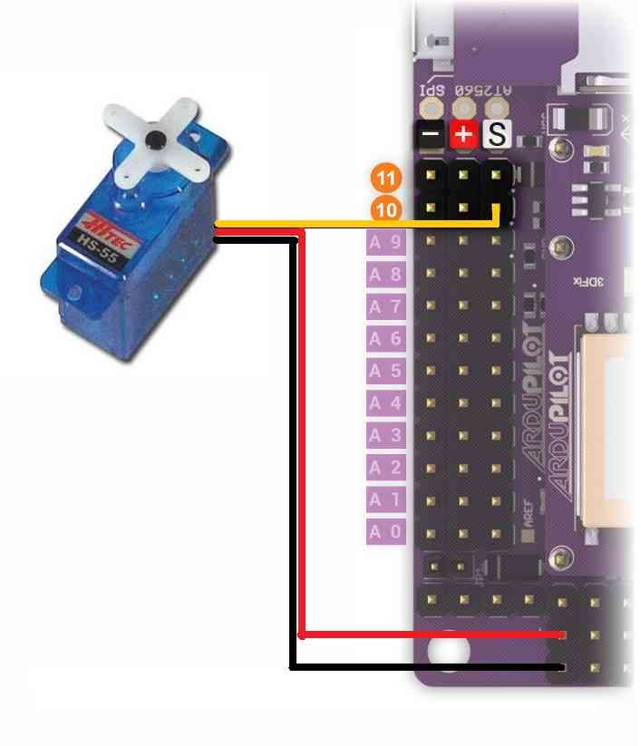

.. _common-servo:

=====
Servo
=====

This article explains how to connect Servos to flight controller, and how to control them from the transmitter or ground station (i.e. Mission Planner).

Overview
========

Copter, Plane and Rover can control servos for any purpose, including:
triggering a camera shutter, releasing a parachute or dropping a tennis
ball.  These servo(s) can be controlled either directly by the pilot via
a switch on the transmitter, through commands sent from the ground
station or as part of a mission.

Either
`analog <http://www.amazon.com/Hitec-31055S-HS-55-Economy-Universal/dp/B0006O3WNW>`__
or `digital servos <http://www.amazon.com/Hitec-RCD-35076S-HS-A5076HB-Digital/dp/B003RXHMNK>`__
may be used.

Connecting the servo to a Pixhawk
=================================

.. image:: ../../../images/Servo_Pixhawk.jpg
    :target: ../_images/Servo_Pixhawk.jpg

-  If using Copter Connect the servo to AUX OUT 1, 2, 3 or 4.  MAIN OUT
   1 ~ 8 should be avoided because these update at 400hz.
-  If using Plane or Rover where all pins update at 50hz, any unused
   MAIN OUT or AUX OUT 1 ~ 4 may be used.
-  AUX OUT 5 and 6 cannot be used by default because they are setup as
   :ref:`Relays <common-relay>`.  These pins can changed to Servo
   outputs by setting the BRD_PWM_COUNT parameter to 6 and setting
   RELAY_PIN and RELAY_PIN2 to -1.
-  The Pixhawk flight controller cannot provide power to the servos so
   an external BEC or ESC that can provide 5V should be used.

Connecting the servo to an APM2.x
=================================

-  On Copter connect the servo's signal wire to either A10 or A11 on the
   left side of the APM
-  On Plane the servos may also be connected to any available channel
   RC1 ~ RC8 on the back of the APM.
-  Connect the power and ground wires to the rear power rail (if the JP1
   jumper is removed) or to an external BEC (if the JP1 jumper is left
   in place).  It is absolutely critical that the servos power and
   ground wires not be connected to the + and - pins on A10 or A11
   because the servos will then be sharing their power source with the
   main CPU.  Movements of the servo will cause ripples in the power
   supply to the CPU and could cause brown-outs. For the same reason the
   rear power rail should not be used if the JP1 jumper is left in
   place.

Controlling the servo as a camera shutter
=========================================

Details on how to set-up and control the servo as if it were triggering
the shutter of a camera can be found  :ref:`here on the Camera Gimbal wiki page <copter:common-camera-gimbal>`.  The 
advantage of this set-up is:

-  the servo can be triggered from the ch7 or ch8 auxiliary switch on
   Copter
-  if you wish the servo to move to one position, delay for a moment
   then return to it's original position this can all be accomplished
   with a single mission command
-  the location and attitude of the copter will be recorded to the
   dataflash each time the servo is triggered

The disadvantage of using the camera shutter method is the servo can
only be moved to two pre-configured positions.

Video example of a tennis ball dropped used at `Sparkfun's AVC 2012 <https://www.youtube.com/watch?v=C_vwC1r3k2g>`__.

..  youtube:: AG9OwXj4Ev4
    :width: 100%

Controlling the servo as a servo
================================

The traditional way to control a servo only works as part of a mission
(i.e. AUTO mode).  Follow these instructions:

-  Connect to your flight controller from the ground station
-  On the Config/Tuning > Full Parameter List page, ensure that the SERVOx_FUNCTION (or RCx_FUNCTION) is set to zero for the servo (i.e. :ref:`SERVO9_FUNCTION <SERVO9_FUNCTION>` = 0 if the servo is connected a Pixhawks AUX OUT2).
-  Press the Write Params button

   .. image:: ../../../images/MissionPlanner_ServoSetup.jpg
       :target: ../_images/MissionPlanner_ServoSetup.jpg

-  Create the mission you wish to fly and add a DO_SET_SERVO command
   and include the servo number (i.e. "10") in the "Ser No" field and
   the PWM value (usually between 1000 ~ 2000) in the "PWM" field.

   .. image:: ../../../images/mp_move_servo.jpg
       :target: ../_images/mp_move_servo.jpg

Note that the DO_SET_SERVO command is a "do command" meaning that it
can only be run between waypoints so it must not be the first or last
command in the mission.  It will be executed immediately after the
waypoint that precedes it.

Testing with the Mission Planner
================================

The mission planner's Flight Data screen includes a "Servo" tab on the
bottom right that can be used to test that the servos are moving
correctly.

.. image:: ../../../images/Servo_TestingWithMP.jpg
    :target: ../_images/Servo_TestingWithMP.jpg
