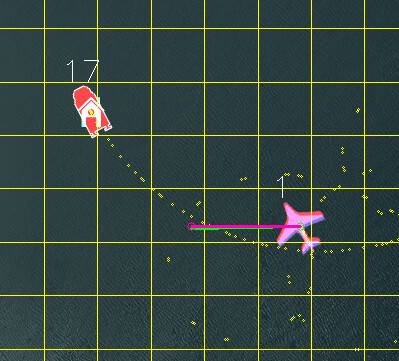
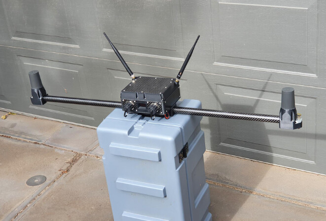
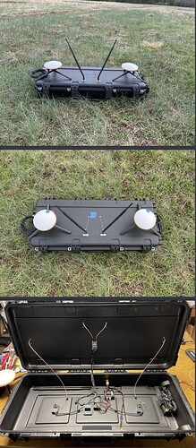
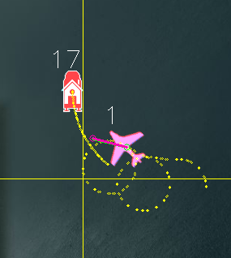
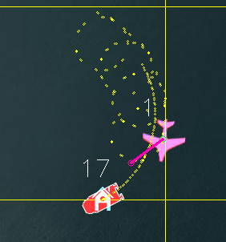

.. _common-ship-landing:

[copywiki destination="plane"]
=========================================================
Moving Platform Takeoff and Landing (Ships, Trucks, etc.)
=========================================================

The Plane 4.2 firmware supports VTOL taking off and landing on a moving platform with QuadPlanes. VTOL Takeoffs and Landings will track the platform's motion to remain vertically above the takeoff/landing pad and landings will provide a tracking hold-off loitering point and controlled angular approach to avoid vehicle superstructures or other obstructions. This article describes how to setup and use this functionality.

Equipment Needed
================

To use this feature you need a beacon setup on the landing platform. This beacon should be based on an ArduPilot autopilot running the ArduPilot Rover firmware. You can set the ``FRAME_CLASS`` parameter on the beacon autopilot to "2" to make it a “boat” or "1" to make it a truck, so that the right icon shows in the ground station. The beacon will be broadcasting its position to allow the QuadPlane to track its moving HOME position, similar to :ref:`Copter's Follow Mode<copter:follow-mode>`.

The beacon system needs the following:

- a reliable yaw source. Using dual-F9P GPS with :ref:`moving baseline yaw<common-gps-for-yaw>` is recommended if the moving platform will cause problems with compasses.
- a telemetry radio setup so that the aircraft can see GLOBAL_POSITION_INT mavlink messages from the beacon autopilot. There are multiple methods of achieving that, see the section below on radio setup
- the beacon needs a different mavlink system ID to the aircraft and the GCS. You set this with the :ref:`SYSID_THISMAV<SYSID_THISMAV>` parameter. In the example below, :ref:`SYSID_THISMAV<SYSID_THISMAV>` = 17, has been set.
- the beacon can be offset from the actual landing location. The beacon should be placed for optimal radio performance, then the instructions below can be used to setup the actual landing location relative to the beacon.

Here are examples a nice setups for the beacon (courtesy of FreeSpace Operations and Offshore Aviation):

Telemetry
---------
The telemetry system needs to be capable of:

- allowing the ground station to see MAVLink packets from both the beacon and the aircraft
- allowing the aircraft see MAVLink packets that originate from the beacon (the only packet the aircraft needs from the beacon is the GLOBAL_POSITION_INT message)

There are several ways to setup this type :ref:`Telemetry<common-telemetry-landingpage>`:

- WiFi, with a multicast network
- a mesh-capable telemetry radio
- using any kind of telemtry for GCS <-> vehicle and GCS <-> beacon, setup the GCS to forward GLOBAL_POSITION_INT packets from the beacon to the aircraft (for example, MAVProxy GCS can do this by setting the fwdpos to TRUE (ie type 'set fwdpos true' from the command line)

For mesh capable radios, you could use three RFD900x radios, with the radios setup for broadcast.(see :ref:`common-rfd900`)

Alternatively you could use the RFD900x relay firmware from `here <https://firmware.ardupilot.org/SiK/RFD900x-relay/>`__  with the GCS set as NODE=1, the beacon set as NODE=0 and the aircraft set as NODE=2.

Firmware
--------
You will need ArduPilot plane 4.2 or later

Lua Script
----------

The ship landing functionality is in a :ref:`LUA script<common-lua-scripts>`. You will need the plane_ship_landing.lua script from `here <https://github.com/ardupilot/ardupilot/blob/master/libraries/AP_Scripting/applets/plane_ship_landing.lua>`__

This script needs to be put in the APM/scripts directory on your microSD card on the aircraft.

This script also creates several new ``SHIP_`` parameters that will need to be setup (see below).

Parameter Setup
===============

Aircraft
--------

-  :ref:`SCR_ENABLE<SCR_ENABLE>` = 1
-  :ref:`SCR_HEAP_SIZE<SCR_HEAP_SIZE>` = 100000 (perhaps more if other scripts are running)
-  ``SHIP_ENABLE`` = 1
-  :ref:`FOLL_ENABLE<FOLL_ENABLE>` = 1
-  :ref:`FOLL_SYSID<FOLL_SYSID>` = 17 (this needs to be the SYSID of the beacon set above)
-  :ref:`Q_RTL_MODE<Q_RTL_MODE>` = 0 (execute a normal RTL)
-  :ref:`FS_LONG_ACTN<FS_LONG_ACTN>` either 0 or 1 (Continue if in AUTO or RTL always)
-  :ref:`RTL_AUTOLAND<RTL_AUTOLAND>` = 0
-  :ref:`Q_OPTIONS<Q_OPTIONS>` bit 5 set (QRTL return in RC failsafes while in a VTOL mode)

Note that you will need to refresh parameters and reboot for these to all take effect. The ``SHIP_ENABLE``, ``SHIP_LAND_ANGLE`` and ``SHIP_AUTO_OFS_n`` parameters will appear when the script is running correctly.

Beacon
------

- :ref:`Moving baseline setup<common-gps-for-yaw>`
- :ref:`EK3_SRC1_POSZ<EK3_SRC1_POSZ>` = 3 (GPS altitude as altitude source)

Land Angle
==========
You can choose the approach angle of the aircraft to the ship. The default is ``SHIP_LAND_ANGLE`` = 0 which means land from behind the ship. A value of 90 will mean that the aircraft approaches the ship from the left-hand side. A value of -90 means it approaches from the right-hand side. A value of 180 means the aircraft will approach the landing from the front of the ship.

You should choose a ``SHIP_LAND_ANGLE`` value to avoid obstructions on the ship, for example masts. The angle should also be chosen such that if you need to abort the landing, flying straight ahead will leave plenty of clearance to obstacles.

Beacon Messages
===============
When the aircraft can see the beacon position it will print a GCS message like this:
“Have beacon”.

If you lose the connection to the beacon (after 3 seconds) you will see a GCS message
“Lost Beacon”.

You will also get an arming failure if you try to arm without the beacon working.

Landing Offset
==============
It is important to set the correct values for :ref:`FOLL_OFS_X<FOLL_OFS_X>`, :ref:`FOLL_OFS_Y<FOLL_OFS_Y>` and :ref:`FOLL_OFS_Z<FOLL_OFS_Z>` on the aircraft for the landing point relative to the beacon. These values are in meters, in front-right-down format.
The easiest way to set these is to place the aircraft in the correct landing location with the beacon working and then set the parameter ``SHIP_AUTO_OFS`` to 1. When this parameter is set to 1 then the ship landing lua script will calculate the right offset values and set them in the :ref:`FOLL_OFS_X<FOLL_OFS_X>`, :ref:`FOLL_OFS_Y<FOLL_OFS_Y>` and :ref:`FOLL_OFS_Z<FOLL_OFS_Z>` values.

The values are:

-   :ref:`FOLL_OFS_X<FOLL_OFS_X>` distance in front of the beacon to land (use a negative value for landing behind the beacon)
-   :ref:`FOLL_OFS_Y<FOLL_OFS_Y>` distance to the right of the beacon to land (use a negative value for left)
-   :ref:`FOLL_OFS_Z<FOLL_OFS_Z>` distance below the beacon to land (use a negative value to land above the beacon)

When the beacon is active you should see the HOME icon on the GCS move to match the landing position. The HOME position is continuously updated while you are flying which gives you a good way to ensure that the beacon is working properly before you land.

It is recommended that the method of setting ``SHIP_AUTO_OFS`` = 1 is used to get the location before each flight. Look carefully at the message it gives when this parameter is set(use the Messages tab in MissionPlanner):

    Set follow offset (-10.82,3.29,0.46)

That message confirms that the X, Y and Z offset has calculated. Check that they are reasonable, paying close attention to the Z offset. If you get a bad Z offset (ie. a long way off from the actual height difference between the beacon and the aircraft) then you may need to reboot the beacon and/or aircraft to cope with GPS altitude drift.

Takeoff Procedure
=================
When ``SHIP_ENABLE`` = 1 and the beacon is visible to the aircraft then an AUTO VTOL takeoff will use velocity matching, so the aircraft will hold its velocity relative to the beacon while ascending. This velocity matching is only done for VTOL takeoff as a mission item in AUTO mode.

Hold-off Position
=================
A key part of ship landing is the “hold-off position”. The hold-off position is where the aircraft will loiter while waiting for the pilot to command the landing via the movement of the throttle stick (see throttle stick information below).

The holdoff position is based on a few criteria:

-  :ref:`RTL_RADIUS<RTL_RADIUS>` in meters (negative for counter-clockwise loiter, positive for clockwise loiter). If :ref:`RTL_RADIUS<RTL_RADIUS>` is zero, then the :ref:`WP_LOITER_RAD<WP_LOITER_RAD>` parameter is used.
-  ``SHIP_LAND_ANGLE`` parameter, which controls the angle that the aircraft will approach the ship for landing. A value of zero means to approach from behind the ship. The hold-off loiter position will be setup so that the tangent of the circle intercepts the beacon landing point.
-  :ref:`Q_TRANS_DECEL<Q_TRANS_DECEL>` parameter, which determines how fast the aircraft can slow down
- The speed of the ship, the wind speed and the speed of the aircraft

Here is an example where ``SHIP_LAND_ANGLE`` is -45 and :ref:`RTL_RADIUS<RTL_RADIUS>` is -100:

and here is an example with ``SHIP_LAND_ANGLE`` at 0 and :ref:`RTL_RADIUS<RTL_RADIUS>` at 100:

Landing Procedure
=================
When you are ready to land you can switch the vehicle to RTL mode. When in RTL mode the aircraft will fly towards the landing location (you can see this location before you land from the HOME icon on the GCS, which moves with the beacon).

The aircraft will initially approach the “hold-off” position. The altitude of the holdoff position is set by the :ref:`RTL_ALTITUDE<RTL_ALTITUDE>` parameter (in centimeters above the landing location). A good value of this is around 9000, which is 90 meters above the landing location.

The description below will assume that ``SHIP_LAND_ANGLE`` = 0 which means landing happens from behind the beacon. The approach and landing is rotated by the value of this parameter in degrees.
With ``SHIP_LAND_ANGLE`` = 0, the hold-off position will be behind and above the beacon. The distance depends on the beacon speed, wind speed and the :ref:`Q_TRANS_DECEL<Q_TRANS_DECEL>` parameter (which controls the deceleration of the aircraft).

Once the aircraft arrives at the hold-off position it will circle until the throttle stick is lowered below 40%. The throttle stick on the transmitter is used to control the landing sequence and also to abort the landing.

Throttle stick controls are:

-  Throttle at 40% or above means to hold at the hold-off position (at :ref:`RTL_ALTITUDE<RTL_ALTITUDE>` height above beacon in centimeters)
-  Throttle below 40% and above 10% means to descend while loitering to the approach altitude. The approach altitude is giving by :ref:`Q_RTL_ALT<Q_RTL_ALT>` in meters above the beacon. A good value for testing may be 40 meters.
-  Throttle below 10% means to start landing approach once the aircraft is at the :ref:`Q_RTL_ALT<Q_RTL_ALT>` and lined up with the ``SHIP_LAND_ANGLE`` to move toward the vehicle.

Once the landing descent has started can still abort the landing. To do this, the :ref:`Q_OPTIONS<Q_OPTIONS>` bit 15 must be set to enable ThrLandControl. When that option is set you can raise the throttle momentarily above 70% to enable throttle control for climb and descent rate. You can use this to slow the descent or climb back up. If you climb up past the :ref:`Q_RTL_ALT<Q_RTL_ALT>` approach altitude then the aircraft will go back to loitering at the hold-off location at :ref:`Q_RTL_ALT<Q_RTL_ALT>`.

You may also want to enable horizontal repositioning with the :ref:`Q_OPTIONS<Q_OPTIONS>` bit 17(EnableLandResponsition). If that is enabled then you can manually reposition the aircraft horizontally while landing to account for any GPS position errors.

Simple Mission
--------------
The simplest mission would be a single VTOL_TAKEOFF waypoint. Once the takeoff is complete the aircraft will immediately switch to RTL mode and go to the hold-off location. You should have the throttle stick above 40% to keep the aircraft circling at the hold-off location. This very simple mission is good for ship operations as it does not have specific latitude/longitude, so will work wherever the ship is.

You could also switch to a fixed wing mode just before reaching the takeoff altitude you set, then fly under pilot control and when ready to land, simply switch back into AUTO to RTL and land.

Simulation
==========

To simulate a QuadPlane ship landing:

#. Copy the plane_ship_landing.lua LUA script, into the /scripts directory where you will run the simulation
#. Run the following commands for Linux SITL:

.. code-block:: bash

    sim_vehicle.py -v plane -f quadplane --console --map -w  /start SITL with default params
    param set sim_ship_enable 1                              /Enable ship sim
    param set scr_enable 1                                   /Enable scripting on QuadPlane
    param ftp                                                /Refresh params to see SCR_ params
    param set scr_heap_size 100000                           /Set memory large enough to run script
    reboot                                                   /Reboot and start running script
    param set ship_enable 1                                  /Enable script action

3. Then setup a mission item: VTOL_TAKEOFF to the desired altitude
#. Enter:

.. code-block:: bash

   mode auto
   arm throttle                                              /Takeoff will begin
   rc 3 1500                                                 /Raise throttle to allow hold-off loiter

The QuadPlane will takeoff and then execute an RTL to the hold-off point and wait until the throttle is lowered (rc 3 1000) to start the landing.

Credit:

Many thanks to SpektreWorks for funding a lot of the work on ship landing support!
