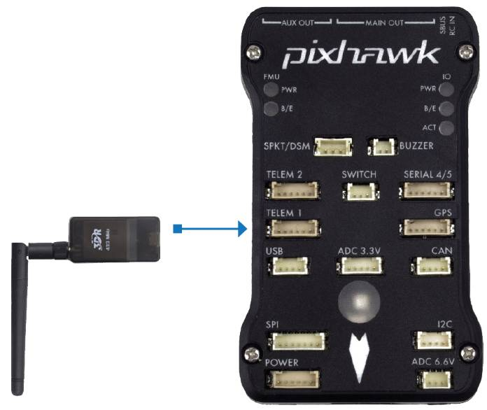
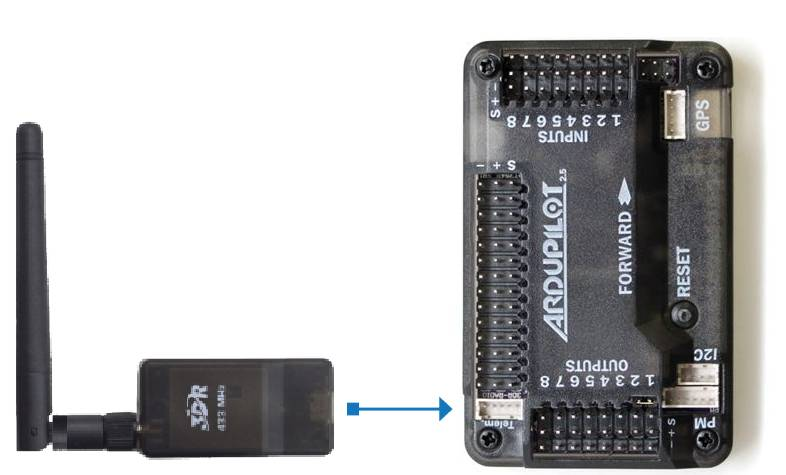
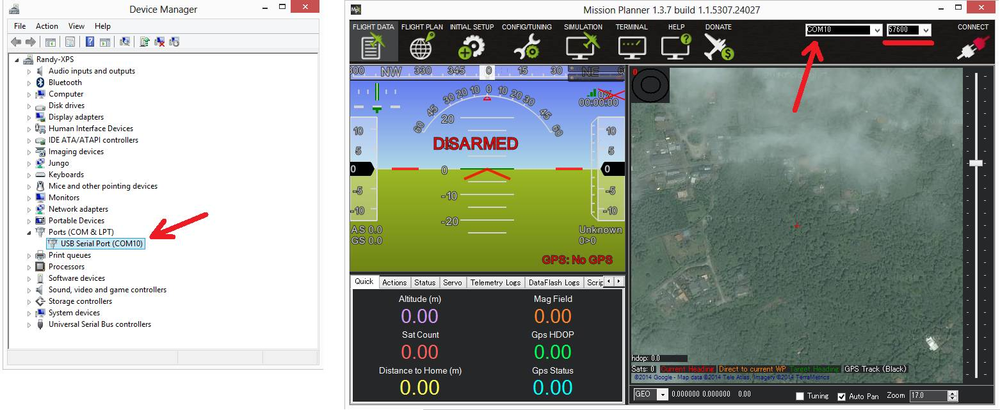
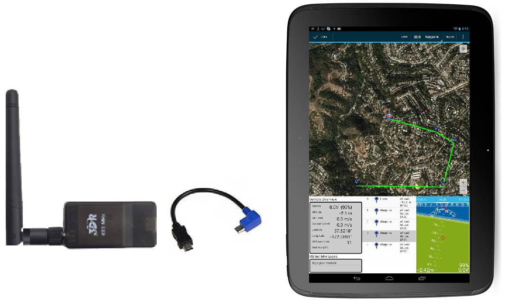
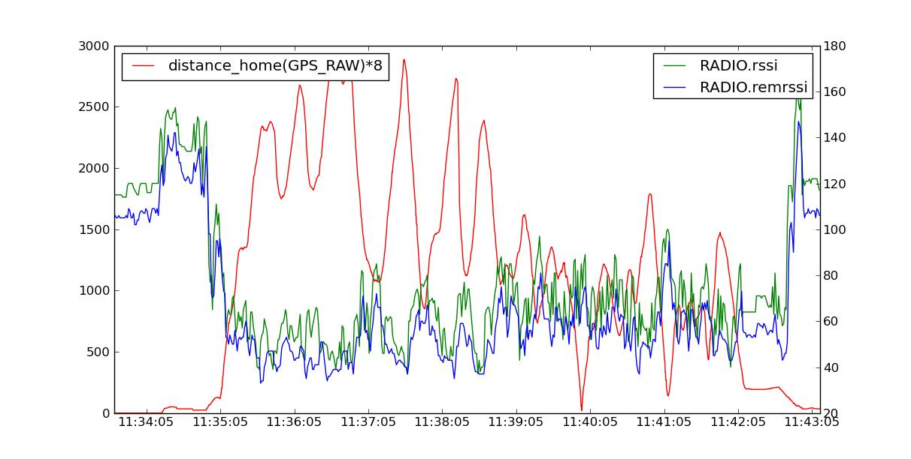

.. _common-sik-telemetry-radio:

===================
SiK Telemetry Radio
===================

A *SiK Telemetry Radio* is one of the easiest ways to setup a telemetry
connection between your Flight Controller and a ground station. This article
provides a basic user guide for how to connect and configure your radio.

.. figure:: ../../../images/3dr_radio_v2.jpg
   :target: ../_images/3dr_radio_v2.jpg

   3DR Radio v2 (a consumer implementation of SiKRadio)

.. note::

   This page was previously named *3DR Radio (version 2)* for
   3DRobotics' trusted high quality implementation of SiK radio. As this
   radio is no longer available from 3DR, the page has been renamed to
   reflect the underlying open source radio platform.

Overview
========

A `SiK Telemetry Radio <https://github.com/ArduPilot/SiK>`__ is a small,
light and inexpensive open source radio platform that typically allows
ranges of better than 300m "out of the box" (the range can be extended
to several kilometres with the use of a patch antenna on the ground).
The radio uses `open source firmware <https://github.com/ArduPilot/SiK>`__
which has been specially designed to work well with MAVLink packets and
to be integrated with the Mission Planner, Copter, Rover and Plane.

The radios can be either 915Mhz or 433Mhz and you should purchase the
model which is :ref:`appropriate for your country/region <common-telemetry-radio-regional-regulations>`.

As the platform is open source, implementation can be purchased from
many different sources, including ArduPilot Partners:

-  `jD-SiK Telemetry Set <http://store.jdrones.com/jD_SiK_Radio_Telemetry_radio_p/rfsik20set900.htm>`__ (jDrones)
-  `mRo SiK Telemetry Radio <https://store.mrobotics.io/ProductDetails.asp?ProductCode=mRo-sikv2>`__ (mRobotics)
-  `CUAV Transceiver Telemetry Radio Set (433Mhz) <https://store.cuav.net/index.php?id_product=34&id_product_attribute=0&rewrite=500mw-433mhz-3dr-wireless-tx-rx-dual-ttl-telemetry-for-mini-pixhawk-apm-pro-flight-control&controller=product&id_lang=3>`__ (CUAV)
-  `VirtualRobotix Telemetry Set <http://www.virtualrobotix.it/index.php/en/shop/telemetria>`__ (VirtualRobotix)

.. tip::

   If you're looking for an alternative, the 
   :ref:`RFD900 Radio Modem <common-rfd900>` is highly recommended by many community members
   (The SiK platform was based on the RFD900 and both platforms have
   continued to evolve). It provides a significantly better range. 

Features
========

The main features of the SiK Radio are listed below (see the :ref:`Advanced Configuration <common-3dr-radio-advanced-configuration-and-technical-information>`
for more information):

-  Very small size
-  Light weight (under 4 grams without antenna)
-  Available in 900MHz or 433MHz (v2 only) variants
-  Receiver sensitivity to -121 dBm
-  Transmit power up to 20dBm (100mW)
-  Transparent serial link
-  Air data rates up to 250kbps
-  MAVLink protocol framing and status reporting
-  Frequency hopping spread spectrum (FHSS)
-  Adaptive time division multiplexing (TDM)
-  Support for LBT and AFA
-  Configurable duty cycle
-  Built-in error correcting code (can correct up to 25% data bit
   errors)
-  Demonstrated range of several kilometres with a small omni antenna
-  Can be used with a bi-directional amplifier for even more range
-  Open source firmware
-  AT commands for radio configuration
-  RT commands for remote radio configuration
-  Adaptive flow control when used with APM
-  Based on HM-TRP radio modules, with Si1000 8051 micro-controller and
   Si4432 radio module

Status LEDs
===========

The radios have 2 status LEDs, one red and one green. The meaning of the
different LED states is:

-  Green LED blinking - searching for another radio
-  Green LED solid - link is established with another radio
-  Red LED flashing - transmitting data
-  Red LED solid - in firmware update mode

Connecting the radios
=====================

The radio has interchangeable air and ground modules, meaning that you
use them as a pair but it does not matter which one goes on the vehicle
and which remains on the ground.

The radio has a micro-USB port, and a DF13 six-position port. The
following sections explain how to connect these to flight controllers
and ground stations.

.. image:: ../../../images/3dr_radio_v2.jpg
    :target: ../_images/3dr_radio_v2.jpg

.. image:: ../../../images/3dr-radio-pinout.jpg
    :target: ../_images/3dr-radio-pinout.jpg

Connecting to Pixhawk
---------------------

Use the 6 pin DF13 connector that should have come with the radio to connect the
radio to your Pixhawk's "Telem 1" ("Telem 2" or "Serial 4/5" can also be used but the
default recommendation is "Telem1").

Connecting to APM2.x
--------------------

Use the 6-to-5 pin DF13 connector to connect the radio to your APM2's Telem port
Because of the limited number of serial ports on the APM2.x, the telemetry radio cannot
be used while the board is also plugged in with the micro USB port.

Connecting to a PC
------------------

Connecting the radio to your Windows PC is as simple as connecting the
micro USB cable (which should have been included with the radio) to your
PC. The necessary drivers should be installed automatically and the
radio will appear as a new "USB Serial Port" in the Windows Device
Manager under Ports (COM & LPT). The Mission Planner's COM Port
selection drop-down should also contain the same new COM port.

To connect the radios:

-  Select the new COM port, set the baud rate drop down (which appears
   between the COM port and Connect buttons) to 57600.
-  Press the **Connect** button and if the two radios connect
   successfully you should be able to lean your vehicle left and right
   and see it's attitude update on the MP's Flight Data screen's
   artificial horizon.

Connecting to an Android tablet
-------------------------------

Connecting the radio to an Android tablet using the L shaped micro USB
cable (which should have been included with the radio). Then follow the
directions in your :ref:`preferred Ground Station app <common-choosing-a-ground-station>`.

    
.. _common-sik-telemetry-radio_configuring_using_the_mission_planner:

Configuring using the Mission Planner
=====================================

Many users will not need to configure their radios! One case where you
might do so is when you use your vehicle with others — in which case you
will need to specify different radio channels (Net ID).

Mission Planner supports configuring your radios using a simple GUI
interface. For more information see :ref:`Configuring a Telemetry Radio using Mission Planner <common-configuring-a-telemetry-radio-using-mission-planner>`.

Expected range
==============

Typical range achieved with the radios using standard configuration and
antenna is around 500m, but the range varies a lot depending on noise
sources and antenna setup.

Diagnosing range issues
-----------------------

The first thing you should do when diagnosing range issues is the "one
meter test". Setup the two radios one meter apart and look at the local
and remote RSSI. You should get a value of over 190 for a standard SiK
radio. If you don't then your antennas may be faulty or your radios may
have been damaged. If you have ever run the radios without an antenna
attached them the radio may have been damaged.

If that test passes then have a look at your local and remote RSSI and
noise from a flight. See the :ref:`advanced setup page <common-3dr-radio-advanced-configuration-and-technical-information_diagnosing_range_problems>`
for detailed information on diagnosing range issues using telemetry
logs.

Improving the range
===================

The range can be improved by:

-  Using a small "patch antenna" on the ground like `this flat patch antenna <http://www.readymaderc.com/store/index.php?main_page=product_info&cPath=11_45_47&products_id=51>`__
   perhaps mounted on an :ref:`Antenna Tracker <antennatracker:home>`
-  Replace at least one of the two radios with a higher powered
   :ref:`RFD900 <common-rfd900>`
-  Reduce the ``AirRate`` parameter which will increase range but at the
   expense of the rate of the data transfer.

The graph below shows the ground and remote receiver strength vs
distance from home (in meters) for a test flight of a *3DR Radio* (SiK
implementation) on a SkyFun plane. The ground based radio was attached
to a 3.5dB flat patch antenna. The SkyFun had a small 'wire' antenna.
The graph shows the vehicle reached a distance of nearly 3km and the
link was completely maintained throughout the flight.

Although anecdotal, another user provided a Tlog showing a good link
kept while the vehicle was 4.5km from the base station, using default
radio settings for a 3DR 900 radio. The plane used a small omni antenna,
and a 8dB patch antenna on the ground station.

Support for different countries/regions
=======================================

It is very important that you configure your radios to comply with your
regional/country regulations for frequency, hopping channels and power
levels. For information on radio -> region frequency ranges and
settings, see

:ref:`Telemetry Radio Regional Regulations <common-telemetry-radio-regional-regulations>`.

3DR Radio Discussion Forum
==========================

The best place to get involved with the development or tuning of these
radios is the `SiK Radios forum <http://discuss.ardupilot.org/c/hardware-discussion/radios-hardware>`__. Join in on the
forum to help make these radios even better!
