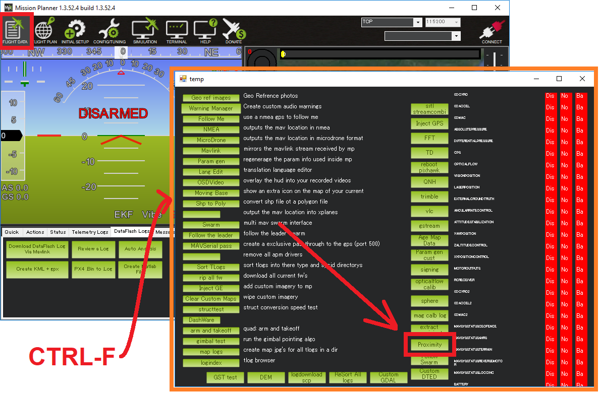

.. _common-simple-object-avoidance:

[copywiki destination="copter,rover"]
=======================
Simple Object Avoidance
=======================

Copter supports simple object avoidance horizontally and upward, while Rover avoids simple objects by only stopping. Both use rangefinders such as:

- 360 degree lidar including the :ref:`Lightware SF40C <copter:common-lightware-sf40c-objectavoidance>`, :ref:`TeraRanger Tower <copter:common-teraranger-tower-objectavoidance>` or :ref:`RPLidarA2/A3 <copter:common-rplidar-a2>`
- Any of the other supported :ref:`lidars <common-rangefinder-landingpage>` .As of ArduPilot firmware versions 4.0 and higher, up to 9 rangefinders can be used for object avoidance. See :ref:`common-rangefinder-setup` for more information.
- Sensors capable of providing `MAVLink Distance Sensor <https://mavlink.io/en/messages/common.html#DISTANCE_SENSOR>`__ messages (like `OpenKai with a 3D camera <https://www.youtube.com/watch?v=qk_hEtRASqg>`__)

..  youtube:: BDBSpR1Dw_8
    :width: 100%

In addition, Simple Object Avoidance can use Geo-Fences and Fence Beacons as proximity sensors as detemined by the setting of the :ref:`AVOID_ENABLE<AVOID_ENABLE>` parameter.
 
See :ref:`common-rangefinder-setup` for general rangefinder setup information.

Simple Object Avoidance Algorithms
==================================

Horizontal object avoidance works in :ref:`AltHold <altholdmode>` and :ref:`Loiter <loiter-mode>` modes.  Upward object avoidance works in LOITER, ALTHOLD, and POSHOLD modes only.

.. warning:: Only one proximity sensor source can be enabled, using either a 360 degree lidar or up to 9 rangefinders. While a second proximity sensor appears in the parameters list, it is not currently functional

.. note:: For Object Avoidance in AUTO and GUIDED modes in Copter and Rover, see :ref:`common-oa-bendyruler` or :ref:`common-oa-dijkstras`

Details on how simple object avoidance is implemented for Copter in ALTHOLD and LOITER mode can be found :ref:`here in the developer wiki <dev:code-overview-object-avoidance>` and involves assessing all the objects detected, in all reported quadrants, and adds control input to the pilot's,trying to move away from the aggregate threat or stop.

In ALTHOLD mode, the aggregate threat is translated into an attempt to add lean input into the pilot's commands to move the Copter away from the aggregate obstructions. The pilot can still overcome these additions to his command inputs and fly into a object, if determined to do so.

In LOITER, either stopping in front of the object or a "sliding" algorithm is used to avoid it. "Sliding" involves slowing and slightly yawing as the vehicle approaches the object. For example, if Copter approaches a fence line at an angle, it will "slide along" the fence as the operator pushes the Copter toward the fence. Head-on approaches would stop, even if the pilot continues to "pushes" it forward.

Setup the Proximity Sensor
==========================

For 360 lidar follow the instructions corresponding to the lidar on the vehicle

  - :ref:`Lightware SF40C <common-lightware-sf40c-objectavoidance>`
  - :ref:`TeraRanger Tower/ Tower EVO <common-teraranger-tower-objectavoidance>`
  - :ref:`RPLidarA2/A3 <common-rplidar-a2>`

For other rangefinders follow the instructions found in there individual setup pages :ref:`here <common-rangefinder-landingpage>`

Be sure to read the :ref:`common-rangefinder-setup` page

Configuring Simple Avoidance for Copter
=======================================

- set :ref:`AVOID_ENABLE <AVOID_ENABLE>` = 7 ("All") to use all sources of barrier information including "Proximity" sensors

- in :ref:`Loiter <loiter-mode>`
- 
  -  set :ref:`PRX_TYPE <PRX_TYPE>` to a 360 deg Lidar type being used or = 4, to enable using range finders as "proximity sensors"
  - :ref:`AVOID_MARGIN <AVOID_MARGIN>` controls how many meters from the barrier the vehicle will attempt to stop or try to slide along it
  - :ref:`AVOID_BEHAVE <AVOID_BEHAVE>` allows setting whether the vehicle should simply Stop in front of the barrier or Slide around it. This parameter only affects Copter, since Rover always stops.

- in :ref:`AltHold <altholdmode>`

  - :ref:`AVOID_DIST_MAX <AVOID_DIST_MAX>` controls how far from a barrier the vehicle starts leaning away from the barrier
  - :ref:`AVOID_ANGLE_MAX <AVOID_ANGLE_MAX>` controls how far the vehicle will try to lean away from the barrier

Configuring Simple Avoidance for Rover
======================================

- set :ref:`AVOID_ENABLE <AVOID_ENABLE>` = 7 ("All") to use all sources of barrier information including "Proximity" sensors.
- set :ref:`PRX_TYPE <PRX_TYPE>` = "4" to enable using range finders as "proximity sensors"
- Rover attempts to stop the vehicle before it hits objects in all modes except MANUAL.

"Stop" Avoidance
----------------

..  youtube:: ho9mlVwhgHA
    :width: 100%

Real-time view
==============

Real-time distances can be seen in the Mission Planner's proximity viewer

.. image:: ../../../images/copter-object-avoidance-radar-view.png

This window can be opened by moving to the MP's Flight Data screen, press Ctrl-F and push the Proximity button.

DataFlash logging
=================

Upward and downward facing range finder distances can be seen in the DataFlash Log's RFND message.

The distance to the nearest object in 8 quadrants around the vehicle is recorded in the DataFlash log's PRX messages.

Limitations
===========

Simple Object Avoidance feature has the following limitations.  Future versions will likely resolve these.

- The vehicle should stop before hitting objects but will never back away from objects that approach the vehicle (a slow backing away will be added in future firmware versions)
- Avoidance is "sensor based" meaning it is **not** building up a 3D map and thus has no "memory" of where barriers were once they are out of view of the lidar.

