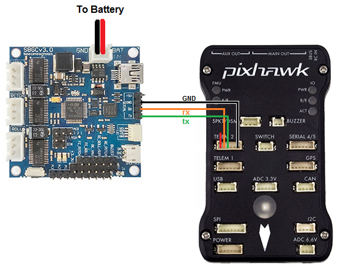

.. _common-simplebgc-gimbal:

=====================================
SimpleBGC Gimbal (aka AlexMos gimbal)
=====================================

The SimpleBGC is a popular brushless gimbal controller that can communicate with ArduPilot (Copter, Plane, and Rover) using MAVLink or a custom serial protocol.
More details on the capabilities of this gimbal can be found at `basecamelectronics.com <https://www.basecamelectronics.com/>`__

More details can be found in the `software user manual <https://www.basecamelectronics.com/files/v3/SimpleBGC_32bit_manual_2_6x_eng.pdf>`__.

Where to Buy
============

The SimpleBGC controller and accompanying 2-axis and 3-axis gimbals can be purchased from `basecamelectronics.com <https://www.basecamelectronics.com/>`__ and many other retailers.

Connecting the gimbal to the Autopilot
======================================

Although the SimpleBGC can be connected using PWM we recommend using the serial interface connected to one of the autopilot's Serial/Telemetry ports like Telem2 as shown above.

Configuration when using Custom Serial Protocol
===============================================

In your Ground Control Station set the following parameters, if using the first mount connected to Serial2 as shown above:

- :ref:`MNT1_TYPE <MNT1_TYPE>` to 3 ("AlexMos-Serial")
- :ref:`SERIAL2_PROTOCOL <SERIAL2_PROTOCOL>` to 7 ("AlexMos Gimbal Serial")

If you are unable to connect you may wish to set the following parameters although normally this should not be required:

- :ref:`SERIAL2_BAUD <SERIAL2_BAUD>` to 115 (means use serial baudrate of 115200)
- :ref:`BRD_SER2_RTSCTS <BRD_SER2_RTSCTS>` to 0 to disable flow control on Telem2 (use BRD_SER1_RSCTS if connecting to Serial1, Serial4/5 never uses flow control)

The gimbal's maximum lean angles can be set using these parameters:

- :ref:`MNT1_ROLL_MIN <MNT1_ROLL_MIN>`, :ref:`MNT1_ROLL_MAX <MNT1_ROLL_MAX>` to -30 and 30 to limit the roll angle to 30 degrees in each direction
- :ref:`MNT1_PITCH_MIN <MNT1_PITCH_MIN>`, :ref:`MNT1_PITCH_MAX <MNT1_PITCH_MAX>` to -90 and 0 to limit the gimbal to point between straight down (-90 degrees) and straight forward (0 degrees)
- For 3-axis gimbals with 360 degrees of yaw set :ref:`MNT1_YAW_MIN <MNT1_YAW_MIN>`, :ref:`MNT1_YAW_MAX <MNT1_YAW_MAX>` to -180 and 180 respectively

Control and Testing
===================

See :ref:`Gimbal / Mount Controls <common-mount-targeting>` for details on how to control the gimbal using RC, GCS or Auto mode mission commands

Configuration when using MAVLink Protocol
=========================================

The manufacturer instructions on the MAVLink setup can be found on page 97 of the `software user manual <https://www.basecamelectronics.com/files/v3/SimpleBGC_32bit_manual_2_6x_eng.pdf>`__.

To use the gimbal GUI and the MAVlink protocol, the gimbal must be running firmware version 2.60 or above.

The following instructions present how to wire the components:

- Connect the autopilot as shown above but connect the RX wire (orange) to the RC-R and the TX wire (green) to the RC-Y pin on the gimbal
- Connect the ground wire (black) to any GND pin.

In this setup you have to take care of the following options in the GUI: 

- Activate RC_SERIAL by setting "RC_ROLL pin mode" = "Serial port (Serial API, etc.)" on the RC tab On the tab "External IMU" in the field "External IMU configuration"
- Select the Model: "MavLink FC channel 1"
- Connection: disabled On the same tab in the field "MavLink connection" for Channel 1 (leave Channel 2 disabled)
- Serial port: "RC_serial" - System Id/Component Id: 1, 154
- Port setting: 115200, none parity 
- Check the options: Send heartbeat and Query RC data 
- MavLink control mode: "Controls ROLL and PITCH axes only" If everything is set correctly you should see something like the following in the fields: AHRS: OK (40ms), GPS: OK (106ms), RC: OK, Control: OK CH1: Packets received: 257502, lost: 0, parse errors: 3 CH2: Packets received: 0, lost: 0, parse errors: 0.

In your Ground Control Station set the following parameters, if using the first mount connected to Serial2:

- :ref:`MNT1_TYPE <MNT1_TYPE>` to 4 ("SToRM32 MAVLink")
- :ref:`SERIAL2_PROTOCOL <SERIAL2_PROTOCOL>` to 1 ("MAVlink1")
- :ref:`SR2_EXTRA1 <SR2_EXTRA1>` to 20
- :ref:`SR2_POSITION <SR2_POSITION>` to 10
- :ref:`SR2_RC_CHAN <SR2_RC_CHAN>` to 20 and all other SR2_* variables to 0.

If you wish to control the pitch angle manually you can set:

-  ``RCx_OPTION`` to 213.
- In the SimpleBCG GUI in the tab "RC Settings" in the field "Input Configuration" set PITCH to "API_VIRT_CH6".

.. warning::

    If you connect the gimbal as shown in the above diagram, it is NOT possible to establish a connection to the GUI on a PC via USB and have it connected simultaneously to the autopilot. It happens because the UART1 ("serial" in the picture above) is "paralleled to the onboard USB-UART converter (excepting the "Tiny" boards that has a dedicated USB). If you accidentally connect both the GUI via USB and an autopilot via UART1, you might end up with corrupt data on the flash of the gimbal. It can result in unexpected motor movement! The reason details, please check the `link <https://www.basecamelectronics.com/files/v3/SimpleBGC_32bit_manual_2_6x_eng.pdf>`__.

.. _common-simplebgc-gimbal_testing_the_gimbal_moves_correctly:

Testing the gimbal moves correctly
==================================

**Testing the pilot's control of pitch**

Once powered the gimbal should point to its Pitch Angle Min (i.e. straight down) when your transmitter's channel 6 tuning knob is at its minimum PWM value (perhaps around 1000) and the camera should point to its maximum pitch angle (i.e. straight forward) when the tuning knob is at its maximum (perhaps around 2000).
The Mission Planner Radio calibration page can be used to check the Ch6's current input PWM value.

**Testing ROI**

**You must have a GPS lock to test ROI.** 
The ROI feature points the vehicle and/or camera to point at a target. 
The instructions above describe setting up the APM/Pixhawk so that it only controls the pitch of the Tarot gimbal so when a :ref:`Do-Set-ROI <copter:mission-command-list_do-set-roi>` command is received Copter will attempt to turn the vehicle's nose to point in the direction of the target and pitch camera depending upon the vehicle's distance and altitude. 
You can test the gimbal pitch moves correctly by connecting with the mission planner, then on the Flight Data screen's map, right-mouse-button-click on a point about 50m ahead of the vehicle (the orange and red lines show the vehicle's current heading), select **Point Camera Here** and input an altitude of -50 (meters). 
This should cause the gimbal to point down at about 45 degrees.

.. image:: ../../../images/Tarot_BenchTestROI.jpg
    :target: ../_images/Tarot_BenchTestROI.jpg

Pilot control of the gimbal can be restored by setting up an :ref:`auxiliary function switch <common-auxiliary-functions>` to "Retract Mount" (i.e. RCx_OPTION = 27) and then move the switch to the lower position
