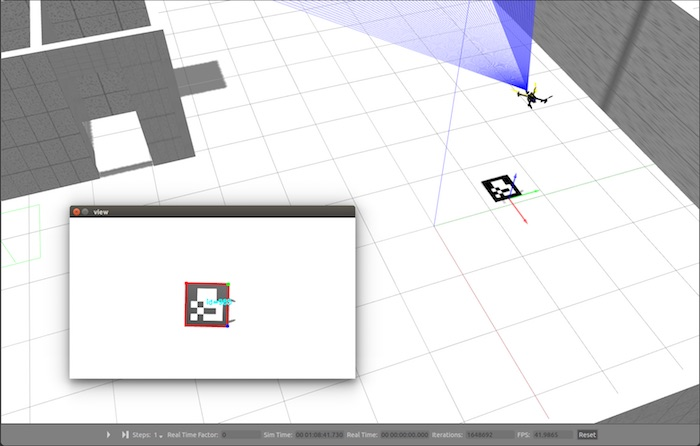
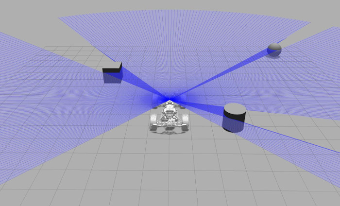

.. _common-simulation:

==========
Simulation
==========

Simulation allows for safe testing of experimental code and settings,
and can help you practice using your Ground Station without having to
leave your desk.

.. tip::

   Crashing simulated planes is a lot cheaper than crashing real
   ones!

Most users should choose the :ref:`Software In The Loop (SITL) simulator <dev:sitl-simulator-software-in-the-loop>`
(dev wiki) as it can simulate Copter, Plane or Rover without the need
for any vehicle hardware, and can be run on Linux, Windows and Mac OSX.
It is also the easiest form of simulation to set up.

Gazebo-based simulations
========================

:ref:`Gazebo <http://gazebosim.org/>` is a powerful real time physics simulator that allows the developers to test their algorithms in a secure and agile way. It runs along :ref:`ROS (Robot Operating System) <http://ros.org/>` and that’s probably what makes it perfect, plus it offers a variety of sensors (such as lidars, cameras, range finders) in form of plugins that can be added to any robot model.

Thanks to the plugins developed, you can simulate this APM based vehicles: :ref:`Erle-Rover <http://erlerobotics.com/blog/erle-rover/>` and :ref:`Erle-Copter <http://erlerobotics.com/blog/erle-copter/>`.

If you wish to have more information, installation, start doing tutorials and much more, please visit :ref: `Erle Robotics Documentation <http://erlerobotics.com/docs/Simulation/index.html>`

..  youtube:: xNengdC0_8s
    :width: 100%