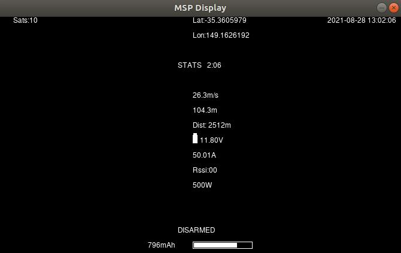

.. _sitl-testing-osd:

=====================
Testing OSD with SITL
=====================

.. note:: The emulation supports multiple screens and stats, but not yet Display Port

MSP OSD functionality can be tested and panel items adjusted without autopilot or video hardware using the :ref:`Software In The Loop (SITL) simulator <dev:sitl-simulator-software-in-the-loop>` setup. Follow those SITL-Instructions to setup a simulation environment. Run the simulator on current source code using ``--osdmsp`` option to build the OSD code into the simulator. For example, for a plane simulation:

::

    sim_vehicle.py -v ArduPlane --console --osdmsp

A graphical DJI style MSP OSD simulation in a separate window will be opened with the other simulation windows using a typical set of OSD panel parameters, located at libraries/AP_MSP/Tools/osdtest.parm . Then the OSD elements can be customized by their parameters using the  MSP OSD emulation program to visualize the OSD.

.. note:: You could also use these parameters to initially setup the MSP OSD panels and positions for use with goggles, but still need to correctly configure the Serial port and other parameters for the particular OSD system.

.. note:: The emulation does not support units other than metric

.. image:: ../../../images/msp_osd_python.png
   :target: ../_images/msp_osd_python.png

By changing the OSD panel items' parameters, a live update of their placement can be seen in this emulator.