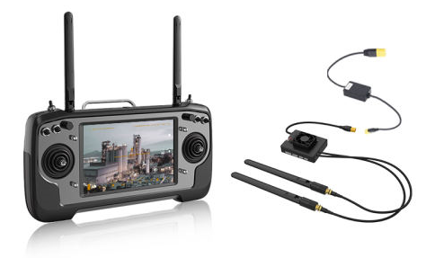
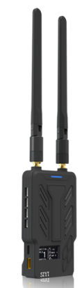
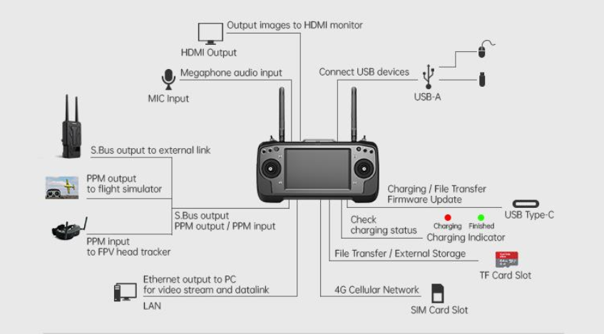
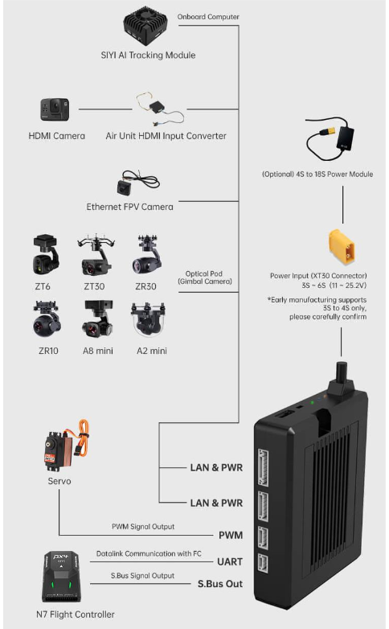

.. _common-siyi-rc:
[copywiki destination="plane,copter,rover,blimp"]
====================================
SIYI RC/HD Video Transmission System
====================================

SIYI MK32 is an integrated remote controller, ground station and wireless digital transmission system which can be used with Ardupilot. Up to 15km range transmission of HD Video, control and telemetry is possible, which can be doubled via the use of the SIYI HM30 in repeater mode.

Features
========
* Android based smart device with 7 inch 1080P screen.
* Integrated digital transmission system simultaneously transmitting video, telemetry and control. 
* SIYI Custom GCS Application or Mission Planner or QGC ground station software with MAVLink support for ArduPilot and PX4.
* 1080P HD video 
* SBUS RC output plus 5 PWM channels on air unit
* Ethernet camera input (HDMI converter provided)
* Video recording
* Dual operator capable
* 10 hour base unit battery life

More Info on SIYI systems can be found on `here <https://shop.siyi.biz/>`__

