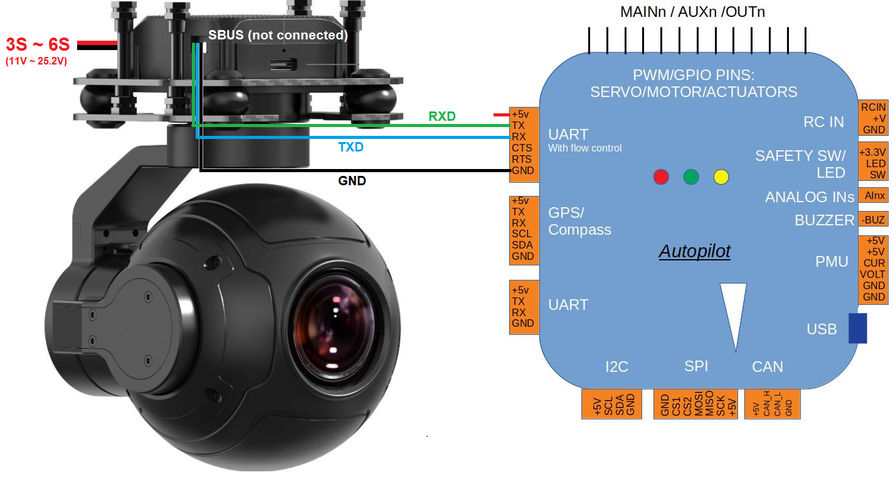

.. _common-siyi-zr10-gimbal:

[copywiki destination="plane,copter,rover"]

=========================================
SIYI A8, ZR10, ZR30, ZT6 and ZT30 Gimbals
=========================================

The `SIYI A8 <https://shop.siyi.biz/products/siyi-a8-mini>`__, `ZR10 <https://shop.siyi.biz/products/siyi-zr10>`__, `ZR30 <https://shop.siyi.biz/products/siyi-zr30>`__, `ZT6 <https://shop.siyi.biz/products/siyi-zt6>`__ and `ZT30 <https://shop.siyi.biz/products/siyi-zt30>`__ are 3-axis gimbals and camera which can communicate with ArduPilot using a custom serial protocol

.. image:: ../../../images/siyi-zr10-gimbal.png
    :target: https://shop.siyi.biz/products/zr10

.. warning::

    The Siyi A2 is not supported

Where to Buy
------------

These gimbals can be purchased directly from `SIYI <https://shop.siyi.biz/collections/gimbal-camera>`__

Connecting to the Autopilot
---------------------------

.. image:: ../../../images/siyi-a8-gimbal-autopilot.png
    :target: ../_images/siyi-a8-gimbal-autopilot.png
    :width: 450px

Connect the gimbal's RX, TX and GND pins to one of the autopilot's serial ports as shown above.

Connect with a ground station and set the following parameters.  The params below assume the autopilot's telem2 port is used and the Camera1 control instance,

- :ref:`SERIAL2_PROTOCOL <SERIAL2_PROTOCOL>` to 8 ("SToRM32 Gimbal Serial")
- :ref:`SERIAL2_BAUD <SERIAL2_BAUD>` to "115" for 115200 bps
- :ref:`MNT1_TYPE <MNT1_TYPE>` to "8" ("Siyi") and reboot the autopilot
- :ref:`MNT1_PITCH_MIN <MNT1_PITCH_MIN>` to -90
- :ref:`MNT1_PITCH_MAX <MNT1_PITCH_MAX>` to 25
- :ref:`MNT1_YAW_MIN <MNT1_YAW_MIN>` to -135
- :ref:`MNT1_YAW_MAX <MNT1_YAW_MAX>` to 135
- :ref:`MNT1_RC_RATE <MNT1_RC_RATE>` to 90 (deg/s) to control speed of gimbal when using RC targetting
- :ref:`RC6_OPTION <RC6_OPTION>` = 213 ("Mount Pitch") to control the gimbal's pitch angle with RC channel 6
- :ref:`RC7_OPTION <RC7_OPTION>` = 214 ("Mount Yaw") to control the gimbal's yaw angle with RC channel 7
- :ref:`RC8_OPTION <RC8_OPTION>` = 163 ("Mount Lock") to switch between "lock" and "follow" mode with RC channel 8
- Enable camera controls with one of the following AP version specific parameters

  - For AP4.3 (or earlier) set ``CAM_TRIGG_TYPE`` to 3 / "Mount (Siyi)" to allow control of the camera
  - For AP4.4 (or later) set :ref:`CAM1_TYPE<CAM1_TYPE>` to 4 / "Mount (Siyi)" to allow control of the camera

- Optionally these auxiliary functions are also available

  - :ref:`RC9_OPTION <RC9_OPTION>` = 9 ("Camera Trigger") to take a picture
  - :ref:`RC9_OPTION <RC9_OPTION>` = 166 ("Camera Record Video") to start/stop recording of video
  - :ref:`RC9_OPTION <RC9_OPTION>` = 167 ("Camera Zoom") to zoom in and out
  - :ref:`RC9_OPTION <RC9_OPTION>` = 168 ("Camera Manual Focus") to adjust focus in and out
  - :ref:`RC9_OPTION <RC9_OPTION>` = 169 ("Camera Auto Focus") to trigger auto focus

.. warning::

    A8 does not support zoom at 4K recording resolution

Configuring the Gimbal
----------------------

- Download, install and run "SIYI PC Assistant" which can be found on the `SIYI ZR10 web page's Downloads tab <https://shop.siyi.biz/products/siyi-zr10>`__
- Ensure the gimbal is running a recent firmware.  For ZR10 use 0.2.1 or higher.  For A8 use 0.1.7 or higher.

Ethernet Connectivity
---------------------

Instead of using a UART serial connection to control the gimbal, an Ethernet virtual serial connection may also be used, as well as transmitting a video stream from the camera.

An example of the setup of the gimbal in a networked ArduPilot vehicle system is detailed in :ref:`common-ethernet-vehicle` but in short, to control the gimbal over Ethernet

- Connect the gimbal and autopilot using an :ref:`ethernet adapter <common-ethernet-adapters>`
- Ensure the autopilot and gimbal are on the same subnet (e.g the first 3 octets of the IP address match, 4th octet is different)

  - The gimbal's IP address can be set using the Siyi Assistant software (see image below)
  - Set the autopilot's :ref:`NET_ENABLE<NET_ENABLE>` = 1 and reboot to enable networking
  - Set the autopilot's IP address using :ref:`NET_IPADDR0<NET_IPADDR0>`, :ref:`NET_IPADDR1<NET_IPADDR1>`, :ref:`NET_IPADDR2<NET_IPADDR2>`, :ref:`NET_IPADDR3<NET_IPADDR3>` (e.g. 192.168.144.26)
- Create a serial connection over ethernet

  - Set :ref:`NET_P1_TYPE<NET_P1_TYPE>` = 1 (UDP Client) and reboot the autopilot
  - Set :ref:`NET_P1_IP0<NET_P1_IP0>`, :ref:`NET_P1_IP1<NET_P1_IP1>`, :ref:`NET_P1_IP2<NET_P1_IP2>`, :ref:`NET_P1_IP3<NET_P1_IP3>` to the gimbal's IP address (e.g. 192.168.144.25)
  - Set :ref:`NET_P1_PORT<NET_P1_PORT>` = 37260 (port that Siyi gimbals listens for commands on)
  - Set :ref:`NET_P1_PROTOCOL<NET_P1_PROTOCOL>` = 8 (Gimbal)

To view the Siyi cammera's live video over Ethernet use the Siyi Assistant to set the "IP Config", "Coding Format" and Video Output mode as shown below.  Note that the IP's first three numbers should match the telemetry system being used (e.g. :ref:`Herelink <common-herelink>`, Siyi MK32, etc) or PC the camera is connected to.  In image below shows the default IP address for Siyi gimbals

The video is available using an RTSP URL which can vary by camera type.  Note the URL's IP address should match the camera's IP address that was entered into the Siyi Assistant above

- A8, ZR10: rtsp://192.168.144.25:8554/main.264
- ZT6 (IR): rtsp://192.168.144.25:8554/video1
- ZT6 (rgb): rtsp://192.168.144.25:8554/video2

If connected to a PC, `VLC <https://www.videolan.org/>`__ can be used to test the feed

- Open VLC
- Select "Media", "Open Network Stream" and enter the RTSP URL

If using QGC, the live video can be configured from the "Application Settings", "General" screen.  Set "Source" to "RTSP Video Stream" and "RTSP URL" to one of the RTSP URLs listed above

Downloading Images and Video
----------------------------

Images and videos captured by the camera can be remotely downloaded to a companion computer or PC via Ethernet using `this siyi-download.py Python script <https://github.com/ArduPilot/ardupilot/blob/master/Tools/cameras_gimbals/siyi-download/siyi-download.py>`__

Control and Testing
-------------------

See :ref:`Gimbal / Mount Controls <common-mount-targeting>` and :ref:`Camera Controls <common-camera-controls>`  for details on how to control the camera and gimbal using RC, GCS or Auto mode mission commands
