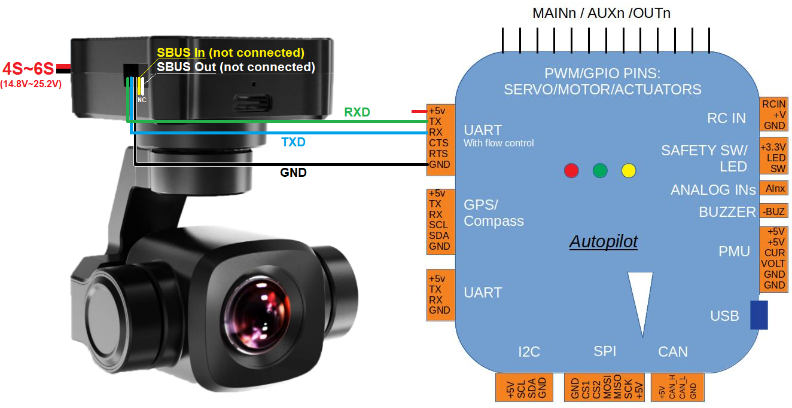

.. _common-siyi-zr10-gimbal:

[copywiki destination="plane,copter,rover"]

==============================
SIYI ZR10, ZR30 and A8 Gimbals
==============================

The `SIYI ZR10 <https://shop.siyi.biz/products/siyi-zr10>`__, `ZR30 <https://shop.siyi.biz/products/siyi-zr30>`__ and `A8 <https://shop.siyi.biz/products/siyi-a8-mini>`__  are 3-axis gimbals and camera which can communicate with ArduPilot using a custom serial protocol.

.. warning::

    Support for these gimbals is available in ArduPilot 4.3.1 (and higher)

.. warning::

    The Siyi A2 is not supported

Where to Buy
------------

These gimbals can be purchased directly from `SIYI <https://shop.siyi.biz/collections/gimbal-camera>`__

Connecting to the Autopilot
---------------------------

.. image:: ../../../images/siyi-zr10-gimbal-autopilot.png
    :target: ../_images/siyi-zr10-gimbal-autopilot.png
    :width: 450px

.. image:: ../../../images/siyi-zr30-gimbal-autopilot.png
    :target: ../_images/siyi-zr30-gimbal-autopilot.png
    :width: 450px

Connect the gimbal's RX, TX and GND pins to one of the autopilot's serial ports as shown above.

Connect with a ground station and set the following parameters.  The params below assume the autopilot's telem2 port is used and the Camera1 control instance,

- :ref:`SERIAL2_PROTOCOL <SERIAL2_PROTOCOL>` to 8 ("SToRM32 Gimbal Serial")
- :ref:`SERIAL2_BAUD <SERIAL2_BAUD>` to "115" for 115200 bps
- :ref:`MNT1_TYPE <MNT1_TYPE>` to "8" ("Siyi") and reboot the autopilot
- :ref:`MNT1_PITCH_MIN <MNT1_PITCH_MIN>` to -90
- :ref:`MNT1_PITCH_MAX <MNT1_PITCH_MAX>` to 25
- :ref:`MNT1_YAW_MIN <MNT1_YAW_MIN>` to -135
- :ref:`MNT1_YAW_MAX <MNT1_YAW_MAX>` to 135
- :ref:`MNT1_RC_RATE <MNT1_RC_RATE>` to 90 (deg/s) to control speed of gimbal when using RC targetting
- :ref:`RC6_OPTION <RC6_OPTION>` = 213 ("Mount Pitch") to control the gimbal's pitch angle with RC channel 6
- :ref:`RC7_OPTION <RC7_OPTION>` = 214 ("Mount Yaw") to control the gimbal's yaw angle with RC channel 7
- :ref:`RC8_OPTION <RC8_OPTION>` = 163 ("Mount Lock") to switch between "lock" and "follow" mode with RC channel 8
- Enable camera controls with one of the following AP version specific parameters

  - For AP4.3 (or earlier) set ``CAM_TRIGG_TYPE`` to 3 / "Mount (Siyi)" to allow control of the camera
  - For AP4.4 (or later) set :ref:`CAM1_TYPE<CAM1_TYPE>` to 4 / "Mount (Siyi)" to allow control of the camera

- Optionally these auxiliary functions are also available

  - :ref:`RC9_OPTION <RC9_OPTION>` = 9 ("Camera Trigger") to take a picture
  - :ref:`RC9_OPTION <RC9_OPTION>` = 166 ("Camera Record Video") to start/stop recording of video
  - :ref:`RC9_OPTION <RC9_OPTION>` = 167 ("Camera Zoom") to zoom in and out
  - :ref:`RC9_OPTION <RC9_OPTION>` = 168 ("Camera Manual Focus") to adjust focus in and out
  - :ref:`RC9_OPTION <RC9_OPTION>` = 169 ("Camera Auto Focus") to trigger auto focus

.. warning::

    A8 does not support zoom at 4K recording resolution

Configuring the Gimbal
----------------------

- Download, install and run "SIYI PC Assistant" which can be found on the `SIYI ZR10 web page's Downloads tab <https://shop.siyi.biz/products/siyi-zr10>`__
- Ensure the gimbal is running a recent firmware.  For ZR10 use 0.2.1 or higher.  For A8 use 0.1.7 or higher.

.. image:: ../../../images/siyi-gimbal-firmversion.png
    :target: ../_images/siyi-gimbal-firmversion.png

Control and Testing
-------------------

See :ref:`Gimbal / Mount Controls <common-mount-targeting>` for details on how to control the gimbal using RC, GCS or Auto mode mission commands
