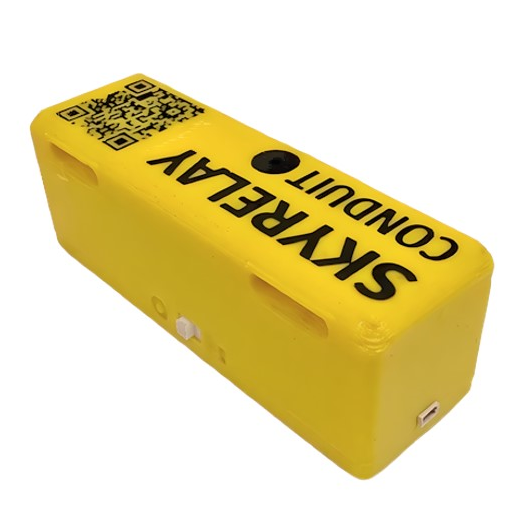
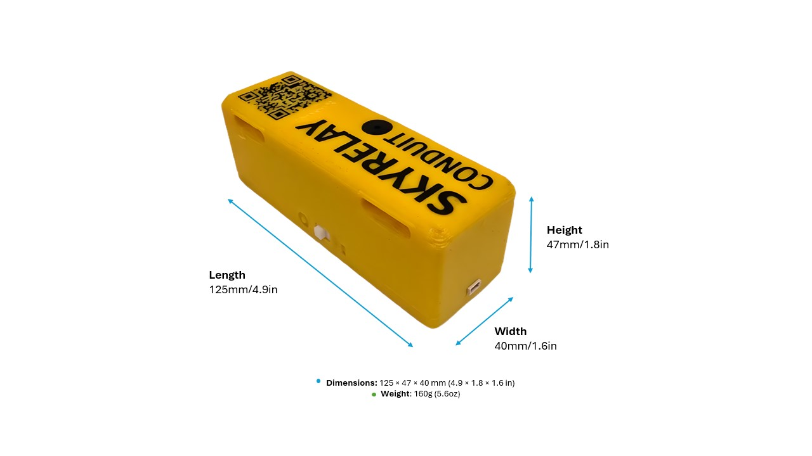
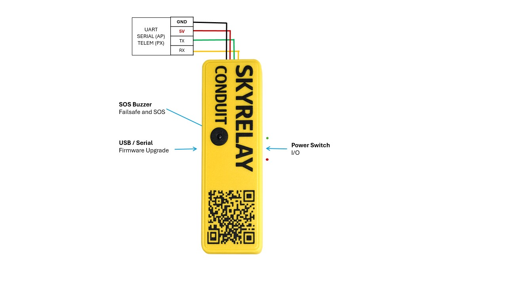
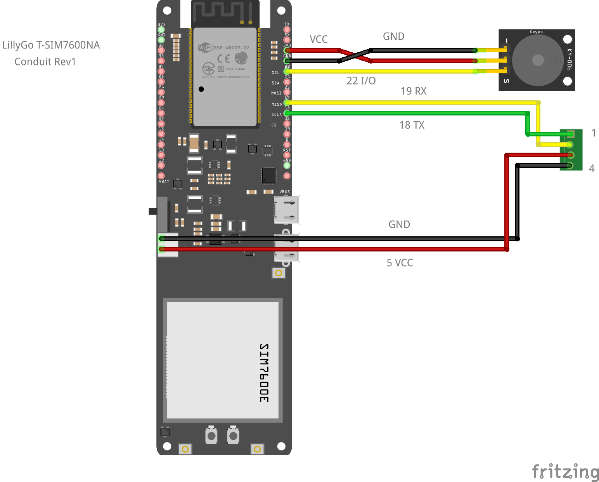

.. _common-skyrelay-conduit:
[copywiki destination="plane,copter,rover,blimp,sub"]
================
SkyRelay Conduit
================

Overview
========

`SkyRelay Conduit <https://www.skyrelay.us/conduit.html>`__ is a compact, plug‑and‑fly device that integrates the LilyGo T‑SIM7600NA with SkyRelay’s firmware to connect a flight controller to cloud operations and expose MAVLink telemetry and commands over LTE.

Features
========

- LTE MAVLink Telemetry — real‑time flight data over 4G LTE.
- MAVLink TCP Relay — remote access via Mission Planner, QGroundControl, MAVProxy.
- Bluetooth GCS Link — local MAVLink link without radio or LTE.
- MQTT Cloud Streaming — live telemetry to the SkyRelay dashboard.
- Remote ID Scanner — detects nearby ASTM F3411‑22a broadcasts.
- SOS / Lost‑Drone Tools — buzzer alerts and QR‑code recovery.
- OTA Firmware Updates — update over LTE or Webserial.
- Data Saver Mode — reduced cellular bandwidth usage.
- Automated Log Backups — Remote ID, UAV logs, and ArduPilot PARAM snapshots.
- Network RTK Support — NTRIP corrections for high‑precision positioning.
- RPIC SkyAssist — voice-enabled prompts to enhance situational awareness.

Supported Autopilots
====================

- ArduPilot
   - Copter
   - Plane
   - Rover

Technical Specifications
========================

   +-------------------+--------------------------------------------------------------------------------------------------+
   | Spec              | SkyRelay Conduit                                                                                 |
   +-------------------+--------------------------------------------------------------------------------------------------+
   | Processor         | ESP32-WROVER-E — dual-core 240 MHz, 4 MB flash, 8 MB PSRAM                                       |
   +-------------------+--------------------------------------------------------------------------------------------------+
   | Cellular          | SIM7600NA (LTE Cat-1, 10/5 Mbps)                                                                 |
   +-------------------+--------------------------------------------------------------------------------------------------+
   | Bands             | B2/B4/B5/B12/B13/B14/B25/B66/B71                                                                 |
   +-------------------+--------------------------------------------------------------------------------------------------+
   | Carriers          | AT&T, T-Mobile, Verizon (US); Bell, Rogers, Telus, Videotron (Canada); Hologram global access    |
   +-------------------+--------------------------------------------------------------------------------------------------+
   | GPS               | Integrated GNSS (GPS + GLONASS), ±2.5m CEP                                                       |
   +-------------------+--------------------------------------------------------------------------------------------------+
   | Bluetooth         | BLE 4.2                                                                                          |
   +-------------------+--------------------------------------------------------------------------------------------------+
   | Battery           | 18650 LiPo, 8-12 hours standby                                                                   |
   +-------------------+--------------------------------------------------------------------------------------------------+
   | Buzzer            | Active piezo                                                                                     |
   +-------------------+--------------------------------------------------------------------------------------------------+
   | MAVLink           | MAVLink2 via UART                                                                                |
   +-------------------+--------------------------------------------------------------------------------------------------+
   | Interface cable   | 4-pin JST SH1.0, 20 cm                                                                           |
   +-------------------+--------------------------------------------------------------------------------------------------+
   | Case              | 3D-printed enclosure with custom QR code                                                         |
   +-------------------+--------------------------------------------------------------------------------------------------+
   | Dimensions        | 125 × 40 × 47 mm (4.9 × 1.6 × 1.9 in)                                                            |
   +-------------------+--------------------------------------------------------------------------------------------------+
   | Weight            | 160 g (5.6 oz)                                                                                   |
   +-------------------+--------------------------------------------------------------------------------------------------+

Pinout
======

The K01 Conduit crosses RX and TX internally. To connect it to an ArduPilot flight controller, follow these steps:

**Step 1: Match the Cable to Your Flight Controller**

The 4-pin UART-to-FC cable must match your FC's telemetry port pinout. Order the pins in the connector as shown in wiring diagram:

- Power and ground go to their counterparts
- Conduit RX → FC RX
- Conduit TX → FC TX

**Step 2: Configure TELEM Settings**

The Conduit communicates with the flight controller over MAVLink serial at 115200 baud. Set the parameters as follows:

where ``x`` represents the serial port

  - ``SERIALx_PROTOCOL`` = 2
  - ``SERIALx_BAUD`` = 115

To play SOS alert tones through the motors, enable the ``DShot`` option in :ref:`NTF_BUZZ_TYPES<NTF_BUZZ_TYPES>` for compatible DShot ESCs.

**Step 3: Plug In and Mount**

Plug the cable into the FC telemetry port and mount the Conduit on the airframe with the straps.

**Step 4: Power On**

Turn the power switch ON:

- · · · · · · (HI) — buzzer confirms firmware is running
- Bluetooth becomes available for a local GCS connection
- Cellular modem connects to LTE
- Cloud connected — — · — (K) confirms telemetry is streaming

Building Your Own (K02)
=======================

SkyRelay Conduit is also available as a bring-your-own-device path based on the LilyGo T-SIM7600NA platform. This option is suited to users who want to assemble the hardware themselves while still using the SkyRelay firmware and service flow.

For BYOD instructions, see `SKYRELAY Conduit manual <https://www.skyrelay.us/conduit/manual.html>`_

Videos
======

* Activation and how it works:

.. youtube:: Rqhx6rzvN1c
   :width: 100%

* SKYRELAY Conduit Wiring to Drone:

.. youtube:: AuUK8JcJtZM
   :width: 100%

* SKYRELAY features and how to connect over LTE MAVLink and GCS

.. youtube:: N1wsOtSbi7A
   :width: 100%

Where to Buy
============

- `SkyRelay <https://www.skyrelay.us>`_
