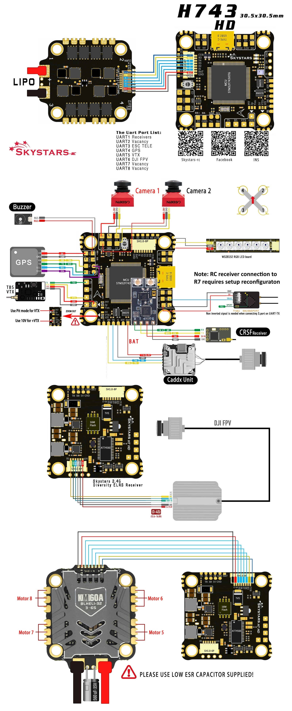

.. _common-skystarsH7:

==============
Skystars H7 HD
==============

Where to Buy
============

- Available from `Skystars RC <https://skystars-rc.com>`__

Specifications
==============

-  **Processor**

   -  STM32H743 32-bit processor 
   -  AT7456E OSD
   -  16 MByte flash for logging

-  **Sensors**

   -  BMI270 IMU (accel and gyro only, no compass)
   -  BMP280 barometer

-  **Power**

   -  3S  - 6S Lipo input voltage with voltage monitoring
   -  10V, 3A BEC for powering Video Transmitter with power switch

-  **Interfaces**

   -  8x PWM outputs, BiDir DShot capable
   -  8x UARTs/serial for GPS and other peripherals
   -  1x I2C port for external compass or airspeed
   -  USB-C port
   -  Switchable VTX power
   -  All UARTS support hardware inversion. SBUS, SmartPort, and other inverted protocols work on any UART without "uninvert hack"
   -  External current monitor input

Pinout
======

=============     =================================================
Pin               Function
=============     =================================================
10V               Selectable 5V/10V for HD System or other VTX, by default ON/OFF is
                  controlled by RELAY2. See :ref:`common-relay`
                  Can be controlled by RELAY2
SDA, SCL          I2C connection (for peripherals)
5                 5v output (1.5A max)
3v3               3.3v output (0.25A max)
C1                Video input from FPV camera1
C2                Video input from FPV camera2
VTX               Video output to video transmitter
CAM               To camera OSD control
OSD               GPIO output
G or GND          Ground
RSI               Analog RSSI (0-3.3v) input from receiver
R1, T1            UART1 RX and TX, normally RC input
R2, T2            UART2 RX and TX
R3, T3            UART3 RX and TX, RX3 normally ESC telem input
R4, T4            UART4 RX and TX, normally GPS
R5, T5            UART5 RX and TX
R6, T6            UART6 RX and TX (UART6 RX is also located in the
                  DJI GH plug)
R7, T7            UART7 RX and TX
R8, T8            UART8 RX and TX
L                 WS2182 addressable LED signal wire
RSSI              Analog RSSI input (ArduPilot pin 13)
BB-               Piezo buzzer negative leg
BB+               Piezo buzzer positive leg
=============     =================================================

ESC Port 1
----------

=============     =================================================
Pin               Function
=============     =================================================
GND               Ground
BAT               Battery positive voltage (3S-6S)
M1                Motor signal output 1
M2                Motor signal output 2
M3                Motor signal output 3
M4                Motor signal output 4 
R3                UART3 RX
CURT              Current sesonr input
=============     =================================================

DJI Port
--------
=============     =================================================
Pin               Function
=============     =================================================
10V               Selectable 5V/10V for HD System or other VTX, by default ON/OFF is
                  controlled by RELAY2. See :ref:`common-relay`
                  Can be controlled by RELAY2
GND               Ground
TX6               UART6 TX
RX6               UART6 RX
GND               Ground
RX1               UART1 RX (used for SBUS or other RC input)
=============     =================================================

UART Mapping
============

The UARTs are marked Rn and Tn in the above pinouts. The Rn pin is the
receive pin for UARTn. The Tn pin is the transmit pin for UARTn.

- SERIAL0 -> USB
- SERIAL1 -> UART1 (default RC protocol, DMA-enabled)
- SERIAL2 -> UART2 (DMA-enabled)
- SERIAL3 -> UART3 (default ESC Telem protocol)
- SERIAL4 -> UART4 (default GPS protocol, DMA-enabled)
- SERIAL5 -> UART5 (User)
- SERIAL6 -> UART6 (default protocol DJI Goggles, DMA-enabled)
- SERIAL7 -> UART7 (DMA-enabled)
- SERIAL8 -> UART8

Any UART may be re-tasked by changing its protocol parameter.

RC Input
========

RC input is configured on the R1 (UART1_RX) pin. It supports all RC protocols except PPM. See :ref:`common-rc-systems` for details for a specific RC system. :ref:`SERIAL6_PROTOCOL<SERIAL6_PROTOCOL>` is set to "23", by default, to enable this.

- SBUS/DSM/SRXL connects to the R1 pin.

- FPort requires connection to T1 and :ref:`SERIAL6_OPTIONS<SERIAL6_OPTIONS>` be set to "7".

- CRSF also requires a T1 connection, in addition to R6, and automatically provides telemetry. Set :ref:`SERIAL6_OPTIONS<SERIAL6_OPTIONS>` to "0".

- SRXL2 requires a connecton to T1 and automatically provides telemetry.  Set :ref:`SERIAL6_OPTIONS<SERIAL6_OPTIONS>` to "4".

Any UART can be used for RC system connections in ArduPilot also, and is compatible with all protocols except PPM. See :ref:`common-rc-systems` for details.

OSD Support
===========

The autopilot has an integrated OSD using :ref:`OSD_TYPE<OSD_TYPE>` 1 (MAX7456 driver). The defaults are also setup to allow DJI Goggle OSD support on UART6.

PWM Output
==========

The autopilot supports up to 8 PWM outputs. Outputs 1-4 are available via a JST-SH connector. All 8 outputs support DShot and bi-directional DShot, as well as all PWM types.

The PWM is in 3 groups:

 - PWM 1, 2 in group1
 - PWM 3, 4 in group2
 - PWM 5, 6 in group3
 - PWM 7, 8 in group4
 - PWM 9 (LED) in group5

Channels within the same group need to use the same output rate, whether PWM or Dshot. If
any channel in a group uses DShot then all channels in the group need
to use DShot.

LED Output
==========

The LED output is configured by default to support :ref:`NeoPixel LED strings<common-serial-led-neopixel>`.

VTX Voltage Selection/Control
=============================

A solder jumper pad (VTX+)is provided to allow selection of 5V or 10V output to the "10V" pads. Another solder pad (Jp) selects if the supply is always on or switchable for Pit mode operation.

If configured for switchable operation, set :ref:`RELAY1_PIN<RELAY1_PIN>` = "81" to control on or off with RELAY1 in ArduPilot and setup an ``RCx_OPTION`` to "28".

Camera Selection
================

Two camera inputs are provided. C1 is selected by default. In order to switch to camera 2 (C2), set :ref:`RELAY2_PIN<RELAY2_PIN>` = "82" to allow RELAY2 to control selection of cameras.

GPIO Output
===========

An additional GPIO output is provided via the OSD pin. It can be controlled by setting ``RELAY_PIN3`` = 83 and using RELAY3 to change its level.

Battery Monitoring
==================

The board has a built-in voltage sensor via the B+ pin, but no internal current sensor. An external current sensor can be connected to the CUR pin. Default parameters for both internal voltage and external current monitoring are set by default to the below for use with any Holybro Tekko32 F4 4in1 ESC.

The correct battery setting parameters are:

 - :ref:`BATT_MONITOR<BATT_MONITOR>` 4
 - :ref:`BATT_VOLT_PIN<BATT_VOLT_PIN>` 10
 - :ref:`BATT_CURR_PIN<BATT_CURR_PIN>` 11
 - :ref:`BATT_VOLT_MULT<BATT_VOLT_MULT>` 11.1
 - :ref:`BATT_AMP_PERVLT<BATT_AMP_PERVLT>` varies depending on external current sensor

Compass
=======

The autopilot does not have a built-in compass, however you can attach an external compass using I2C on the SDA and SCL pads.

Firmware
========

Firmware for this board can be found `here <https://firmware.ardupilot.org>`_ in  sub-folders labeled "SkystarsH7HD-bdshot".

Loading Firmware
================

Initial firmware load can be done with DFU by plugging in USB with the
bootloader button pressed. Then you should load the "with_bl.hex"
firmware, using your favourite DFU loading tool.

Once the initial firmware is loaded you can update the firmware using
any ArduPilot ground station software. Later updates should be done with the
\*.apj firmware files.

[copywiki destination="plane,copter,rover,blimp"]
