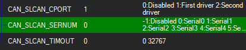

.. _common-slcan-f4:

===================================
SLCAN Access on F4 based Autopilots
===================================

Enabling SLCAN allows the autopilot to connect to CANBUS through USB on PC.
It allows viewing, configuration and software updates of devices connected to the CANBUS.
There are two different applications for using SLCAN to modify UAVCAN device parameter: UAVCAN GUI or Mission Planner. But first, the SLCAN interface must be enabled.

Enabling SLCAN
==============

Connect the autopilot to Mission Planner.

Set :ref:`CAN_SLCAN_CPORT<CAN_SLCAN_CPORT>` = 1, if not already set, and reboot.

.. image:: ../../../images/can-slcan-cport.png

Connect normally to Mission Planner and navigate to Initial Setup->Optional Hardware->UAVCAN.
Click on SLCan Mode CAN1, and any attached UAVCAN nodes using Driver 1 will appear and firmware updates or parameter changes of the node are now available. To return to normal Mission Planner operation, leave this tab for 2 seconds and reconnect to Mission Planner. 

.. image:: ../../../images/can-slcan-mpc.png

Making Changes to UAVCAN Devices
================================

Once SLCAN has been enabled, you can use :ref:`Mission Planner <common-mp-slcan>`  to make changes immediately to device parameters or firmware update.

:ref:`UAVCAN GUI tool <common-uavcan-gui>` can also be used, but requires a slightly different setup: 

Enabling Use of UAVCAN GUI
==========================

Connect the flight autopilot to Mission Planner. Set the parameter :ref:`CAN_SLCAN_CPORT<CAN_SLCAN_CPORT>` = 1 , if not already set, and reboot.

Reconnect Mission Planner and set :ref:`CAN_SLCAN_SERNUM<CAN_SLCAN_SERNUM>` = 0. This will direct the output to the autopilot's SERIAL0 port which is normally the autopilot USB connection. Be sure that the :ref:`CAN_SLCAN_TIMOUT<CAN_SLCAN_TIMOUT>` parameter is 0 to prevent timeouts.

Do not reboot, and click SLCAN Mode CAN1 in the Initial Setup->Optional Hardware->UAVCAN. Now open the :ref:`UAVCAN GUI tool<common-uavcan-gui>` .

.. note:: In this mode, you can also use Mission Planner's UAVCAN page to make changes, but it will not connect normally as a Mavlink Ground Station. To re-connect Mission Planner, you will need to reboot the autopilot.

