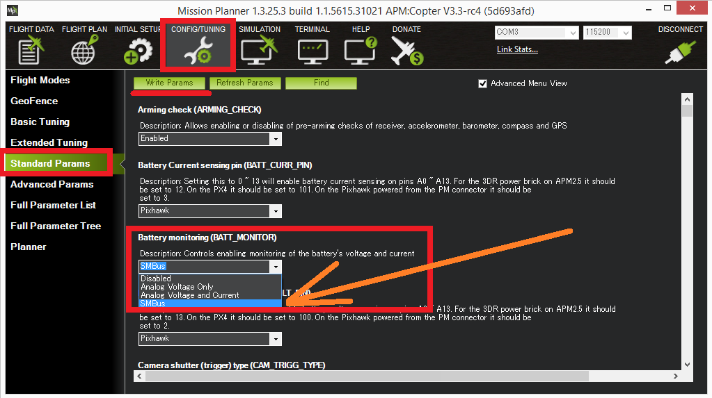

.. _common-smart-battery-landingpage:

===============
Smart Batteries
===============

ArduPilot supports several types of "smart battery" that communicate using `SMBus <https://en.wikipedia.org/wiki/System_Management_Bus>`__:

- the `Solo battery <https://www.amazon.com/Solo-Smart-Battery-Rechargeable-Lithium/dp/B01LWAAMV3>`__
- Maxell
- :ref:`Royote<common-smart-battery-rotoye>`
- Generic support for SUI3 and SUI6 SMBus batteries

While not yet very common, smart batteries are easier to attach and detach from the vehicle and are capable of providing more information on the state of the battery including capacity, individual cell voltages, temperature, etc.

.. toctree::
    :maxdepth: 1

    Solo <common-smart-battery-solo>

Setup through Mission Planner
=============================

Set :ref:`BATT_MONITOR <BATT_MONITOR>` to appropriate Smart Battery model
Set :ref:`BATT_I2C_BUS <BATT_I2C_BUS__AP_BattMonitor_INA2xx>` to the appropriate bus number

For adding more batteries, set :ref:`BATT2_MONITOR <BATT2_MONITOR>` & :ref:`BATT2_I2C_BUS <BATT2_I2C_BUS__AP_BattMonitor_INA2xx>`, :ref:`BATT3_MONITOR <BATT3_MONITOR>` & :ref:`BATT3_I2C_BUS <BATT3_I2C_BUS__AP_BattMonitor_INA2xx>`,etc.

Restart the board and connect with a ground station and check the battery voltage appears.
The :ref:`BATT_CAPACITY <BATT_CAPACITY>` parameter should be automatically updated to the batteries actual capacity in mAh.

Additional information
======================

- `SMBus specifications (see ver 1.1, ver 2.0) <http://smbus.org/specs/>`__

Limitations
===========

-  Battery "address discovery" is not supported so the battery must use the I2C address 0x0B (7 bit address).  Most smart batteries use this address.
