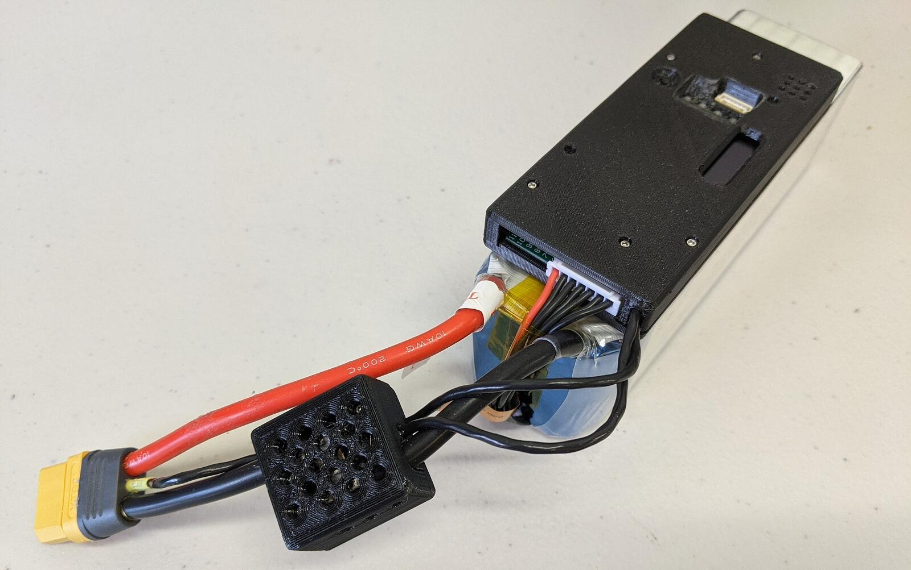

.. _common-smart-battery-rotoye:

===========================
Rotoye BatMon Smart Battery
===========================

`Rotoye BatMon <https://rotoye.com/>`__ is a smartification kit for off-the-shelf Lithium-Ion and LiPo batteries. It can be purchased as a standalone unit or factory-assembled into a smart-battery.

Connecting to the Pixhawk
=========================
Rotoye Batmon uses XT90 connectors with I2C pins built-in. `See Rotoye Tutorials <https://rotoye.com/batmon-tutorial/>`__ for more details.

Multiple BatMon-equipped batteries can be connected, in series, to the same I2C bus using an opto-isolator; `Read more <https://github.com/rotoye/batmon_reader/tree/ArduinoAsMaster/Tutorials/running_multiple_batmons>`__

