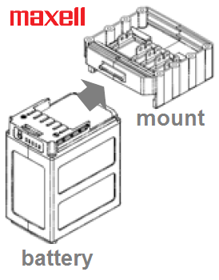
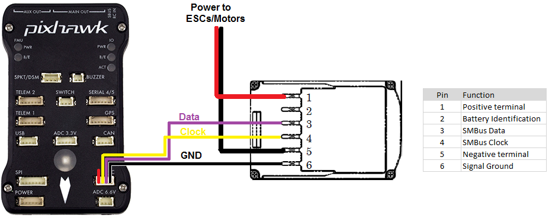
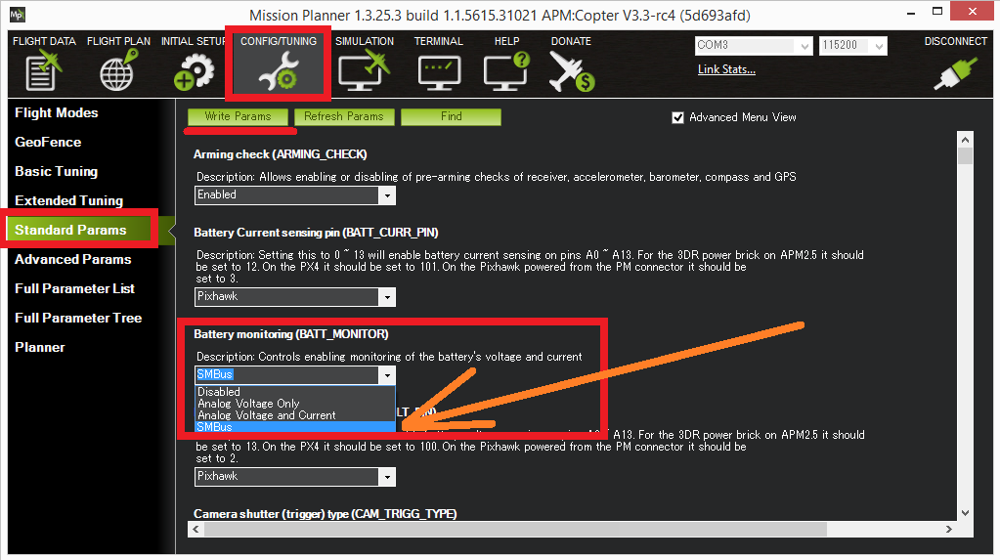

.. _common-smart-battery:

===============
Smart Batteries
===============

ArduPilot supports two types of "smart batteries" that communicate using `SMBus <https://en.wikipedia.org/wiki/System_Management_Bus>`__, the Maxell battery and the `Solo battery <https://www.amazon.com/3DR-BT11A-Solo-Smart-Battery/dp/B00X97EXEU>`__.
While not yet very common, smart batteries are easier to attach and detach from the vehicle and are capable of providing more information on the state of the battery including capacity and individual cell voltages (not yet supported).

.. note::

   Support for Solo smart batteries was introduced in Copter-3.3, Maxell battery support arrived in Copter-3.5.
   We have not yet found a webstore that sells the Maxell smart batteries.

.. image:: ../../../images/smart-battery-solo.jpg
    :target: ../_images/smart-battery-solo.jpg

Connecting to the Pixhawk
=========================

The diagram above shows how to connect the Maxell battery to a Pixhawk.

SMBus is close enough to I2C that the GND, SDA and SCLK lines from the battery can be connected to the Pixhawk's I2C connector (see I2C pin assignment on :ref:`this page <common-pixhawk-overview_pixhawk_connector_pin_assignments>`).

Setup through Mission Planner
=============================

If using the Maxell battery set :ref:`BATT_MONITOR <BATT_MONITOR>` to "7" ("SMBus-Maxell").

If using the Solo battery set :ref:`BATT_MONITOR <BATT_MONITOR>` to "5" (which may appear as "SMBus" or "Solo" depending upon the software version).

Restart the board and connect with a ground station and check the battery voltage appears.
If using the solo battery, the :ref:`BATT_CAPACITY <BATT_CAPACITY>` parameter should be automatically updated to the batteries actual capacity in mAh.

Limitations
===========

-  Battery "address discovery" is not supported so the battery must use the I2C address 0x0B (7 bit address).  Most smart batteries use this address.
-  If using a Solo battery with Copter-3.4.6 (or earlier) with a Pixhawk1, the ArduPilot start-up scripts must be modified to search for the battery on the "external" I2C bus.  This is not necessary if using Copter-3.5 (or higher)
   This can be changed in `the startup scripts <https://github.com/ArduPilot/ardupilot/blob/master/mk/PX4/ROMFS/init.d/rc.APM#L465>`__ (see line below) to tell the **batt_smbus** driver to searching on bus "1" instead of "2":

   ::

       # optional smbus battery monitor
       if batt_smbus -b 2 start 

Additional information
======================

- `SMBus specifications (see ver 1.1, ver 2.0) <http://smbus.org/specs/>`__
- `Maxell battery announcement (Japanese only) <https://prtimes.jp/main/html/rd/p/000000006.000019742.html>`__

..  youtube:: eIiOLvGYcDs
    :width: 100%