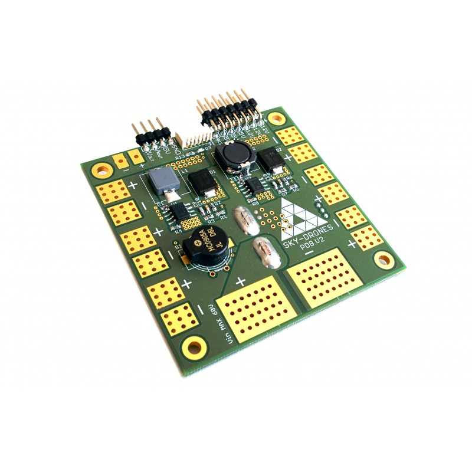
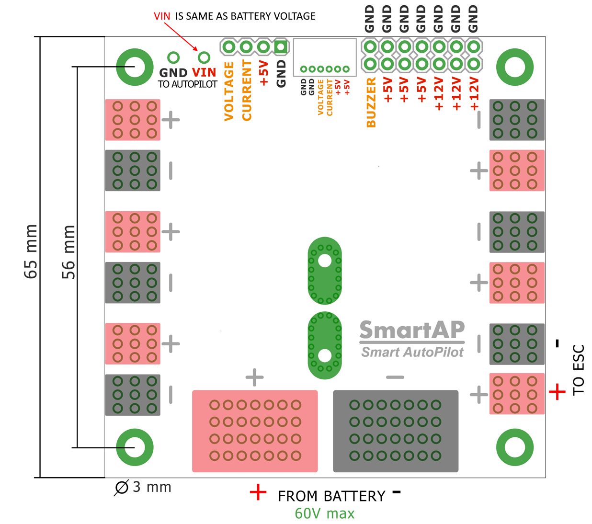
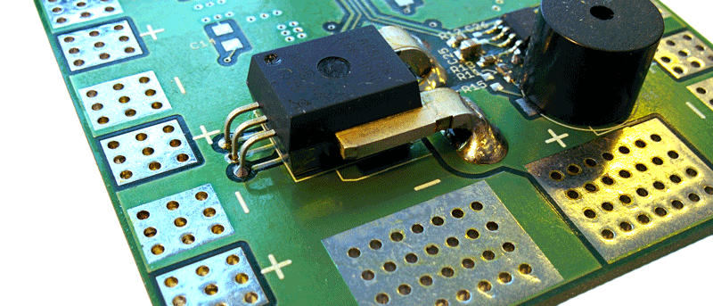

.. _common-smartap-pdb:

===========================================
Sky-Drones SmartAP Power Distribution Board
===========================================

Overview
========

`SmartAP PDB <https://sky-drones.com/parts/smartap-pdb.html>`__ (Power Distribution Board) is a board which allows transferring the power from 
the battery to ESCs / Motors and generate power supply for the flight controller and 
other peripherals with different voltage levels. Also, PDB provides the functionality for battery 
voltage / current measurements. SmartAP PDB makes high-power lines connections easier and much more reliable.

Specifications
==============

- Size: 65x65 mm, four 3mm mounting holes
- Input voltage up to 60 Volts (14S)
- Capability to handle extremenly high currents (peak current up to 400A)
- Power input from the main battery, possibility to connect up to 4 independent batteries
- 12 pairs of pads (6 on top, 6 on bottom) for powering up to 12 motors (all possible airframe configurations supported)
- Integrated voltage and current sensors with L/C filters
- Precise Hall Effect based current measurements
- Integrated DC-DC converter from 10-60 V input (up to 14S battery) to 5V / 5A output  to power peripherals
- Integrated DC-DC converter from 10-60 V input (up to 14S battery) to 12V / 5A output to power peripherals
- 5V and 12V power output terminals (standard 2.54mm/0.1" connectors)
- Integrated loud electromagnetic sounder (buzzer)
- Power output for the flight controller (both 5V regulated and battery voltage level output)
- Fully compatible with SmartAP, ArduPilot and PX4 autopilots

Size and Weight
===============

- Length: 65mm
- Width: 65mm
- Height: 14mm
- Weight: 16g

Buy
===

Sky-Drones store - purchase `here <https://sky-drones.com/parts/smartap-pdb.html>`__

Pinouts
=======

SmartAP Power Distribution Board pinout diagram is shown below. Big pads in the rear side are intended for the main battery connection. Up to four independent batteries can be connected using the thick wires (e.g. 8-10 AWG) to be able to handle high current loads and even more using thinner wires. Both top and bottom, left and right sides have pads for ESCs power supply connection. Therefore, up to 12 ESCs can be connected.

Voltage and current sensors
===========================

SmartAP PDB has integrated voltage and current sensors. Current sensor is located on the bottom side of the PDB. For correct scale / offset configuration, please, refer to Configuration section.

Configuration
=============

Set battery parameters as following: 

- :ref:`BATT_MONITOR<BATT_MONITOR>` to 4 to Set to analog voltage and current.
- :ref:`BATT_VOLT_MULT<BATT_VOLT_MULT>` to 18.4615
- :ref:`BATT_AMP_PERVLT<BATT_AMP_PERVLT>` to 37.2300
- :ref:`BATT_AMP_OFFSET<BATT_AMP_OFFSET>` to 0.63
