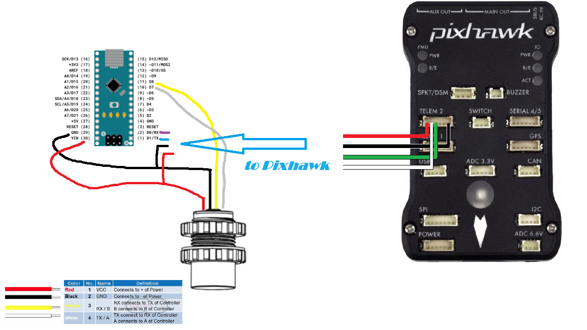

.. _common-sonar-L04xMTW-GL04xMT:

=======================
Sonar L04xMTW / GL04xMT  
=======================

The L04xMTW / GL04xMT is an echosounders (aka underwater sonar) with a 2 / 6 m range. More details can be found in the `datasheet <https://github.com/AlksSAV/Sonar-to-i2c-NMEA-/blob/main/L04xMTW%20%20GL04xMT%20datasheet.pdf>`__ 

Supported sonar models:

- L041MTW, GL041MT (min 5cm range, max 6m range)
- L042MTW, GL042MT (min 2cm range, max 2m range)

Recommended Hardware
--------------------

- L04xMTW / GL04xMT
- Arduino nano

The firmware file (sonar_to_nmea__SDDBT.ino) is located in this `repository <https://github.com/AlksSAV/Sonar-to-i2c-NMEA-/blob/main/sonar_to_nmea__SDDBT.ino>`__ 

Connecting and Configuring
--------------------------

The L04xMTW / GL04xMT sensors provide distance measurement.  Using Arduino nano sensor data is converted to NMEA 0183 stream. The data is transmitted to the autopilot via the serial port.

The sensor can be connected to any available serial/uart port on the autopilot.  In the diagram below the first sensor is connected to SERIAL2.

If the SERIAL2 is used then the following parameters should be set:

-  :ref:`SERIAL2_PROTOCOL <SERIAL2_PROTOCOL>` = 9 (Lidar)
-  :ref:`SERIAL2_BAUD <SERIAL2_BAUD>` = 115 (115200 baud)

Then the following range finder related parameters should be set:

-  :ref:`RNGFND1_TYPE <RNGFND1_TYPE>` = 17 (NMEA)
-  :ref:`RNGFND1_MIN <RNGFND1_MIN>` = 5
-  :ref:`RNGFND1_MAX <RNGFND1_MAX>` = 600 (i.e. 6m).  *This is the distance in centimeters that the rangefinder can reliably read.*
-  :ref:`RNGFND1_ORIENT <RNGFND1_ORIENT>` = 25 (i.e. down) if mounted on a boat
