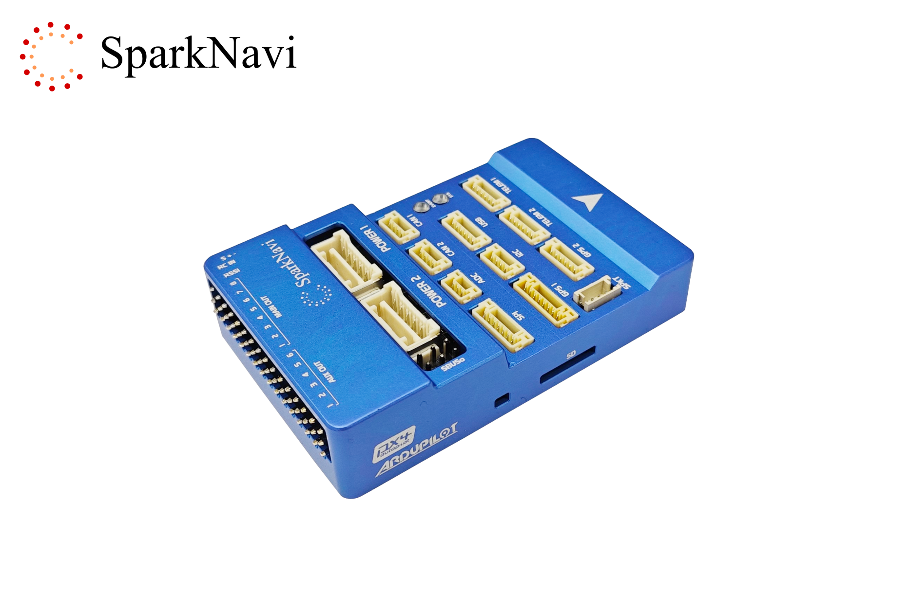
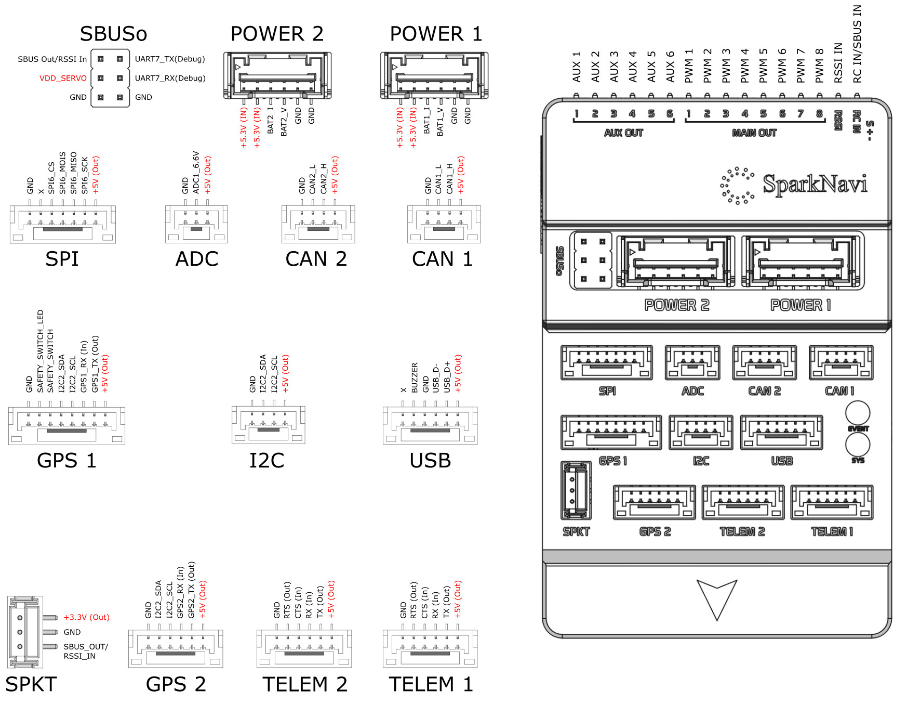

.. _common-sparknavi-blue:

====================
SparkNavi Blue
====================

The **SparkNavi Blue** is a high-performance STM32H743 flight controller designed and manufactured by `SparkNavi <https://www.sparknavi.com>`_.  
It is designed for professional UAV, robotics and research platforms and is fully supported by ArduPilot.

The board provides dual IMUs, CAN FD, dual GPS, microSD logging and wide peripheral connectivity in a compact enclosure.

Key Features
============

- CNC machined aluminum enclosure
- STM32H743 MCU (480MHz)
- 2MB Flash
- Dual IMU (ICM42652 + ICM42688)
- External I2C compass support (RM3100 / IST8310)
- CAN FD (2 ports)
- Dual GPS ports
- microSD logging
- Dedicated IOMCU
- Integrated RGB status LED
- USB Type-C
- Compact enclosed design

Manufacturing and Compliance
============================

The SparkNavi Blue is designed and manufactured in Taiwan.

The hardware complies with major international certifications including:

- FCC
- CE
- PSE

The product is manufactured using a globally sourced supply chain suitable for
customers with strict regulatory, compliance, or export requirements.

Size
===============

.. image:: ../../../images/sparknavi/sparknavi-blue-dimensions.png
    :width: 600px
    :target: ../_images/sparknavi/sparknavi-blue-dimensions.png

Specifications
===============

+-----------------------+----------------------------------+
| MCU                   | STM32H743 (480MHz)               |
+-----------------------+----------------------------------+
| IOMCU                 | STM32F103                        |
+-----------------------+----------------------------------+
| Flash                 | 2MB                              |
+-----------------------+----------------------------------+
| IMU                   | ICM42652 + ICM42688              |
+-----------------------+----------------------------------+
| Barometer             | BMP280                           |
+-----------------------+----------------------------------+
| Internal Compass      | HMC5883L (HMC5843 driver)        |
+-----------------------+----------------------------------+
| CAN                   | 2x CAN FD                        |
+-----------------------+----------------------------------+
| UARTs                 | 6                                |
+-----------------------+----------------------------------+
| PWM Outputs           | 14 (6 AUX + 8 MAIN via IOMCU)    |
+-----------------------+----------------------------------+
| Logging               | microSD                          |
+-----------------------+----------------------------------+
| USB                   | USB-C                            |
+-----------------------+----------------------------------+

Connector Overview
==================

Main connectors:

- POWER1 / POWER2
- GPS1 / GPS2
- TELEM1 / TELEM2
- CAN1 / CAN2
- SPI expansion
- ADC expansion
- I2C external bus
- SBUS / RSSI port

UART Mapping
============

+-----------+------------------+
| Port      | Function         |
+-----------+------------------+
| USART1    | GPS1             |
| UART4     | GPS2             |
| USART2    | TELEM1           |
| USART3    | TELEM2           |
| UART7     | Debug            |
| UART8     | IOMCU            |
+-----------+------------------+

I2C Buses
=========

+---------+---------------------+
| Bus     | Usage               |
+---------+---------------------+
| I2C2    | External I2C port   |
| I2C4    | Internal sensors    |
+---------+---------------------+

External compasses are automatically detected on the external I2C bus.

PWM Outputs
===========

MAIN outputs are driven by the IOMCU.  
AUX outputs are driven by the FMU.

+------------+------------------+
| Outputs    | Pins             |
+------------+------------------+
| MAIN OUT   | 1-8              |
| AUX OUT    | 1-6              |
+------------+------------------+

RC Input
========

The SBUS connector supports:

- SBUS input
- SBUS output
- RSSI input

Powering the Board
==================

The controller can be powered from either **POWER1** or **POWER2**.

Both power modules provide:

- Power input
- Voltage/current sensing
- Redundant supply capability

Compass
=======

The SparkNavi Blue uses **external compasses** by default.

The internal compass is intended primarily as a backup or development sensor.
For optimal flight performance, an external compass is recommended due to
reduced magnetic interference.

Supported compasses:

- RM3100
- IST8310

Automatic compass rotation detection is enabled.

Firmware
========

The board is available in the firmware list as:

**SparkNavi Blue**

Connections and Wiring
======================

Typical wiring includes:

- GPS on GPS1
- Telemetry radio on TELEM1
- External compass on I2C
- ESCs on MAIN outputs

Mechanical Specifications
=========================

+-----------+---------+
| Length    | 73.3 mm |
| Width     | 47.4 mm |
| Height    | 17 mm   |
| Weight    | 70 g    |
+-----------+---------+

Manufacturer
============

SparkNavi  
https://www.sparknavi.com

Country of Origin
-----------------

Taiwan
