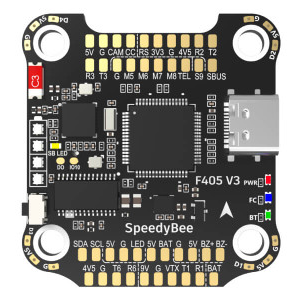
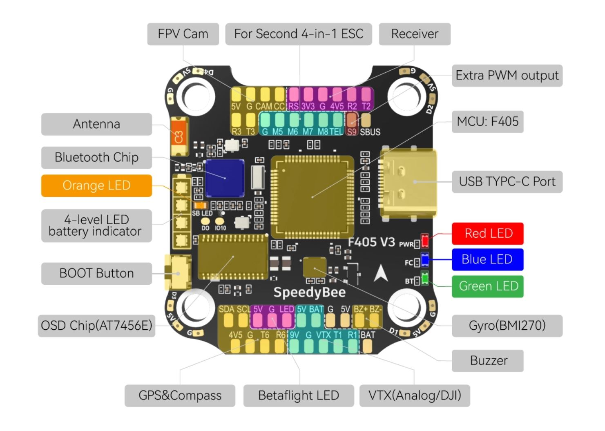
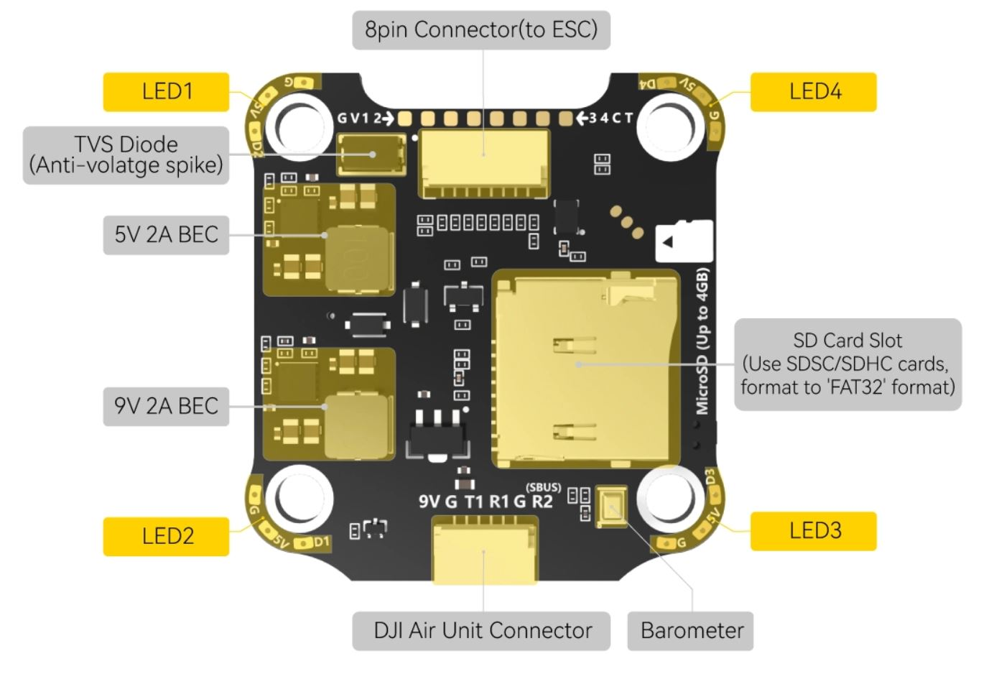
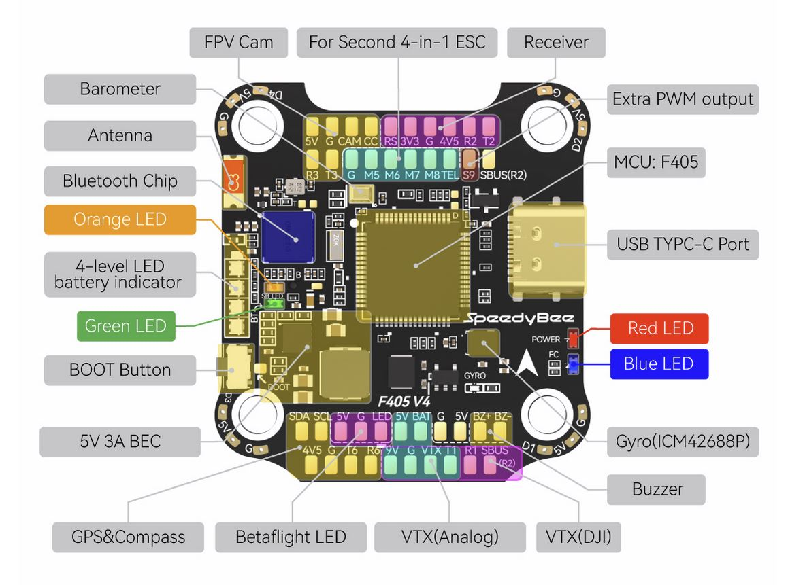
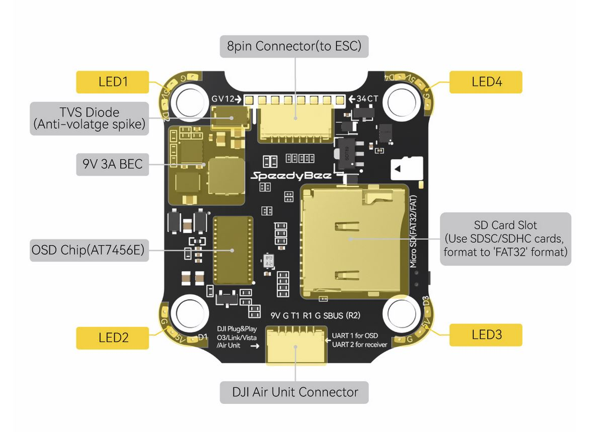

.. _common-speedybeef4-v3:

===================
Speedy Bee F4 V3/V4
===================

*above image and some content courtesy of the* `speedybee.com <https://www.speedybee.com>`__

Specifications
==============

-  **Processor and Sensors**

   -  STM32F405 ARM microcontroller
   -  V3:BMI270 IMU, V4:ICM42688 (Gyro and Accelerometers)
   -  V3:SPL06, V4:DPS310 Barometer
   -  AT7456E OSD

-  **Interfaces**

   -  9x PWM outputs (PWM9 for Neopixel LED)
   -  1x RC input (PWM/PPM, SBUS)
   -  6x serial port inputs (including RC input listed above)
   -  1x I2C for external compass or airspeed sensor
   -  Micro SD card slot
   -  4 in 1 ESC connector
   -  DJI Air Unit connector
   -  USB-C connector

-  **Power**

   -  9V ~ 25V DC input power (3S-6S)
   -  5V 2A BEC for peripheral 
   -  9V 2A for Video

-  **Size and Dimensions**

   - 41.6mm x3 9.4mm x 7.8mm (30.5mm x 30.5mm mount pattern)
   - 9.6g

Pinouts
=======
V3
--

V4
--

UART Defaults
=============

The UARTs are marked Rn and Tn in the above pinouts. The Rn pin is the receive pin for UARTn. The Tn pin is the transmit pin for UARTn. N

-    SERIAL0 -> USB
-    SERIAL1 -> UART1 (DJI-VTX, DMA-enabled)
-    SERIAL2 -> UART2 (RCIN, DMA-enabled) Note that the SBUS input must be used for SBUS.
-    SERIAL3 -> UART3 (User defined)
-    SERIAL4 -> UART4 (connected to internal BT module, not currently usable by ArduPilot)
-    SERIAL5 -> UART5 (ESC Telemetry)
-    SERIAL6 -> UART6 (GPS, DMA-enabled)

RC Input
========

RC input is configured on the R2 (UART2_RX) pin for most RC unidirectional protocols except SBUS which should be applied at the SBUS pin. PPM is not supported. For Fport, a bi-directional inverter will be required. See `this article for connection information for F4 autopilots <https://ardupilot.org/plane/docs/common-connecting-sport-fport.html>`__. 

For CRSF/ELRS/SRXL2 connection of the receiver to T2 will also be required.

Dshot capability
================

The SpeedyBee F405 v3/v4 supports up to 9 PWM outputs. The M1 to M4 outputs are on the esc connector, M5 to M8 on solder pads, plus LED pad(PWM output 9) for LED strip or another PWM output.

V3
--
The PWM is in 3 groups:

-  PWM 1-4 in group1
-  PWM 5-8 in group2
-  PWM 9   in group3

V4
--
The PWM is in 5 groups:

- PWM 1-2 in group1
- PWM 3-4 in group2
- PWM 5-6 in group3
- PWM 7-8 in group4
- PWM 9 in group5

Channels within the same group need to use the same output protocol. If any channel in a group uses DShot then all channels in the group need to use DShot. Channels 1-4 also support bi-directional DShot (V4 only).

OSD Support
===========

The SpeedyBee F405 v3 has an on-board OSD using :ref:`OSD_TYPE<OSD_TYPE>` =  1 (MAX7456 driver). The CAM and VTX pins provide connections for using the internal OSD.

DJI Video and OSD
=================

A JST-GH-6P connector supports a standard DJI HD VTX connection and SERIAL6 is already setup for this by default.  Pin 1 of the connector is 9v so be careful not to connect this to any peripheral requiring 5v.

Battery Monitoring
==================

The board has a internal voltage sensor and connections on the ESC connector for an external current sensor input. The voltage sensor can handle up to 6S LiPo batteries.

The default battery parameters are:

-    :ref:`BATT_MONITOR<BATT_MONITOR>` = 4
-    :ref:`BATT_VOLT_PIN<BATT_VOLT_PIN>` = 10
-    :ref:`BATT_CURR_PIN<BATT_CURR_PIN>` = 11
-    :ref:`BATT_VOLT_MULT<BATT_VOLT_MULT>` = 11.2
-    :ref:`BATT_AMP_PERVLT<BATT_AMP_PERVLT>` = 52.7 (will need to be adjusted for whichever current sensor is attached)

Compass
=======

The SpeedyBee F405 v3 does not have a builtin compass, but you can attach an external compass using I2C on the SDA and SCL pads.

Where to Buy
============

- Available from various retailers and directly from the manufacturer `SpeedyBee <https://www.speedybee.com/speedybee-f405-v3-bls-50a-30x30-fc-esc-stack/>`__

[copywiki destination="plane,copter,rover,blimp"]