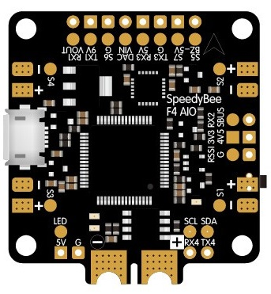

.. _common-speedybeef4:

=============
Speedy Bee F4
=============

.. warning:: This autopilot does not have a barometer. An external barometer can be added, or operation with an alternate altitude sensor, such as GPS for outdoor use or rangefinder for indoor applications is supported (see :ref:`EK3_SRC1_POSZ<EK3_SRC1_POSZ>`), with the following caveats. In Plane, if GPS is lost, then the user should switch to MANUAL mode immediately to avoid a crash. In Copter, operation is allowed using GPS, but not recommended, due to the imprecision in altitude hold modes. Bear in mind if GPS fails and the vehicle is using it for altitude information, a crash can eventually result due to lack of accurate altitude information.See :ref:`common-gps-for-alt` for more information.

*above image and some content courtesy of the* `speedybee.com <https://www.speedybee.com/speedy-bee-f4-aio-flight-controller/>`__

.. note::

   Support for the SpeedyBee F4 was released with Copter-3.6.1

Specifications
==============

-  **Processor and Sensors**

   -  STM32F405 ARM microcontroller
   -  InvenSense MPU6000 IMU (accel, gyro, compass)

-  **Interfaces**

   -  4x PWM outputs
   -  1x RC input (PWM/PPM, SBUS)
   -  4x serial port inputs (including RC input listed above)
   -  1x I2C for external compass
   -  battery voltage and current monitor
   -  Onboard Bluetooth
   -  USB port
   -  3S to 6S input power

.. note:: This controller does not integrate a barometer which ArduPilot requires for proper operation, so an external barometer must be attached.

Dshot capability
================

All motor/servo outputs are Dshot and PWM capable. However, mixing Dshot and normal PWM operation for outputs is restricted into groups, ie. enabling Dshot for an output in a group requires that ALL outputs in that group be configured and used as Dshot, rather than PWM outputs. The output groups that must be the same (PWM rate or Dshot, when configured as a normal servo/motor output) are: 1/2/3/4,5, and 6.

Logging
=======

Logging to on-board data flash is supported on this controller.

Where to Buy
============

- Available from various retailers and directly from the manufacturer `SpeedyBee <https://www.speedybee.com/speedy-bee-f4-aio-flight-controller/>`__

[copywiki destination="plane,copter,rover,blimp"]