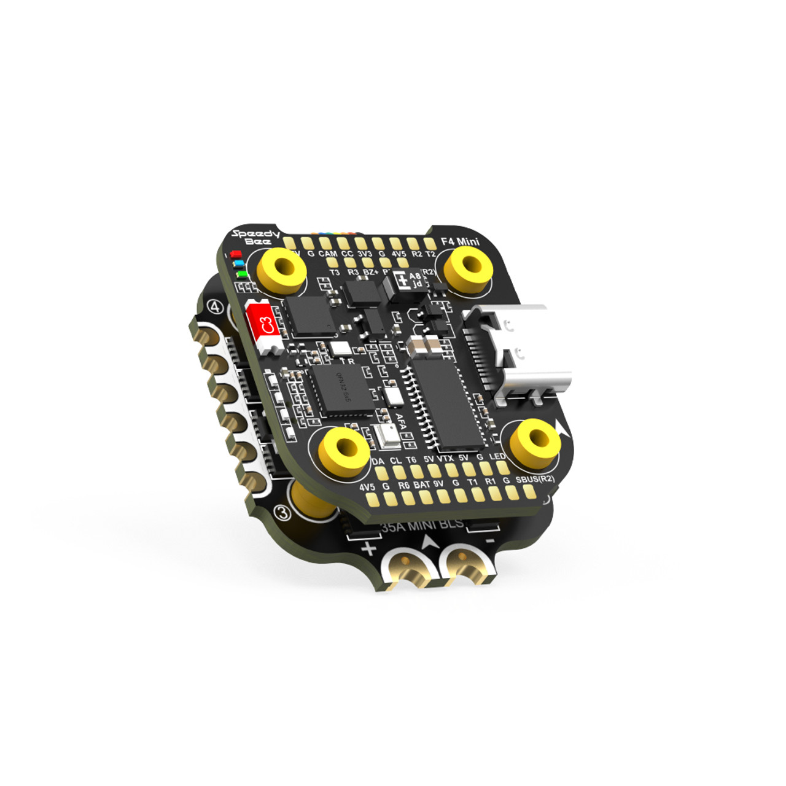
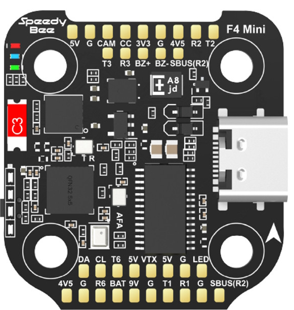
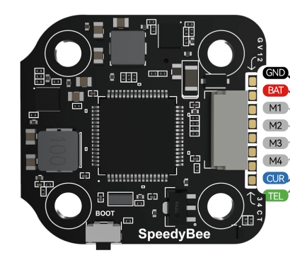
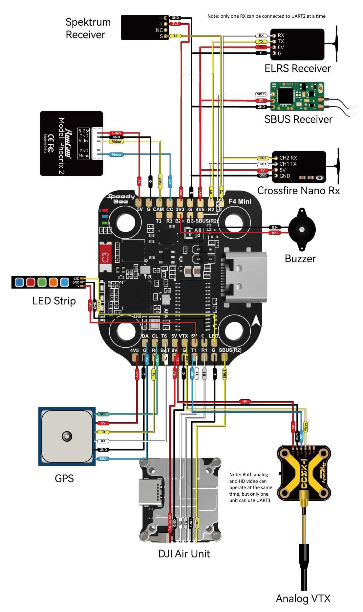

.. _common-speedybeef405-mini:

==================
SpeedyBeeF405-Mini
==================

the above image and some content courtesy of `SpeedyBee <http://speedybee.com/>`__ and the autopilot is shown with a companion 4in1 ESC as a stack.

.. note::

	Due to flash memory limitations, this board does not include all ArduPilot features.
        See :ref:`Firmware Limitations <common-limited_firmware>` for details.

Specifications
==============

-  **Processor**

   -  STM32F405RGT6 ARM (168MHz)
   -  AT7456E OSD
   -  8MByte flash for logging

-  **Sensors**

   -  ICM-42688P IMU (accel, gyro)
   -  DSP-310 barometer
   -  Voltage Sensor, Input for external current sensor

-  **Power**

   -  4.75-5.25V input
   -  9V 3A BEC for powering Video Transmitter
   -  5V, 2A BEC for internal and peripherals

-  **Interfaces**

   -  4x PWM outputs DShot capable (Serial LED output is 5th output)
   -  1x RC input
   -  5x UARTs/serial for GPS and other peripherals, 6th UART internally tied to Wireless board)
   -  I2C port for external compass, airspeed, etc.
   -  USB-C port

-  **Size and Dimensions**

   - 30mm x 32mm x 7.8mm
   - 9.6g

Where to Buy
============

`SpeedyBee <https://www.speedybee.com/speedybee-f405-mini-bls-35a-20x20-stack/>`__

User Manual
===========

`SpeedyBeeF405-Mini Stack User Manual <https://store-fhxxhuiq8q.mybigcommerce.com/product_images/img_SpeedyBee_F405_Mini_BLS_35A/SpeedyBee%20F405%20Mini%20BLS%2035A%20Stack%20-%20User%20Manual%20-%20EN.pdf>`__

Pinout
======

Wiring Diagram
==============

Default UART order
==================

The UARTs are marked Rn and Tn in the above pinouts. The Rn pin is the
receive pin for UARTn. The Tn pin is the transmit pin for UARTn.

- SERIAL0 -> USB
- SERIAL1 -> UART1 (DJI-VTX, DMA-enabled)
- SERIAL2 -> UART2 (RX, DMA-enabled)
- SERIAL3 -> UART3
- SERIAL4 -> UART4 (connected to internal BT module, not currently usable by ArduPilot)
- SERIAL5 -> UART5 (ESC Telemetry, RX only on ESC connector)
- SERIAL6 -> UART6 (GPS, DMA-enabled)

Serial protocols shown are defaults, but can be adjusted to personal preferences.

Servo/Motor Outputs
===================

The SpeedyBeeF405 Mini supports up to 5 PWM outputs. The pads for motor output M1 to M4 on the ESC connector, plus M5(LED) for LED strip or another PWM output.

The PWM is in 3 groups:

- PWM 1-2 in group1
- PWM 3-4 in group2
- PWM 5 in group3

Channels within the same group need to use the same output rate. If any channel in a group uses DShot then all channels in the group need to use DShot. Channels 1-4 support bi-directional DShot.

RC Input
========

The SBUS pin, is passed by an inverter to RX2 (UART2 RX), which can be used for all ArduPilot supported receiver protocols, except PPM/CRSF/ELRS and SRXL2. CRSF/ELRS and SRXL2 require the RX2 and TX2 pin be connected instead of the SBUS pin. 

- SRXL2 requires :ref:`SERIAL2_OPTIONS<SERIAL2_OPTIONS>` be set to "4".
- Fport should be connected to TX2 via a bi-directional inverter and :ref:`SERIAL2_OPTIONS<SERIAL2_OPTIONS>` be set to "4".

Any UART can be used for RC system connections in ArduPilot also, and is compatible with all protocols except PPM (SBUS requires external inversion on other UARTs). See :ref:`common-rc-systems` for details.

.. note:: the "4V5" pins are powered when USB is connected. Be careful not to present too much load to the USB source or voltage droop may occur. All other 5V pins are only powered when battery is present.

Bluetooth
=========

The SpeedyBeeF405-Mini has an integrated wireless module connected to UART4 but its BLE Bluetooth is not compatible with exisiting ArduPilot ground stations for Windows or Android.

OSD Support
===========

The SpeedyBeeF405-Mini supports using its internal OSD using OSD_TYPE 1 (MAX7456 driver). External OSD support such as DJI or DisplayPort is supported using UART1 or any other free UART. See :ref:`common-msp-osd-overview-4.2` for more info.

Battery Monitor Configuration
=============================
These settings are set as defaults when the firmware is loaded and are appropriate for the usual ESC included with the stack version. However, if they are ever lost, you can manually set the parameters:

Enable Battery monitor.

:ref:`BATT_MONITOR<BATT_MONITOR>` =4

Then reboot.

:ref:`BATT_VOLT_PIN<BATT_VOLT_PIN>` 10

:ref:`BATT_CURR_PIN<BATT_CURR_PIN>` 11

:ref:`BATT_VOLT_MULT<BATT_VOLT_MULT>` 11.0

:ref:`BATT_AMP_PERVLT<BATT_AMP_PERVLT>` 40

Connecting a GPS/Compass module
===============================

This board does not include a GPS or compass so an :ref:`external GPS/compass <common-positioning-landing-page>` should be connected as shown below in order for autonomous modes to function.

Firmware
========
This board does not come with ArduPilot firmware pre-installed. Use instructions here to load ArduPilot the first time :ref:`common-loading-firmware-onto-chibios-only-boards`.

Firmware for this board can be found `here <https://firmware.ardupilot.org>`_ in  sub-folders labeled "SpeedyBeeF405Mini". Only Copter firmware is pre-built since this autopilot is very targeted for that application.

[copywiki destination="plane,copter,rover,blimp"]

