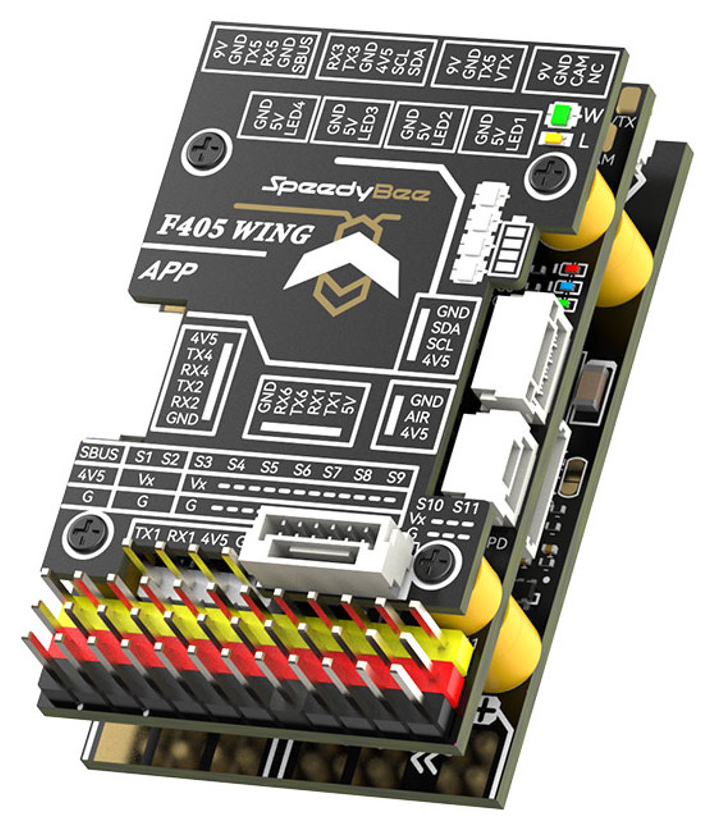
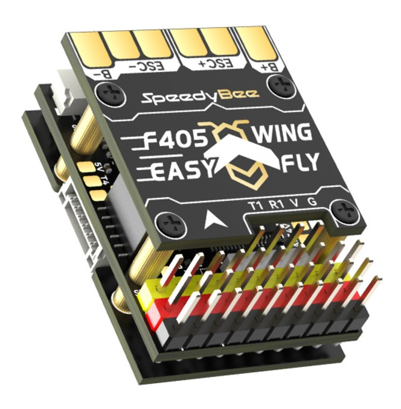
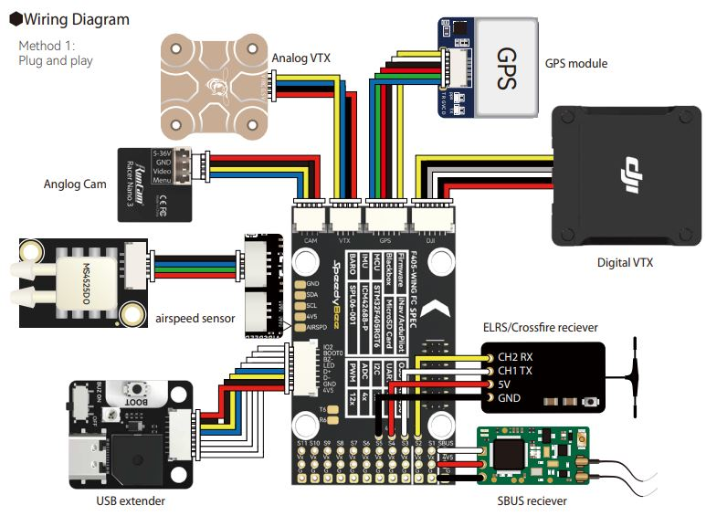

.. _common-speedybeef405wing:

============================
SpeedyBeeF405WING/ Wing Mini
============================

The SpeedyBeeF405wing/Wing Mini integrates all the highly desired features for a Plane autopilot:

- Sufficient outputs for QuadPlane applications as well as normal complex Fixed Wing applications
- Full peripheral capabiliy: GPS/Compass/Analog or Digital Airspeed/SBUS,PPM or Serial RC/HD Video/Rangefinders,etc.
- JST-GH connectors for most peripherals, Dupont connectors for motor/servo and serial RC
- Integrated current and voltage monitors
- Integrated OSD or HD Video
- VTX control via IRX TRAMP or SmartAudio
- Integrated Wireless Telemetry (WIFI MAVLink)

Plus several unique features:

- Multiple LED string connectors with selectable predefined displays or control via autopilot
- Integrated LED battery level indicator

the above image and some content courtesy of `SpeedyBee <http://speedybee.com/>`__

.. note::

	Due to flash memory limitations, this board does not include all ArduPilot features.
        See :ref:`Firmware Limitations <common-limited_firmware>` for details.

Specifications
==============

-  **Processor**

   -  STM32F405RGT6 ARM (168MHz)
   -  AT7456E OSD

-  **Sensors**

   -  ICM-42688P IMU (accel, gyro)
   -  SPL-06 barometer
   -  Voltage & 120A current sensor

-  **Power**

   -  2S - 6S Lipo input voltage with voltage monitoring
   -  90A Cont., 215A peak current monitor
   -  9V/12/5V, 1.8A BEC for powering Video Transmitter controlled by GPIO(early bd revs do not have this feature)
   -  4.9V/6V/7.2V, 4.5A BEC for servos
   -  5V, 2.4A BEC for internal and peripherals

-  **Interfaces**

   -  12x PWM outputs DShot capable (Serail LED output is PWM12)
   -  1x RC input
   -  5x UARTs/serial for GPS and other peripherals, 6th UART internally tied to Wireless board)
   -  I2C port for external compass, airspeed, etc.
   -  microSDCard for logging, etc.
   -  USB-C port

-  **Size and Dimensions**

   - Wing: 52mm x 32mm x 19mm , Mini:37mm x 26mm x 14mm
   - Wing: 35g, Muini:19G

Where to Buy
============

`SpeedyBee <https://www.speedybee.com/speedybee-f405-wing-app-fixed-wing-flight-controller/>`__

User Manual
===========

`SpeedyBeeF405 User Manual <https://store-fhxxhuiq8q.mybigcommerce.com/product_images/img_SpeedyBee_F405_WING_APP/SpeedyBee_F405_WING_APP_Manual-EN.pdf>`__

Wiring Diagram
==============

Default UART order
==================

The UARTs are marked Rn and Tn in the above pinouts. The Rn pin is the
receive pin for UARTn. The Tn pin is the transmit pin for UARTn.

 - SERIAL0 -> USB
 - SERIAL1 -> USART1 (Serial RC input) (DMA capable)
 - SERIAL2 -> USART2 (RX tied to inverted SBUS RC input, but can be used as normal UART if :ref:`BRD_ALT_CONFIG<BRD_ALT_CONFIG>` =1) 
 - SERIAL3 -> UART3 (GPS) (TX DMA capable)
 - SERIAL4 -> UART4 (User) (TX DMA capable)
 - SERIAL5 -> UART5 (User, available on DJI air unit connector) (TX DMA capable)
 - SERIAL6 -> UART6 (tied to internal wireless module, MAVLink2 telem) 

Serial protocols shown are defaults, but can be adjusted to personal preferences.

Servo/Motor Outputs
===================

All motor/servo outputs are Dshot and PWM capable. However, mixing Dshot, serial LED, and normal PWM operation for outputs is restricted into groups, ie. enabling Dshot for an output in a group requires that ALL outputs in that group be configured and used as Dshot, rather than PWM outputs.

 - PWM 1,2 in group1
 - PWM 3,4 in group2
 - PWM 5-7 in group3
 - PWM 8-10 in group4
 - PWM 11,12 in group5  Note: PWM12 is setup for serial LED use by default, if PWM11 is used for motors or servos, you must re-assign PMW12 to a normal PWM output or nothing

RC Input
========

The SBUS pin, is passed by an inverter to RX2 (UART2 RX), which by default is mapped to a timer input instead of the UART, and can be used for all ArduPilot supported receiver protocols, except CRSF/ELRS and SRXL2 which require a true UART connection. However, FPort, when connected in this manner, can provide RC without telemetry. 

To allow CRSF and embedded telemetry available in Fport, CRSF, and SRXL2 receivers, the UART1 should be used. With this option, :ref:`SERIAL11_PROTOCOL<SERIAL1_PROTOCOL>` must be set to "23" (already set by default), and:

- PPM is not supported.

- DSM/SRXL connects to the RX1  pin, but SBUS would still be connected to SBUS.

- FPort requires connection to TX1 and RX1 via a bi-directional inverter. See :ref:`common-FPort-receivers`.

- CRSF also requires a TX1 connection, in addition to RX1 and automatically provides telemetry. ELRS is connected in the same way, but bit 13 of :ref:`RC_OPTIONS<RC_OPTIONS>` should be set.

- SRXL2 requires a connection to TX1 and automatically provides telemetry.  Set :ref:`SERIAL2_OPTIONS<SERIAL2_OPTIONS>` to "4".

.. note:: UART1 is configured by default for serial receivers. You can also have more than one receiver in the system at a time (usually used for long range hand-offs to a remote TX). See :ref:`common-multiple-rx` for details.

Any UART can be used for RC system connections in ArduPilot also, and is compatible with all protocols except PPM (SBUS requires external inversion on other UARTs). See :ref:`common-rc-systems` for details.

.. note:: the "4V5" pin above the SBUS pin and the 4V5 pins in the GPS, Airspeed, and Telem connectors are powered when USB is connected. Be careful not to present too much load to the USB source or voltage droop may occur. All other 5V pins are only powered when battery is present.

WIFI
====

The SpeedyBeeF405Wing has an integrated wireless module allowing connections to GCS via WIFI. See the user manual for instructions. While BT is advertised as an alternate mode, this has not been proven to work with all BT dongles or cell-phones by ArduPilot. The WIFI mode has been tested with a variety of systems, however. Be sure the :ref:`SERIAL6_BAUD<SERIAL6_BAUD>` = 115 and that nothing is loading the TX6/RX6 pins which are connected to the wireless module, by default..

OSD Support
===========

The SpeedyBeeF405Wing supports using its internal OSD using OSD_TYPE 1 (MAX7456 driver). External OSD support such as DJI or DisplayPort is supported using UART5 or any other free UART. See :ref:`common-msp-osd-overview-4.2` for more info.

VTX Control
===========

UART5 TX is located in the Video Output connector to provide IRC Tramp or Smart Audio control of video transmitters. See :ref:`common-vtx` for more information.

VTX Power Control
=================

GPIO 81 controls the VTX BEC output to pins marked "9V". Setting this GPIO high removes voltage supply to pins.

Set a ``RELAYx_PIN`` to “81” to control the  switching. Then select an RC channel for control (Chx) and set its ``RCx_OPTION`` to the appropriate Relay (1-6) that you had set its pin parameter above.

For example, use Channel 10 to control the switch using Relay 2:

    :ref:`RELAY2_PIN<RELAY2_PIN>` = “81”

    :ref:`RC10_OPTION<RC10_OPTION>` = “34” (Relay2 Control)

Battery Monitor Configuration
=============================
These settings are set as defaults when the firmware is loaded (except :ref:`BATT_AMP_PERVLT<BATT_AMP_PERVLT>` which needs to be changed from the default value). However, if they are ever lost, you can manually set the parameters:

Enable Battery monitor.

:ref:`BATT_MONITOR<BATT_MONITOR>` =4

Then reboot.

:ref:`BATT_VOLT_PIN<BATT_VOLT_PIN>` 10

:ref:`BATT_CURR_PIN<BATT_CURR_PIN>` 11

:ref:`BATT_VOLT_MULT<BATT_VOLT_MULT>` 11.05

:ref:`BATT_AMP_PERVLT<BATT_AMP_PERVLT>` 50

Connecting a GPS/Compass module
===============================

This board does not include a GPS or compass so an :ref:`external GPS/compass <common-positioning-landing-page>` should be connected as shown below in order for autonomous modes to function.

Firmware
========
This board does not come with ArduPilot firmware pre-installed. Use instructions here to load ArduPilot the first time :ref:`common-loading-firmware-onto-chibios-only-boards`.

Firmware for this board can be found `here <https://firmware.ardupilot.org>`_ in  sub-folders labeled
"SpeedyBeeF405WING".

[copywiki destination="plane,copter,rover,blimp"]

